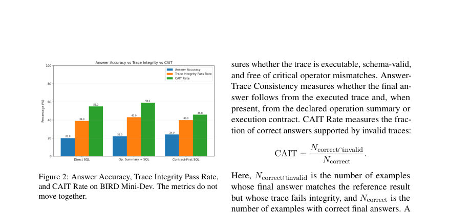
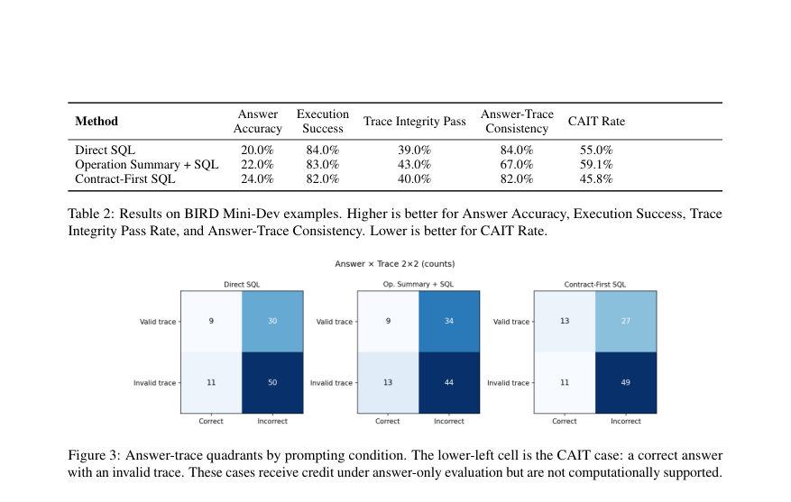

# Trace Integrity for LLM Data Agents: A Vision for Auditable Structured Reasoning in Real-World Systems

- **게시일:** 2026-08-27
- **arXiv:** [2608.26036v1](http://arxiv.org/abs/2608.26036v1) · [PDF](https://arxiv.org/pdf/2608.26036v1)
- **저자:** Srimonti Dutta, Akshata Kishore Moharir
- **분야:** cs.AI, cs.CL
- **선정 점수:** 5.20
- **선정 이유:** 최근성 1.2, 인용 영향 0.0 (인용 0회), 저자 영향 0.0 (최고 h-index 0), AI 주제 적합성 2.9, 개발자 관심 0.3, 학술 신호 0.8, 오픈 웨이트·주요 연구조직 신호 0.0

[← 2026-08-27 목록으로 돌아가기](../daily/2026-08-27.html)

<!-- paper-visuals:start -->
## 주요 Figure

> 원문 PDF에서 실제 Figure 캡션과 그림 영역이 함께 확인된 자료만 자동 추출했다.

*Figure · 원문 PDF 5쪽 · Figure 2: Answer Accuracy, Trace Integrity Pass Rate,*

*Figure · 원문 PDF 6쪽 · Figure 3: Answer-trace quadrants by prompting condition. The lower-left cell is the CAIT case: a correct answer*

<!-- paper-visuals:end -->

## 한 문장 요약

구조화된 데이터 질의에서 LLM 데이터 에이전트가 반환한 답변 뒤의 계산이 감사·재실행 가능한지 평가하는 'Trace Integrity' 기준과 이를 운영화하는 실행 계약(execution contracts) 및 CAIT(정답·무효 트레이스) 비율 측정을 제안한다.

## 해결하려는 문제

기존 평가(정답 정확도)는 엔드 결과만 비교하므로, 동일한 정답이라도 실제로는 잘못된 필터·조인·집계·그루핑·스키마 바인딩 등으로 산출된 '무효 트레이스'를 가려내지 못한다. 저자들은 이를 구조적 요구(필터, 조인, 그룹핑, 집계, 시간 창, 스키마 바인딩 등)를 요구하는 작업에서 자연어 추론과 연산자 수준의 프로그램 간 불일치인 'Structure Gap'으로 규정하고, 답변 뒤의 계산이 명시적·실행가능·스키마 유효·연산자 충실·재실행 가능·답변 일관·감사 가능해야 한다는 문제를 제기한다.

## 핵심 기여

- Trace Integrity라는 배포 신뢰성 기준을 제안하여 트레이스가 명시적, 실행가능, 스키마-유효, 연산자-충실, 재실행가능, 답변-일관, 감사가능한지를 정의함.
- 실행 계약(execution contracts)을 도입하여 사용자 의도와 스키마 요소, 연산자 계획, 가정, 실행 가능한 쿼리, 검증 상태, 최종 답변 연계를 구조화된 아티팩트로 기록하도록 운영화함.
- Structure Gap과 Isolation Principle(기본적으로 값 레벨 접근 전에 계산을 명세할 것)을 개념화하여 왜 자연어 합리화만으로는 충분치 않은지 설명함.
- CAIT(정답/무효 트레이스) Rate라는 지표를 도입하여 정답-기반 평가가 계산적으로 뒷받침되지 않은 출력까지 성공으로 세는 비율을 정량화함.
- BIRD Mini-Dev 데이터셋에서 Direct SQL, Operation Summary + SQL, Contract-First SQL을 비교하는 증명적 실험을 수행하여 정답 정확도와 트레이스 무결성 지표가 분리된 신호임을 보임.

## 접근 방법

* Trace Integrity를 운영화하기 위해 저자들은 실행 계약(execution contract)을 제안한다.
* 실행 계약은 사용자 질의 의도(intent), 참조 스키마(테이블·조인·필터·그룹핑·메트릭 등), 연산자 계획(plan), 검증 상태 등을 구조화된 JSON 유사 아티팩트로 기록한다(예: intent, schema:{tables, join, filters, group_by, metric}, plan, verification).
* 에이전트 수명주기는 '사용자 질의 → 스키마와 정책 맥락 → 실행 계약 → 검증 → 결정론적 실행 → 최종 답변 → 감사 가능한 트레이스 저장'으로 정의된다.
* Isolation Principle은 기본적으로 값(level) 접근 전에 연산을 명세하도록 하여 결과 값이 모델을 유도해 잘못된 후행 합리화를 만들지 않게 한다.
* 트레이스 검증기는 결정론적 연산자 수준의 검사(스키마 존재 여부, 필터 포함 여부, 조인 키·경로, 집계·그룹핑 일치, 정렬/limit, 실행 가능 여부, 답변-트레이스 일관성, 계약-쿼리 불일치 등)를 적용한다.
* 실험적 비교는 BIRD Mini-Dev의 100개 예제에 대해 동일한 실행기와 검증기를 사용하여 claude-haiku-4-5(temperature=0.0)를 세 조건(Direct SQL, Operation Summary + SQL, Contract-First SQL)으로 평가하였다.
* 정량 지표로는 Answer Accuracy, Execution Success, Trace Integrity Pass Rate, Answer-Trace Consistency, 그리고 CAIT Rate(정답 중 무효 트레이스 비율 = N_correct∩invalid / N_correct)를 사용한다.

## 주요 결과

- 실험은 BIRD Mini-Dev의 100 예제(각 방법별 총 100 예제, 세 방법 합계 300 예측)를 사용했고 주요 수치는 다음과 같다 (Table 2 기반).
- Direct SQL: Answer Accuracy 20.0%, Execution Success 84.0%, Trace Integrity Pass Rate 39.0%, Answer-Trace Consistency 84.0%, CAIT Rate 55.0%.
- Operation Summary + SQL: Answer Accuracy 22.0%, Execution Success 83.0%, Trace Integrity Pass Rate 43.0% (최고), Answer-Trace Consistency 67.0%, CAIT Rate 59.1% (최고).
- Contract-First SQL: Answer Accuracy 24.0% (최고), Execution Success 82.0%, Trace Integrity Pass Rate 40.0%, Answer-Trace Consistency 82.0%, CAIT Rate 45.8% (최저).
- 세 기법에서 정답 정확도, 트레이스 무결성 통과율, CAIT 비율이 일치하지 않아 서로 다른 신호임이 관찰되었고, 세 방법의 CAIT 사례 수는 Direct SQL 11건, Operation Summary + SQL 13건, Contract-First SQL 11건으로 보고되었다. 전체 300 예측 중 51개의 쿼리가 실행되지 않아 실행 실패 비율은 17.0%였다.

## 한계

- 저자가 명시한 한계: 본 연구는 비전과 제한된 증명(concept proof-of-concept)이며, 100개의 BIRD Mini-Dev 예제와 단일 모델(Claude Haiku 4.5), 고정된 프롬프트·실행 설정만을 사용하였으므로 절대적 수치나 방법 간 안정적 서열을 일반화할 수 없다.
- 저자가 명시한 한계: 트레이스 검증기는 결정론적 연산자 수준의 검사에 의존하므로 완전한 의미론적 동등성 검사가 아니며, 검사기가 동등성을 증명하지 못하면 의미적으로 타당한 SQL 재작성도 과다 검출(페널티)할 수 있다.
- 저자가 명시한 한계: 실행 실패(예: 비실행 쿼리)는 트레이스 무결성 실패의 일부를 설명하며, CAIT가 타깃으로 삼는 '실행 성공이면서 무효 트레이스' 케이스와는 구분된다.
- 본문에서 합리적으로 확인되는 제약: 실험은 단일 LLM과 제한된 프롬프트 패밀리만 평가했으므로 모델 아키텍처, 온도 설정, 대규모 파이프라인(예: 외부 도구·체인) 등에 대한 일반성은 불확실하다.

## 개발자 관점

- 배포시 실행 계약(execution contract)을 에이전트가 답변과 함께 생성·저장하고, 계약에 기재된 스키마 바인딩·필터·조인·메트릭·연산자 계획을 사전 검증하면 잘못된 계산을 사전에 걸러낼 수 있다.
- Isolation Principle을 기본 정책으로 도입해 가능하면 값 접근(실제 쿼리 실행) 전에 계획을 명세하고, 값 의존적 탐색이 필요한 경우 그 사유와 변경을 계약에 기록해야 한다.
- 감사 가능 트레이스와 계약은 운영 모니터링(Trace Integrity Pass Rate, CAIT Rate)과 회귀 테스트(regression objects)로 재사용할 수 있으므로 트레이스 저장·검색·버전관리 체계를 설계하라.
- 검증기는 결정론적이고 보수적으로 설계되므로 의미론적 동등성 증명이 필요한 경우(리라이트 허용 등) 추가적인 정형화·심볼릭 검사 또는 실행 기반 동등성 검증을 보완해야 한다.
- 트레이스 아티팩트는 민감한 운영 정보(쿼리, 스키마 연결, 샘플 값 등)를 포함할 수 있으므로 접근 통제, 보존 정책, 마스킹/익명화, 감사 로깅을 적용해 보안·프라이버시 위험을 줄여야 한다; 또한 트레이스 저장 비용과 검증 비용(계산 자원)을 운영 예산에 반영하라.

**근거 범위:** 본 분석은 제공된 논문 PDF 본문(제공된 텍스트 블록, 페이지 1–8)에 근거하여 작성되었음. 표(Table 2)와 본문 수치(Answer Accuracy, Execution Success, Trace Integrity Pass Rate, Answer-Trace Consistency, CAIT Rate, 실행 실패 51건/17.0%)는 PDF 본문에서 직접 인용되었음. 구현 세부사항(검증기 내부 구현, 완전한 의미론적 동등성 검사 알고리즘, 코드·하이퍼파라미터의 구체적 재현 절차 등)은 본문에 상세히 제공되지 않아 해당 부분은 본문에 근거한 범위에서만 기술했음.
