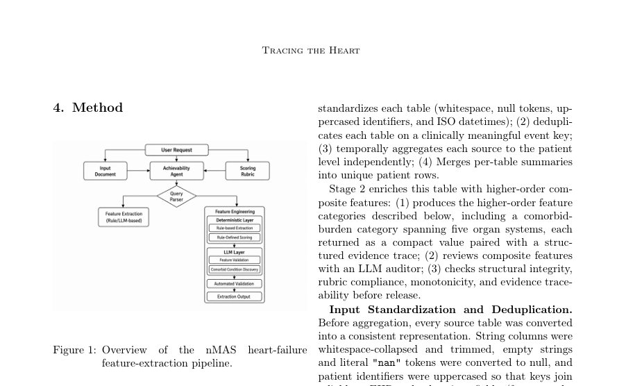

# Tracing the Heart: An Evidence-Linked Pipeline for Heart-Failure Feature Engineering

- **게시일:** 2026-08-07
- **arXiv:** [2608.06366v1](http://arxiv.org/abs/2608.06366v1) · [PDF](https://arxiv.org/pdf/2608.06366v1)
- **저자:** Soorya Ram Shimgekar, Michelle Hu, Dorisa Shehi, Daniel Kang, Roy Ka-Wei Lee, Koustuv Saha, Christian Poellabauer, Christopher Lee, Sajeev Singh, Piyum Zonooz, Navin Kumar, Zeeshan Ahmed, Priyadarshini Kachroo
- **분야:** cs.AI, cs.LG
- **선정 점수:** 6.21
- **선정 이유:** 최근성 0.8, 인용 영향 0.0 (인용 0회), 저자 영향 1.7 (최고 h-index 18), AI 주제 적합성 3.0, 개발자 관심 0.2, 학술 신호 0.5, 오픈 웨이트·주요 연구조직 신호 0.0

[← 2026-08-07 목록으로 돌아가기](../daily/2026-08-07.html)

<!-- paper-visuals:start -->
## 주요 Figure

> 원문 PDF에서 실제 Figure 캡션과 그림 영역이 함께 확인된 자료만 자동 추출했다.

*Figure · 원문 PDF 4쪽 · Figure 1: Overview*

<!-- paper-visuals:end -->

## 한 문장 요약

가이드라인·근거 기반의 버칙(rubric)과 증거연결(evidence-linked) 추적을 포함한 Nimblemind Multi-Agent System(nMAS)을 통해 단일기관 EHR(9개 테이블, 500환자)에서 심부전용 집계 피처(132개 구조적, 70개 루브릭 점수형)를 자동 생성·검증하고 LLM 감사를 적용한 파이프라인을 제안했다.

## 해결하려는 문제

임상 연구와 의료 AI에서 EHR 특성 공학(feature engineering)은 이질적이고 분산된 소스(진단, 약물, 검사, 영상 등)를 가이드라인 기반의 임상적 해석과 결합해 환자 수준의 재현 가능한 변수를 만드는 과정으로, 데이터 과학자 작업의 큰 부분(약 39–45%)을 차지한다. 기존의 규칙 기반 방식은 유지관리와 근거 추적이 어렵고, LLM 기반 방법은 유연하지만 근거·재현성·레이블 누수 위험과 같은 한계로 심부전 같은 복합 질환의 임상적 정의를 완전 자동화하기에 부족하다.

## 핵심 기여

- 증거연결(evidence-linked)·루브릭(rubric)-기반의 다중에이전트 파이프라인 nMAS를 설계·구현하여 심부전 특화 피처 공학을 자동화함.
- 500개의(dummy) 환자, 9개 EHR 소스 테이블에서 Stage1(표준화·중복제거·환자 수준 집계)으로 132개의 구조화 컬럼을 생성하고 Stage2로 버칙 적용 집계 피처 70개를 생성·추적 가능한 근거(trace)와 함께 산출함.
- 버칙 생성 및 행(row) 감사에 소형·제한적 LLM(Qwen 2.5-1.5B-Instruct)을 사용하고, 감사 응답과 교정 가능 필드를 엄격히 제한해 증거·수정 내역을 추적 가능하게 함.
- 집계 피처를 추가했을 때 HFrEF AUROC을 0.895→0.963, HFpEF AUROC을 0.870→0.910으로 개선함(5-fold CV 반복 실험).
- Claude Opus 4.8 기반의 구성타당성(construct-validity) 평가에서 전체 정규화 점수 81.5%를 획득하고, 범주별 점수(예: 혈액 93.8%, 치료 권고 38.5%)를 보고함.

## 접근 방법

* 파이프라인은 요청에 따라 사용 가능한 소스·피처 지원 여부를 판단하는 Achievability Agent와 Query Parser를 통해 라우팅된다.
* 본문 상세는 피처엔지니어링 파이프라인으로, Stage1과 Stage2로 구분된다.
* Stage1은 입력 표준화(공백·null 정리, ISO datetime 변환), 임상 의미 키 기반 중복제거, 이벤트별 환자 수준의 시계열 집계(카운트, 최초/최신 타임스탬프, 가용성 지표) 및 테이블 병합을 수행해 환자당 단일 행(500개 환자, 132 컬럼)을 생성한다.
* Ejection fraction(흔히 범위로 기록)을 저·고·중점값으로 파싱해 최저·최고·최신 EF와 충돌 플래그를 계산한다.
* Stage2는 버칙(rubric) 기반의 결정론적 점수엔진을 적용해 8개 범주(예: disease severity, cardiovascular risk, 다섯 개 장기별 comorbid burden, demographic vulnerability, phenotype, care/gap 관련 등)의 집계 피처를 생성한다.
* 버칙은 Qwen 2.5-1.5B-Instruct로 문헌을 수집해 초안을 만들고 전문 심장내과의사가 검토·승인한 형태로 버전 관리된 JSON로 구현되며, 각 구성요소별 점수 합산을 100으로 캡(upper cap)하고 점수 구간(>=55 high, 25–54 medium, <25 low)으로 분류한다.
* 심부전 phenotype은 EF midpoint 기준(<=40 HFrEF, <50 HFmrEF, >=50 HFpEF)을 우선하고, 수치 EF가 없으면 ICD-10 진단으로 결정하되 중복 부여는 없음.
* 각 행은 Qwen 2.5-1.5B-Instruct 기반의 로컬 LLM 감사자로 검토되며(수정 가능 필드 화이트리스트 적용, *_json·*_explanation 필드는 보호), 수정 응답과 모델 정보가 로그된다.
* 추가적으로 고정 후보 13개 질환에 대해 증거 열을 식별하는 comorbid-condition discovery 단계와 구조·루브릭 준수·증거 추적성을 확인하는 자동화된 검증 허니스(harness)를 실행한다.
* 다운스트림 성능 평가는 XGBoost 분류기(하이퍼파라미터: max_depth=3, n_estimators=100, learning_rate=0.05, gamma=1.0, min_child_weight=3, subsample=0.8, colsample_bytree=0.8)로 HFrEF vs phenotype-unknown, HFpEF vs phenotype-unknown 이진 과제에 대해 5-fold stratified CV를 10회 반복(총 50 테스트 평가)하여 비교했다.
* 또한 Claude Opus 4.8을 이용해 독립적인 LLM 기반 구성타당성 평가를 수행하고, LLM 단독 비교자로 Claude에 동일 원시 EHR을 주어 피처를 생성하게 한 실험을 수행했다.

## 주요 결과

- Stage1 병합으로 9개 소스 테이블이 환자 수준으로 집계되어 500환자에 대해 정확히 1행/환자, 총 132개의 구조화 컬럼이 생성됨.
- Stage2에서 버칙에 따라 8개 범주로 총 70개의 집계(루브릭 점수형 포함) 컬럼을 생성하고 모든 500행을 Qwen 2.5-1.5B-Instruct로 감사함. 각 집계값은 기여 구성요소, 점수, 소스 컬럼, 입력 가용성 정보를 포함하는 구조적 증거 추적을 반환함.
- 데이터 특성: 수치 ejection fraction은 500명 중 15명(3.0%)에서만 관측되어 진단명 대체 논리가 빈번히 사용됨. BNP/NT-proBNP 가용성은 30.8% (154/500), troponin은 85.8% (429/500)였음(본문 표1).
- 예측 성능 개선(교차검증 평균 ± std, 5-fold ×10 반복): HFrEF—베이스라인 AUROC 0.895 ± 0.046 → 집계 추가 AUROC 0.963 ± 0.028; 정확도 0.776 ± 0.065 → 0.896 ± 0.049; F1 0.776 ± 0.063 → 0.894 ± 0.052. HFpEF—베이스라인 AUROC 0.870 ± 0.042 → 집계 추가 AUROC 0.910 ± 0.040; 정확도 0.752 ± 0.056 → 0.809 ± 0.061; F1 0.758 ± 0.058 → 0.812 ± 0.059.
- SHAP 중요도 분석에서 HFrEF 상위 10개 특성 중 6개가 본 파이프라인의 집계 피처였고(예: demographic vulnerability adjusted gap, disease severity adjusted gap 등), HFpEF에서는 disease severity score가 주요 집계 예측인자였음(상세 등급은 Appendix Table 12).

## 한계

- 저자가 명시한 한계: 평가가 단일 기관의 dummy(모의) 코호트 500명으로 수행되어 통계적 검정력과 외적 일반화 가능성이 제한됨; 평가 대상은 phenotype-unknown을 포함한 심부전 코호트 내에서의 phenotyping(질환 탐지 대상이 아님)으로, 비심부전 대조군에 대한 성능은 평가하지 않음; 평가가 내부 일관성·루브릭 준수·증거 추적성·하위 분류 성능 중심이어서 외부 임상 유효성(독립 판정자 기반 레이블, 환자 결과)은 평가되지 않음; 일부 집계 피처가 phenotype 관련 증거를 포함해 피처-라벨 중복(feature-label overlap)의 위험이 존재함; 정규표현식 기반 추출은 기관 특이적 언어·비정형 표기 누락 가능성이 있음; 임상가 검토는 루브릭과 대표 출력에 한정되어 전체 코호트 전체 검토는 아님.
- 본문에서 합리적으로 확인되는 제약(추론 가능한 한계): 수치 EF 가용성이 매우 낮음(3%)으로 인해 phenotype 결정의 신뢰도가 입력 데이터 분포에 크게 의존하고, 다른 기관에서는 EF 기록 관행이 달라 성능 변화가 클 수 있음; LLM 감사는 화이트리스트로 수정 가능한 필드를 제한하나 여전히 LLM의 오답·불확실 응답(파싱 실패는 감사 실패로 기록) 위험이 존재하며 감사 모델의 한계가 전체 파이프라인 신뢰성에 영향을 줄 수 있음; 단일기관·단시점 검증이므로 시간분리 검증 및 외부기관 검증이 필요함.

## 개발자 관점

- 버칙을 버전 관리된 JSON으로 분리해 임상 지식(루브릭)과 실행 엔진을 분리하면 유지관리성과 재사용성이 좋아지며, 다른 만성질환에 동일 인프라를 재사용 가능함(버칙만 교체).
- 모든 집계 피처에 대해 원천 컬럼, 기여 점수, 설명문, 입력 가용성 플래그를 포함하는 구조적 증거 추적을 보관하면 감사·재현·규제 심사에 유리함. *_json과 *_explanation 필드처럼 증거 추적 필드는 불변(protected) 처리할 것.
- 결측과 미기록(unrecorded)을 구별하는 'missingness guardrails'를 유지하라(논문은 결측을 0으로 대체하지 않음). 임의 대체(imputation)를 제거하면 심부전과 같이 결측 자체가 임상 의미를 가질 때 유리함.
- LLM을 루브릭 초안 작성 및 감사에 제한적으로(작고 로컬로 실행 가능한 모델, Qwen 2.5-1.5B-Instruct 사용) 적용하면 유연성과 비용·위험을 균형있게 유지할 수 있으나, 최종 버칙·가중치는 임상의 검토로 확정해야 함.
- 재현 가능한 검증 허니스(구조적 무결성, 루브릭 준수, 단조성 검사, 증거 추적성 검사)와 교차검증 재현(5-fold ×10 반복) 및 SHAP 기반 중요도 분석을 통합하면 피처 기여도를 기술적으로 설명 가능하게 만들 수 있음; 하지만 외부·시간분리 검증과 독립 판독자 기반 레이블은 필수적으로 추가해야 함.

**근거 범위:** 이 분석은 제공된 논문 PDF 본문 전체(본문과 부록 포함)를 근거로 작성되었다. 본문에 명시된 수치(환자수 500, 9개 테이블, 132 구조화 컬럼, 70 집계 피처, AUROC/정확도/F1 수치, LLM 및 모델 구성 등)를 직접 인용했으며, 논문에 명시되지 않은 실행 시간·연산 비용·시스템 리소스 등은 기술하지 않았다. PDF에서 추출 가능한 모든 관련 정보는 반영했으나, 원시 코드·실행 로그·원기관 실제 환자 데이터는 공개되어 있지 않아 재현 관련 세부(예: 실행 시간, 메모리 사용량)는 확인 불가하다.
