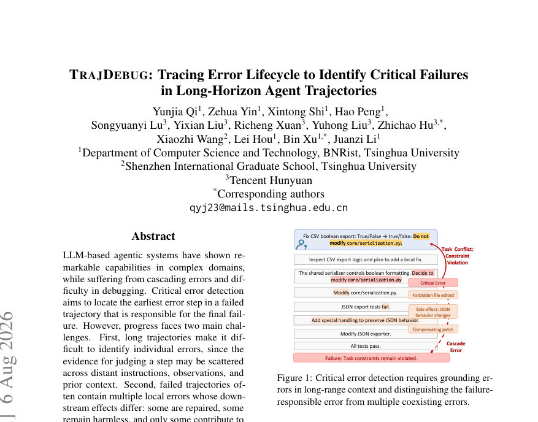
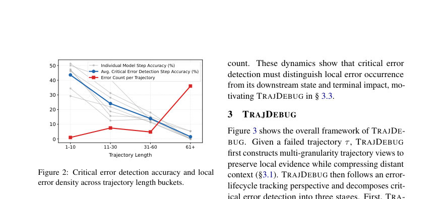
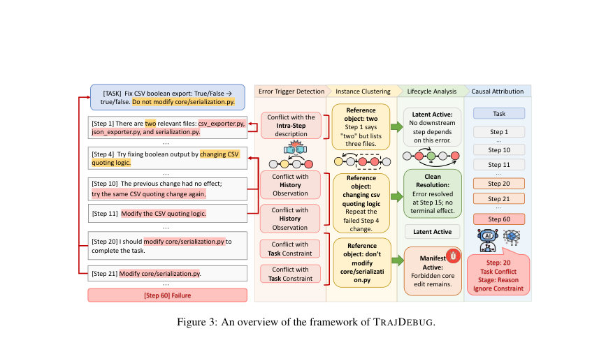

# TRAJDEBUG: Tracing Error Lifecycle to Identify Critical Failures in Long-Horizon Agent Trajectories

- **게시일:** 2026-08-07
- **arXiv:** [2608.06346v1](http://arxiv.org/abs/2608.06346v1) · [PDF](https://arxiv.org/pdf/2608.06346v1)
- **저자:** Yunjia Qi, Zehua Yin, Xintong Shi, Hao Peng, Songyuanyi Lu, Yixian Liu, Richeng Xuan, Yuhong Liu, Zhichao Hu, Xiaozhi Wang, Lei Hou, Bin Xu, Juanzi Li
- **분야:** cs.AI
- **선정 점수:** 6.34
- **선정 이유:** 최근성 0.8, 인용 영향 0.0 (인용 0회), 저자 영향 1.5 (최고 h-index 10), AI 주제 적합성 3.0, 개발자 관심 0.6, 학술 신호 0.6, 오픈 웨이트·주요 연구조직 신호 0.0

[← 2026-08-07 목록으로 돌아가기](../daily/2026-08-07.html)

<!-- paper-visuals:start -->
## 주요 Figure

> 원문 PDF에서 실제 Figure 캡션과 그림 영역이 함께 확인된 자료만 자동 추출했다.

*Figure · 원문 PDF 1쪽 · Figure 1: Critical error detection requires grounding er-*

*Figure · 원문 PDF 3쪽 · Figure 2: Critical error detection accuracy and local*

*Figure · 원문 PDF 4쪽 · Figure 3: An overview of the framework of TRAJDEBUG.*

<!-- paper-visuals:end -->

## 한 문장 요약

장기간 에이전트 실행 궤적에서 근거 기반 트리거 탐지, 오류 인스턴스 상태 추적(해결/단말영향) 및 후보 집합 기반 인과 귀속을 결합한 TRAJDEBUG로 실패 궤적의 결정적(critical) 오류 단계를 자동 식별한다.

## 해결하려는 문제

LLM 기반 에이전트의 실패 궤적은 수백 단계에 이르며(장거리 문맥), 오류 판단에 필요한 근거가 멀리 흩어져 있고 동일 궤적에 다수의 지역적 오류가 공존한다. 이로 인해 (1) 개별 오류를 근거있게 식별하기 어렵고, (2) 여러 지역 오류 중 실제 최종 실패를 초래한 결정적 오류만을 가려내기 어렵다. 기존의 범주/제약 기반 방법은 후보를 좁히되 중요성 판정이 취약하고, 인과-귀속 방법은 이후 수리 시도나 피드백으로 인해 판정이 모호해질 수 있다.

## 핵심 기여

- TRAJDEBUG: 오류 트리거 탐지, 오류 인스턴스 상태 분류, 후보 집합 기반 인과 귀속의 세 단계 파이프라인을 제안해 장기 궤적의 결정적 오류를 식별한다.
- 멀티-그레인(다중 세분도) 히스토리 압축 설계로 지역 근거는 보존하고 장거리 문맥은 압축하여 근거검증 기반 트리거 탐지를 가능하게 함.
- 위반된 참조 객체(reference object) 기준으로 트리거를 클러스터링하여 오류 인스턴스를 만들고, 각 인스턴스에 대해 해결 여부와 단말 흔적(irreversible / semantic / budget-debt)을 추적해 결정적 후보를 필터링함.
- TRAJERRBENCH: τ2-Bench(400)와 SWE-Bench Pro(86)를 포함한 총 486개의 수동 주석된 실패 궤적 벤치마크를 구축하여 장기 도구 활용·코딩 시나리오에서 평가 가능하게 함.
- 광범위한 에이전트 벤치마크에서 기존 직접 프롬프트 및 다중 에이전트 진단 기법보다 평균 성능이 우수함을 보이고, 진단 결과를 피드백으로 사용해 에이전트 성공률을 실험적으로 향상시킴.

## 접근 방법

* TRAJDEBUG는 세 단계로 동작한다: (1) 멀티-그레인 히스토리 압축: 각 스텝에 대해 high-detail(th1, 최대 3000자), medium-detail(th2, 1200자), low-detail(th3, 600자) 뷰를 생성하여 현 단계의 고밀도 근거는 유지하고 먼 역사(context)는 압축해 보관한다.
* 각 판정 단계는 필요한 가장 미세한 뷰를 불러온다.
* (2) 오류 트리거 탐지: 각 스텝에 대해 '트리거' e=(t,c,p,qw,qr)를 추출한다.
* 여기서 qw는 스텝의 잘못된 커밋(잘못된 주장), qr은 위반된 참조(태스크 지시, 이전 궤적 맥락, 환경 반응, 혹은 동일 스텝)에 대한 인용문이다.
* 트리거는 반드시 verbatim 인용(qw와 qr)을 포함해야 하며, 주석화된 분류 축은 참조 범주 c={Task Conflict, History Conflict, Intra-Step Conflict, Environment Anomaly}와 실행 단계 p={planning, reasoning, action, observation, verification}이다.
* (3) 오류 인스턴스 클러스터링 및 상태 분류: 동일한 위반 참조 객체 O를 공유하는 트리거들을 하나의 인스턴스 E=(E,O)로 묶어 반복적 표현을 하나의 오류 인스턴스로 처리한다.
* 각 인스턴스에 대해 (a) 해결 여부(resolved vs active) 판정(해결은 후속 단계가 명시적으로 O를 다시 다루어 기각·수정하는 경우), (b) 단말 흔적 여부 판단(irreversible state change, semantic footprint, 또는 budget debt).
* budget-debt 임계값 k=50%를 사용해 경과 자원(궤적의 절반 초과 소모)을 비용성 흔적으로 정의한다.
* 단말 관련 상태 {CostlyResolution, ManifestActive}를 후보 집합 F(τ)에 유지한다.
* (4) 후보 집합 기반 인과 귀속: 각 후보의 최초 발생 스텝·상태·증거를 LLM에 제공하여 결정적 오류 스텝을 선택한다.
* 후보가 모두 실제 실패를 설명하지 못하면 엄격한 증거 요구(누락된 트리거·위반 참조·원점 스텝·단말 흔적을 설명) 조건에서 out-of-set 예측을 허용한다.
* 구현상 기본 백본은 Qwen3-235B-A22B-Thinking, 온도 0로 고정하여 실험을 수행함.

## 주요 결과

- 데이터셋: TRAJERRBENCH 총 486개(τ2-Bench 400, SWE-Bench Pro 86; 평균 길이 각각 29.3, 119.7 스텝)와 기존 WhoAndWhen/AgentDebugBench 등 포함 총 평가 궤적 869개로 평가.
- 종합 성능: TRAJDEBUG의 매크로 평균 정확도는 34.11%로 직접 프롬프트(동일 백본 기준 25.69%) 대비 +8.42pp 개선을 보고함(문헌표기 기준).
- 도메인별 성능 예시: τ2-Bench에서 52.75% 정확도, SWE-Bench Pro에서 24.41% (Table 1/2의 수치). 장기 궤적(bucket별) 분석에서 다른 방법들이 길어질수록 급격히 성능 하락(짧은 궤적 35–50% → 긴 궤적 <15%)하는 반면 TRAJDEBUG는 가장 긴 버킷에서도 20% 이상을 유지하여 장기 안정성에서 우세함.
- 구성요소 기여(절단 실험): 멀티-그레인 압축을 제거하면 AVG가 17.56%로 가장 큰 성능 하락을 보였고, 트리거 근거화 제거 시 AVG 33.59%, 상태 분류 제거 시 AVG 31.27%로 각각 성능 저하를 확인함(Table 2).
- 응용 실험(피드백으로서의 가치): (a) per-trajectory repair(오라클 실패 라벨 제공)에서 GLM-5.1 배우자에 피드백을 주는 방식으로 평균 성공률을 약 +10.8% 향상시켰고(예: Airline 78.0→90.0, Retail 84.21→95.61, SWE 72.0→81.0), (b) failure-memory 전이 실험에서 소수의 실패로 구성한 메모리를 미지 작업에 주입하면 평균 약 +5.7% 개선을 보고함(Table 3).

## 한계

- 저자가 명시한 한계: (1) TRAJDEBUG는 여전히 LLM에 의존해 오류 해석 및 최종 귀속을 수행하므로 모델의 추론력·도메인 지식·보정(calibration)에 민감하다. (2) 단계형 파이프라인 특성상 초기 트리거 탐지나 상태 분류 단계의 false negative가 있으면 최종 후보 집합에서 진짜 결정적 오류가 누락될 수 있다. 이를 보완하기 위해 귀속 단계는 엄격한 증거 요구를 충족하면 out-of-set 예측을 허용하지만 여전히 한계가 존재한다.
- 본문에서 확인되는 추가 제약(근거 기반): (1) 절대 성능이 아직 낮음 — 전체 정확도(34.11%)는 개선되었으나 많은 경우 정확한 스텝을 찾지 못함. (2) 후보 보존률: TRAJDEBUG가 최종 귀속에 넘겨준 후보 집합에 인간 주석의 정답 단계가 포함되는 비율은 42.0%에 불과(표 12), 즉 초기 단계의 트리거 누락 문제가 잔존. (3) 실패 모드 분해: 실패의 주요 원인은 Trigger Miss(42.1%)와 Attribution Miss(40.1%)로, 상태 분류단의 손실은 상대적으로 적음(17.7%) — 즉 트리거 검출 및 최종 후보간 판별이 주된 개선 지점이다. (4) 계산 비용·실행 복잡성: 논문이 보고하는 토큰 소모 수치(TRAJDEBUG 1,382,243 토큰, direct prompting 34,530 토큰)는 매우 큰 차이를 보여 파이프라인형 접근의 계산·추론 비용이 높음을 시사한다(논문 표기대로 인용). (5) 주석의 일관성: 긴 코드 중심 궤적(SWE-Bench Pro)에서 주석자 간 일치도(Fleiss’ κ=0.67) 가 낮아(논문 보고) 결정적 오류 정의 자체가 어려운 경우가 있음.

## 개발자 관점

- 재현·구성: 파이프라인을 세 단계(트리거 탐지→인스턴스 클러스터링·상태 분류→후보 기반 귀속)로 구현하라. 각 단계는 서로 다른 압축 뷰(th1/th2/th3)를 사용하도록 설계해야 장거리 문맥에서 근거를 보존하면서 추론비용을 줄일 수 있다.
- 트리거 근거요구: 트리거는 'wrong_content_quote'와 'reference_quote'의 verbatim 인용을 필수로 요구해 주관적·헐루시네이션 진단을 줄여라. 출력 포맷은 JSON 구조로 엄격히 고정해 downstream 파이프라인 자동화를 용이하게 하라.
- 인스턴스 클러스터링 원칙: 같은 ‘위반 객체(I)’를 기준으로 클러스터링하라(같은 규칙·동일 prior observation·동일 self-claim 등). 재발현된 표현은 단일 인스턴스로 병합하고, ‘수리 후 재발’은 별도 인스턴스로 분리하라.
- 상태 분류 운영화: 해결 여부와 단말 흔적(irreversible/semantic/budget-debt)을 판정하고 budget-debt 임계값을 k=50%로 설정한 구현은 실험적으로 유효했다. 단, k 값은 도메인에 따라 조정 검토 필요.
- 귀속 단계 설계: 최종 귀속은 후보 집합과 각 후보의 verbatim 근거를 LLM에 제공해 선택하도록 하라. 후보가 전부 실패를 설명하지 못하면 모델이 누락된 트리거·위반 참조·원점 스텝·단말 흔적을 명시적으로 제시하게 해 out-of-set 예측을 엄격히 검증하라. 또한 온도 0 고정 등 재현성 설정을 권장한다. 구현 시 계산 비용(토큰 소모)이 크게 증가할 수 있으니, 비용 대비 성능을 고려해 후보 수 제한·뷰 길이·LLM 호출 횟수를 튜닝하라.

**근거 범위:** 이 분석은 사용자에게 제공된 논문 PDF 본문(페이지 1–24의 텍스트)을 기반으로 작성되었음. 표와 본문에 명시된 수치(예: 정확도, TRAJERRBENCH 규모, 평균 스텝 길이, ablation·토큰 사용량 등)는 PDF 본문에서 직접 추출·요약하였다. 다만 논문이 보고한 토큰 소모(예: TRAJDEBUG의 1,382,243 토큰)는 표기된 값이 실험 집합 전체 합계인지 혹은 평균치인지 해석상의 혼동 여지가 있어(본문에서는 '평균 토큰 소비'라 표기) 그 점을 명시했음. 나머지 수치와 방법·제한·실험 구성은 본문에 근거해 정리했으며, 본문 밖의 추가 구현·하이퍼파라미터 세부사항은 재구성하지 않았다.
