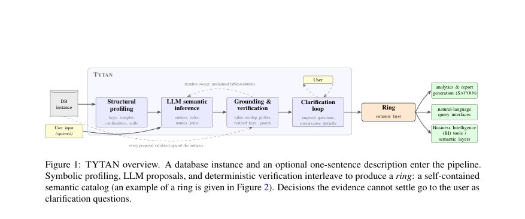
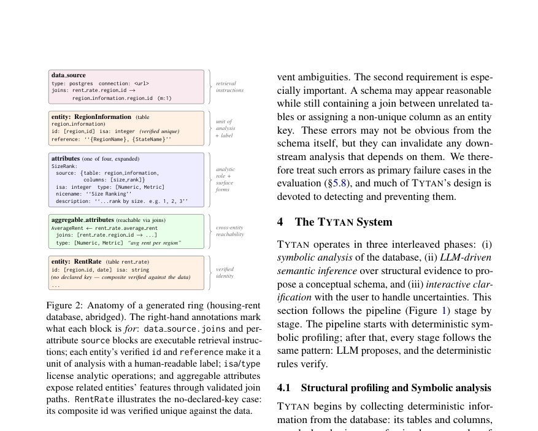
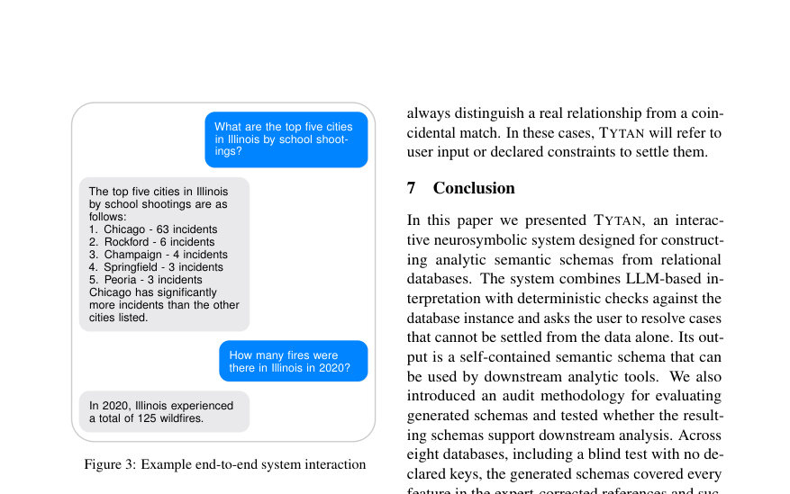

# Tytan: Interactive Neurosymbolic Construction of Analytic Semantic Schemas from Relational Data

- **게시일:** 2026-08-08
- **arXiv:** [2608.06331v1](http://arxiv.org/abs/2608.06331v1) · [PDF](https://arxiv.org/pdf/2608.06331v1)
- **저자:** Donna Hooshmand, Shubham Shahi, Cameron Barrie, Abhratanu Dutta, Marko Sterbentz, Harper Pack, Kristian J. Hammond
- **분야:** cs.DB, cs.AI
- **선정 점수:** 4.10
- **선정 이유:** 최근성 0.5, 인용 영향 0.0 (인용 0회), 저자 영향 0.0 (최고 h-index 0), AI 주제 적합성 2.8, 개발자 관심 0.2, 학술 신호 0.6, 오픈 웨이트·주요 연구조직 신호 0.0

[← 2026-08-08 목록으로 돌아가기](../daily/2026-08-08.html)

<!-- paper-visuals:start -->
## 주요 Figure

> 원문 PDF에서 실제 Figure 캡션과 그림 영역이 함께 확인된 자료만 자동 추출했다.

*Figure · 원문 PDF 3쪽 · Figure 1: TYTAN overview. A database instance and an optional one-sentence description enter the pipeline.*

*Figure · 원문 PDF 5쪽 · Figure 2: Anatomy of a generated ring (housing-rent*

*Figure · 원문 PDF 14쪽 · Figure 3: Example end-to-end system interaction*

<!-- paper-visuals:end -->

## 한 문장 요약

TYTAN은 관계형 데이터베이스 인스턴스(및 선택적 한 문장 설명)를 입력받아 심볼릭 프로파일링과 LLM 기반 의미추론을 결합하고 모든 LLM 제안을 데이터 기반 검증으로 걸러낸 뒤, 불확실한 경우에만 사용자에게 명확화 질문을 던져 분석용 의미적 스키마(‘ring’)를 자동 구성하는 인터랙티브 신경-심볼릭 파이프라인이다.

## 해결하려는 문제

오늘날 분석·자연어 질의용 시스템은 컬럼이 어떤 실세계 엔터티의 식별자/측정값/카테고리인지, 테이블 간의 유효한 조인 경로는 무엇인지 등을 담은 의미층(semantic layer)을 필요로 한다. 이 의미층은 보통 수작업으로 작성되어 확장성·유지보수·비전문가 접근성에서 병목이 된다. 기존의 기호적 기법(키/타입 추론 등)은 구조적 증거를 회복하지만 의미적 역할(예: 집계 가능한 측정인지, 단순 ID인지)을 결정하지 못하고, LLM은 의미추론은 잘 하지만 환각(hallucination)·비일관성·근거 없는 조인 제안 등 신뢰성 문제를 갖는다. 연구 질문은 (RQ1) 생성한 스키마가 관련 엔터티·속성을 포괄하는가? (RQ2) 스키마가 적시하는 테이블/컬럼/조인 경로가 실제로 데이터에서 실행 가능한가? (RQ3) 속성들의 분석적 역할(집계 가능/범주/시간 등) 지정이 정확한가? 이 문제들을 실용적·검증 가능한 방식으로 자동화하는 방법이 본문에서 제시된다.

## 핵심 기여

- 분석용 스키마 구성(task definition): 데이터 인스턴스로부터 분석에 필요한 단위(엔터티, id, 속성의 분석적 역할, 검증된 조인 경로, 인간 친화적 표면형)를 갖춘 구조화된 'ring' 표현을 정의함.
- TYTAN 시스템: 심볼릭 구조 프로파일링과 LLM 기반 의미 추론을 교차·보완하고, 모든 LLM 제안을 데이터 기반의 결정적 검증(값 중복·유일성·값중복 검사 등)으로 필터링하며 불가결한 경우에만 사용자에게 초점화된 자연어 질문을 하는 인터랙티브 신경-심볼릭 파이프라인을 설계·구현함.
- 검증 가능한 파이프라인 설계: 조인 후보에 대해 값-중복(value-overlap) 검사, 키-역할 가드(key-role guards), LLM 신빙성 검증 임계치 등을 결합해 스키마의 실행 가능성을 보장하는 절차를 제시함.
- 기능적 평가 프레임워크: 스키마의 실용성을 엔터티·속성 커버리지(reference coverage), 스키마가 제시하는 데이터 검색·조인 지시문의 실행 여부(retrieval correctness), 그리고 속성의 분석적 역할 정확도(characterization accuracy)로 측정하는 평가 체계를 제안하고 적용함.
- 광범위한 실험·케이스: 7개 레퍼런스 도메인(핵심은 SATYRN용 전문가 보정 링)과 1개의 블라인드(메타데이터 없는 FIFA CSV)에 대해 자동 생성된 링들을 평가하고 downstream 플랫폼(SATYRN)과 연계 데모를 수행함.

## 접근 방법

* TYTAN 파이프라인은 세 단계가 교차한다: (1) 구조적 프로파일링(테이블·컬럼·선언된 제약·샘플값·카디널리티·널 비율 수집), (2) LLM 기반 의미추론(엔터티 제안, 속성·이름·초기 분석적 역할 부여, 테이블 분류(entity/link/passthrough/ignore) 및 조인 후보 제안), (3) 결정적 데이터 검증과 명확화(clarification) 루프.
* 핵심 검증 절차는 다음과 같다: (A) 값-중복 검사: 후보 조인 쌍이 공유 값이 전혀 없으면 제거(모든 distinct 값 검사), (B) 키-역할 가드: 이미 primary key이거나 Numeric으로 분류된 컬럼은 외래키 후보에서 제외, 값이 여러 테이블과 중복되는 컬럼(≥3)도 후보에서 제외 등 휴리스틱, (C) LLM 검증: 위 가드를 통과한 후보에 대해 컬럼 이름·타입·샘플값을 LLM에 제공해 의미상 타당성 점검 후 임계치 이상일 때만 수용.
* 속성 유형 결정은 저장형(storage isa: string/integer/float/date/datetime/boolean)과 분석적 역할(type: Identifier/Categorical/Numeric/Datetime/Metric)을 분리해 관리한다.
* 저장형은 선언형 메타데이터나 값 패턴으로 결정하고, 분석적 역할은 LLM이 제안하되 데이터 근거에 따라 보완(숫자값이라도 우편번호 등은 카테고리로 유지).
* 엔터티 식별자(id)는 LLM 제안·선언된 PK·후보 컬럼들을 데이터에서 유일성 검증해 확정한다.
* 데이터 증거로도 결론이 나지 않으면 사용자에게 표적질문(테이블 역할/컬럼 매핑/분류 등)을 던져 답변을 반영하고 파이프라인을 재실행한다.
* 출력은 JSON 형식의 'ring'이며, 엔터티·속성·검증된 조인·집계 가능 속성(aggregable)·명명·참조 템플릿을 포함한다.

## 주요 결과

- 데이터셋: 총 8개 데이터베이스(7개 레퍼런스: wildfire, school-shooting, housing-rent(Zillow), income disparity, Spider의 college/insurance/hospital; 1개 블라인드: FIFA WC2026 CSV 묶음)에서 평가.
- RQ1(커버리지): 7개 레퍼런스 도메인에 대해 TYTAN이 레퍼런스 링의 모든 엔터티·속성·aggregable 속성에 대해 provenance(컬럼 매핑) 기준으로 매칭해 누락 없음(보고된 결과: 레퍼런스 도메인들에서 100% 커버리지, 표로 요약됨).
- RQ2(검색 실행정확성): 생성된 링이 제시한 모든 실행가능성 주장을 데이터에 대해 실행·검증함. 도메인별 self-generated retrieval tests 결과(Table 2): college 325, insurance 145, hospital 854, income 16, zillow 19, school shooting 290, wildfire 38, FIFA(블라인드) 2,071; 총 3,758개의 자기-생성 주장(엔터티 ID 유일성, 속성 매핑, 조인 체인 실행, 레퍼런스 해결)을 모두 실행 성공(100% 통과).
- RQ3(특성화 정확도): 레퍼런스와 매칭된 속성들에 대한 분석적 역할(role) 및 저장형(isa) 일치율이 높음(Table 3). 역할(role) 일치율은 도메인별로 93.9%~100% 범위(예: college 93.9%, hospital 94.7%, 나머지 도메인은 100%), 저장형(isa) 일치율은 대부분 98%~100%로 보고됨. 저자들은 소수의 불일치가 레퍼런스의 오류였음을 추가 점검으로 확인했다고 보고.
- 블라인드 일반화(FIFA): 초기 자동 실행에서 일부 문제(스푸리어스 조인 3건 통과, 놓친 FK 3건)가 발견되었고, 결함 진단 뒤 결정적 규칙을 보강해 재실행한 최종 파이프라인은 7개 또는 8개(판단 기준별) 엔터티와 검증된 키들, 19개 조인을 찾아내고 2,071 자기-검증 주장 모두 100% 통과. 블라인드 기대(사전 고정된 기대 목록) 대비 satisfiable 항목에 대해 모든 주석자(인간 및 LLM 패널)에서 100% recall을 기록함(Table 4).

## 한계

- 저자가 명시한 한계(논문 본문): TYTAN은 관계형·표 형식 데이터에 초점을 맞춤. JSON·이벤트 로그 등 계층적 데이터는 평탄화 후 처리해야 하며, 평탄화 과정에서 원래 구조가 손실될 수 있음. 지식그래프 등 그래프 소스는 범위 밖임.
- 저자가 명시한 한계(조인 복구와 데이터 접근 관련): 조인 발견은 보수적 설계로 동일 엔터티를 다른 표현(예: 한쪽은 ID, 다른 쪽은 이름)으로 저장한 경우 실제 관계를 놓칠 수 있음. 값-중복(value-overlap) 검사는 전체 인스턴스 접근을 가정하므로 샘플만 접근 가능하면 신뢰도가 떨어짐. 메타데이터 제거 시(메타데이터 어블레이션) 조인 복구 성능이 저하될 수 있으며(특히 여러 식별자 공간이 겹치는 경우), 복합키 탐색은 선언된 FK를 후보 생성에 활용하므로 선언이 없을 때 약화됨.
- 사용자 명확화 루프 관련 한계: 명확화는 도메인 지식을 가진 사용자가 있다고 가정(데이터베이스 전문지식은 불필요). 사용자가 없을 때는 AI 제안 기본값을 사용하며, 개별 기본값의 질은 본 연구에서 별도로 평가되지 않음.
- 실험·평가 범위 한계: 레퍼런스 링과 downstream 평가에서 사용한 SATYRN과 같은 소비자와의 호환성은 확인했으나, 다른 스키마 소비자(다른 BI 시스템 등)에 대한 직접적 유용성은 아직 검증되지 않음.

## 개발자 관점

- LLM의 의미추론 역량을 활용하되 결정적 데이터 검증을 반드시 설계하라: 값-중복, 유일성 검사, 선언형 메타데이터 우선 적용 등은 LLM 환각으로 인한 잘못된 조인·키 지정을 크게 줄임.
- 파이프라인은 'LLM 제안 → 규칙적/데이터 기반 검증 → 사용자 명확화' 순환으로 구성해 불확실성만 사람에게 이전하면 자동화 신뢰성을 높일 수 있다. 명확화 질문은 구조화된 식별자와 문맥을 포함해 정형 저장해야 동일 입력에서 재현 가능함.
- 조인 후보 수가 많아지면 LLM 검증 호출 비용과 런타임이 증가하므로 조인 후보 필터링(키-역할 가드, 값-중복 전 필터링 등)과 병렬화·캐싱 전략이 중요하다. 메타데이터가 없을 때는 비용이 약 5배 증가(본문 언급)하므로 대규모 CSV 컬렉션에선 비용/시간 예산을 설계해야 한다.
- 자체 생성한 검증 테스트(엔터티 ID 유일성, 속성 매핑, 조인 체인 실행, 레퍼런스 렌더링)를 자동화된 회귀 테스트로 포함시키면 데이터별 실패를 조기에 검출하고 결정적 수정을 적용하기 쉬움.
- 생성물은 시스템-중립적 JSON('ring') 포맷으로 직렬화하라. 이를 통해 SATYRN 같은 다운스트림 분석 엔진과의 통합이 쉬우며, 다른 소비자와의 호환성 확보를 위해 ring 스펙을 문서화·버전 관리해야 함.

**근거 범위:** 이 분석은 제공된 논문 PDF 본문 전체(본문, 표, 부록 포함)의 텍스트를 근거로 작성되었다. 본문에서 제시한 표(Table 1–7), 실험 절차(§4), 평가 결과(§5)와 한계(§6)를 직접 인용·요약하였다. 단, 초록과 본문 사이에 자기-생성 주장(claims)의 총계(초록의 1,678 vs 본문·표의 합계 3,758 등)처럼 숫자 표기 불일치가 일부 관찰된다. 본 요약은 본문과 표에 명시된 수치(특히 Table 2의 도메인별 카운트와 결론부의 총합)를 우선으로 삼아 작성했으며, 원문에 명시된 작은 불일치는 그대로 보고함.
