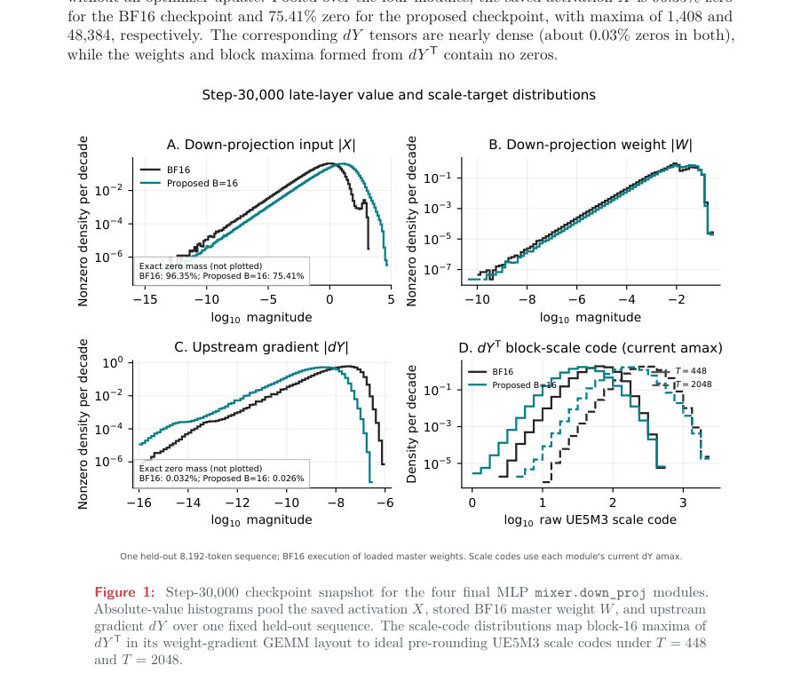
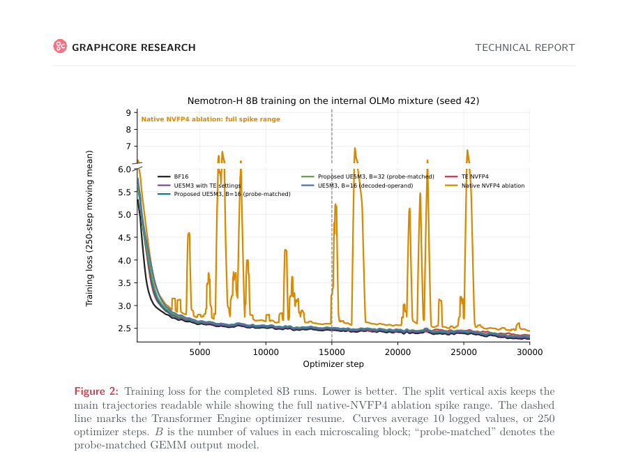
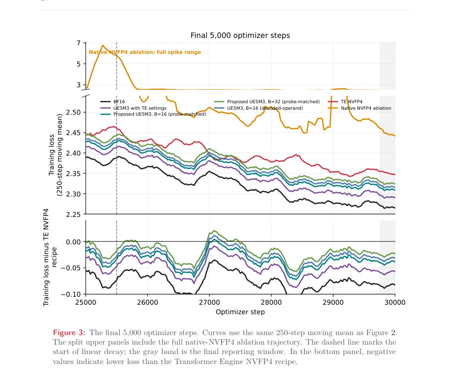

# UE5M3 FP4 Block Scaling for Stable Language Model Pretraining

- **게시일:** 2026-09-04
- **arXiv:** [2609.02846v1](http://arxiv.org/abs/2609.02846v1) · [PDF](https://arxiv.org/pdf/2609.02846v1)
- **저자:** Robert Hu, Carlo Luschi, Paul Balanca
- **분야:** cs.LG
- **선정 점수:** 6.01
- **선정 이유:** 최근성 0.8, 인용 영향 0.0 (인용 0회), 저자 영향 0.0 (최고 h-index 0), AI 주제 적합성 1.9, 개발자 관심 0.2, 학술 신호 0.6, 오픈 웨이트·주요 연구조직 신호 2.5

[← 2026-09-04 목록으로 돌아가기](../daily/2026-09-04.html)

<!-- paper-visuals:start -->
## 주요 Figure

> 원문 PDF에서 실제 Figure 캡션과 그림 영역이 함께 확인된 자료만 자동 추출했다.

*Figure · 원문 PDF 9쪽 · Figure 1: Step-30,000 checkpoint snapshot for the four final MLP mixer.down_proj modules.*

*Figure · 원문 PDF 17쪽 · Figure 2: Training loss for the completed 8B runs. Lower is better. The split vertical axis keeps the*

*Figure · 원문 PDF 18쪽 · Figure 3: The final 5,000 optimizer steps. Curves use the same 250-step moving mean as Figure 2.*

<!-- paper-visuals:end -->

## 한 문장 요약

UE5M3 블록 스케일(E5M3)과 50-스텝 주기적 텐서 스케일링, 역전파의 업스트림 그래디언트에만 선택적 확률적 반올림을 적용하고 RHT를 생략해, UE5M3 블록-16 레시피로 Nemotron‑H 8B를 약 188.7B 토큰 동안 FP4로 안정적으로 사전학습했다.

## 해결하려는 문제

E2M1 페이로드를 쓰는 기존 FP4(E2M1+E4M3/MXFP4) 사전학습은 블록 스케일의 유효 범위가 좁아 스케일 선택·아웃라이어·반올림·누적 민감성 때문에 불안정하다. NVIDIA Transformer Engine의 NVFP4 레시피는 현재-텐서 스케일링(D=1), RHT(무작위 하다마드 변환), BF16 예외(final blocks) 등으로 안정화를 달성하지만, 이들 모두 FP4 GEMM 외부에서 추가 연산·복잡도를 늘린다. 논문은 더 넓은 블록-스케일(UE5M3)이 단순한 레시피로 FP4 사전학습을 안정화할 수 있는지 묻는다.

## 핵심 기여

- UE5M3(E5M3 블록 스케일) FP4 레시피 제안: 연산별(activations/weights/gradients) 50-스텝 주기 sample-and-hold 텐서 스케일(D=50), 2D weight scaling, 역전파의 업스트림 그래디언트(dY)만에 대한 stochastic rounding(SR), RHT 생략, 내부의 모든 eligible linears(총 112개)에 FP4 적용(최종 출력은 FP32 유지).
- Nemotron-H 8B 모델을 seed=42로 각 설정별 1개 trajectory씩, 총 188.7B 토큰(30,000 스텝)에 걸쳐 학습하고 체크포인트별(12개) 양자화된 추론 성능과 다운스트림(OLMES Core9, MMLU, MMLU-Pro MC) 평가를 제공.
- UE5M3 스케일 타깃 T와 stale-maximum(캐시된 amax의 골격) 및 작은 스케일 표현 가능성 사이의 범위 바운드를 유도: 기본 T=448은 약 137×의 성장 헤드룸을 제공하고, T=2048 오버라이드는 약 30×를 보존함을 수치로 제시.
- 하드웨어(Blackwell/Transformer Engine)에서 관찰된 NVFP4 GEMM 출력 동작을 재현하는 소프트웨어 FP4 GEMM 'probe-matched' 수치 모델(64-제품 그룹, 그룹별 FP32 부분합, 그룹 간 추가는 RTZ(round-toward-zero), 최종적으로 1/1024 product-lattice canonicalization)을 식별·검증하고, 이를 통해 소프트웨어 기반 UE5M3 실험을 가능하게 함.
- 네이티브 NVFP4 실행에서 RHT 제거 및 최종-블록 BF16 예외를 없앤(모두 FP4로) 조합 실험에서 모델-바디 토큰 처리량이 21.2% 증가함을 보고하여, UE5M3 블록 스케일의 네이티브 지원 필요성을 주장.

## 접근 방법

* 핵심 설계 요소(논문 본문 기준):
* 형식: 페이로드는 E2M1(부호·2지수·1분수), 블록 스케일은 부호 없는 E5M3(5지수·3분수) 사용(블록 크기 기본 B=16, 제어로 B=32 테스트).
* UE5M3은 E4M3 대비 더 넓은 양수 코드북(최대 61,440) 제공.
* 텐서 스케일링 라이프사이클: 각 operand(activation, weight, gradient)마다 별도 amax 캐시를 두고, sample-and-hold 규칙으로 D=50 스텝마다 amax를 갱신(캐시는 체크포인트에 직렬화하지 않음).
* 이 주기적 지연은 스케일 타깃 T를 통해 블록 코드북의 실수값 창을 슬라이드함.
* 기본 T=448, 단 특정 네 개의 최종 MLP mixer.down_proj 레이어의 Wgrad-dY에 대해 T=2048로 오버라이드.
* 반올림: forward activations, weights, block scales 등은 deterministic ties-to-even(nearest-even).
* 역전파의 upstream gradient(dY) payload만 stochastic rounding(SR) 적용(두 backward GEMM, dX=dY W 및 dW=dY^T X).
* 블록 스케일이 0으로 라운드되면 1로 대체하는 zero-scale 교정 규칙 적용.
* RHT: 제안 레시피는 RHT를 생략(Transformer Engine NVFP4는 weight-gradient GEMM의 saved activation과 output-gradient에만 RHT 적용).
* 2D weight scaling: NVFP4와 동일하게 2D 스케일을 유지하여 forward/backward GEMM 뷰 일치.
* 소프트웨어 GEMM 모델(probe-matched emulator): 네이티브 관찰에 따라 (1) 길이 K의 도트 제품을 64-제품 그룹으로 분할, (2) 각 그룹은 FP32 partial sum으로 nearest-even 반올림, (3) 그룹 합산은 물리적 순서로 진행하고 inexact한 교차-그룹 덧셈은 round-toward-zero(RTZ) 적용, (4) 선택적으로 결과를 1/1024 product-lattice에 ties-to-even로 canonicalize(토치 구현: torch.round(1024*c)/1024).
* 이 에뮬레이터는 네이티브 출력과 결정론적 비교에서 높은 일치를 보였음.
* 학습·추론 설정: Nemotron-H 8B(52 hybrid blocks) 구성, 시퀀스 길이 8192, 글로벌 배치 768, AdamW, 학습 스케줄 등은 NVFP4 논문 설정과 가능한 범위에서 일치시키되 전체 토큰 수는 1T 대비 단축(188.7B 토큰).
* 추론 시 activation 스케일 정책은 세 가지 중 선택: delayed D=50(본 연구 주요), current D=1(TE 설정 감도), calibrated frozen(64 calibration sequences).
* delayed 정책은 순서 의존성을 가지므로 평가는 고정 요청 순서를 사용.

## 주요 결과

- 완전 학습(30,000 스텝, 188.7B 토큰) 주요 학습 손실(마지막 250-스텝 윈도우 10개 로그 평균): BF16(비양자화) 윈도우-평균 2.2651(엔드포인트 2.2620). Transformer Engine NVFP4 레시피(네이티브) 윈도우-평균 2.3474(엔드포인트 2.3349). 제안된 UE5M3 FP4 블록-16(probe-matched) 윈도우-평균 2.3090(엔드포인트 2.3065). UE5M3 FP4 with Transformer Engine settings(UE5M3 포맷이나 D=1 등 TE 세팅) 윈도우-평균 2.2902(엔드포인트 2.2874)로 평가된 FP4 중 가장 낮은 최종-윈도우 손실을 기록.
- 네이티브 NVFP4 no-RHT/all-linears(ablation, D=1) 경로는 반복적 손실 스파이크를 보이며 최종-윈도우 손실 2.4420으로 매우 불안정함(엔드포인트 2.4391). 제안 레시피(D=50, RHT 생략, 모든 eligible linears FP4)는 같은 조건 하에서 안정적으로 수렴함.
- 체크포인트별(12개) 양자화된(FP4 fake quant) held-out negative log-likelihood(NLL) 결과(검증 스트림 고정, 6,291,456 토큰): BF16 2.27834(비양자화), 제안된 UE5M3 블록-16(probe-matched, delayed D=50) 2.32230, Transformer Engine NVFP4(recipe, current D=1) 2.32592, UE5M3 with TE settings 2.30376(최저 FP4 NLL). 제안 블록-16은 12개 체크포인트 중 8개에서 TE NVFP4보다 낮은 NLL을 기록(마지막 4개 체크포인트 모두 포함)하고, step 30,000에서 2.32230 vs 2.32592로 −0.00362 NLL 이득.
- 다운스트림(단일 checkpoint step=30,000, OLMES 기반 multiple-choice) 점수: BF16(Core9) 65.14%. 제안 UE5M3 블록-16(probe-matched) Core9 63.82%, Transformer Engine NVFP4 63.69%, UE5M3 with TE settings 64.43%. 논문은 FP4 간 비교에서 제안 블록-16이 NVFP4 대비 Core9/MMLU/MMLU-Pro MC에서 각각 +0.13, +1.01, +0.01 percentage point(포인트) 높음을 보고함(수치들은 본문 표 참조).
- 네이티브 NVFP4 실행 비용·성능 실험: RHT 유지·최종 16개 선형을 BF16으로 둔 원래 TE 구성(96 FP4 linears, 16 BF16 linears)의 모델-바디(동기화된 forward+backward, 100-스텝) 벽시계 합은 31.877s(3,212 tokens/s). RHT 제거 및 모든 112 eligible linears를 FP4로 전환하면 26.298s(3,894 tokens/s)로 토큰 처리량이 +21.2% 증가(논문 표). 이 측정은 Blackwell/Transformer Engine 네이티브 NVFP4 경로에서 얻은 것임(단 해당 HW는 E4M3 블록 스케일을 지원).

## 한계

- 저자 언급: 본 연구는 단일 시드(seed=42)로 구성된 각 설정별 1개 trajectory만 실행하여 결과가 시드 변이성을 포함한 통계적 불확실성이나 유의성 검정을 제공하지 않음(따라서 비교는 기술적·설명적임).
- 저자 언급: 원 논문의 NVIDIA 8B 설정은 1T-토큰 장기 훈련을 가정하지만 본 실험은 학습 지평을 188.7B 토큰으로 단축했음(데이터 블렌드도 대체됨). 따라서 장기(1T) 성능·경향은 본 결과로 일반화하기 제한적임.
- 저자 언급: 평가 시 delayed 스케일링(inference D=50)은 상태(stateful)이며 요청 순서(order-dependent)를 가지므로 검증/다운스트림 평가는 고정 요청 순서 하의 결정론적 포인트 추정임(실제 서비스에서 순서/동시성에 따른 변동이 있을 수 있음).
- 저자 언급: 평가에 사용된 실험적 네이티브 경로(GB200 Blackwell/Transformer Engine)는 E4M3 블록 스케일을 지원하며 UE5M3는 하드웨어에서 네이티브로 지원되지 않음. 따라서 UE5M3 실험은 소프트웨어 에뮬레이션에 의존하며 하드웨어 지원이 있어야 완전한 네이티브 검증 가능함(저자도 네이티브 UE5M3 지원을 권고). (문헌 근거: 본문 여러 곳 언급).   

분석자 판단: 소프트웨어 probe-matched GEMM 에뮬레이션은 네이티브 출력의 여러 결정론적 검사에서 일치했으나, 다른 HW/드라이버/스택 변종에서는 누적·반올림·병렬 축약(ordering) 구현 차이로 행동이 달라질 수 있어 이식성/일반성에 제약이 있음(본문에서 accumulation-path sensitivity와 GPU-specific 규칙을 상세히 제시함). 

분석자 판단: 데이터 믹스(82% DataComp-LM 등 내부 OLMo 대체)와 단일-호라이즌 단축 때문에 실제 공개 NVFP4 장기 결과와 직접 비교할 때 데이터·기간 차이가 결과에 영향을 줄 수 있음. 

분석자 판단: 블록 크기(B=16 vs 32)와 GEMM 출력 모델(프로브 매칭 vs decoded-operand)에서 소규모 성능 차이가 관찰되어 하이퍼파라미터/수치 모델에 민감함(본문 실험 참조).

## 개발자 관점

- UE5M3 블록-스케일 사용 시 텐서-레벨 스케일을 주기적(예: D=50)으로 갱신하면 RHT 없이도 안정성을 확보할 수 있으므로, 구현 시 각 operand별 amax 캐시(activation/weight/gradient)를 두고 주기 갱신/샘플-앤-홀드 규칙을 적용하라. 단 캐시는 체크포인트에 직렬화되지 않음을 명확히 처리해야 한다.
- 역전파에서 dY 페이로드만 stochastic rounding(SR)을 적용하고 나머지(저장된 activation, weight, block-scale)는 deterministic tie-to-even을 사용하면 작은 그래디언트를 기댓값 관점에서 보전하면서 연산 비용을 낮출 수 있다(실행 시 SR의 난수 비트 품질에 주의).
- 블록-스케일 타깃 T는 트레이드오프(작은 스케일 유지 vs 성장 헤드룸)를 결정하므로 필요시 모듈별 타깃 오버라이드(논문 예: 마지막 네 개 FFN의 Wgrad-dY에 T=2048)를 사용하여 민감 레이어를 보호하라.
- 하드웨어가 UE5M3를 네이티브로 지원하지 않을 경우, 논문에서 제시한 probe-matched GEMM(64-product 그룹, 그룹별 FP32 partial sum, 교차그룹 RTZ, 1/1024 격자 canonicalization)으로 네이티브 출력 행동을 모방해 소프트웨어 실험을 수행할 수 있다. 다만 이 모델은 구현 세부(그룹 크기·RTZ 규칙)에 민감하므로 네이티브 HW 프로브로 검증하라.
- 네이티브 NVFP4 경로에서 RHT 제거 및 최종-블록 BF16 예외를 없애면(모두 FP4로) 모델-바디 처리량이 크게 향상(+21.2% 관찰)하므로, 성능/복잡도 판단 시 BF16 예외 유지 비용과 RHT 오버헤드를 고려하라. 하지만 수치적 안정성은 포맷(UE5M3 vs E4M3), 스케일 주기, SR 정책에 달려 있으므로 레시피 전환 시 충분한 검증이 필요하다(네이티브 ablation에서 RHT 제거만으로는 불안정성 관찰됨).

**근거 범위:** 이 분석은 제공된 논문 PDF 본문(전체 페이지)에 근거해 작성되었음. 제시된 수치(학습 손실, NLL, 다운스트림 점수, 처리량 증감 등)는 본문 표와 서술을 직접 인용했으며, 저자가 명시한 한계와 본문에서 합리적으로 확인되는 한계를 구분해 표기했다. 하드웨어·드라이버별 미세 구현(예: GEMM 내부 스케줄링)에 관한 추가적인 일반화는 본문 외부 정보 없이 제한적으로 판단했음을 밝힌다.
