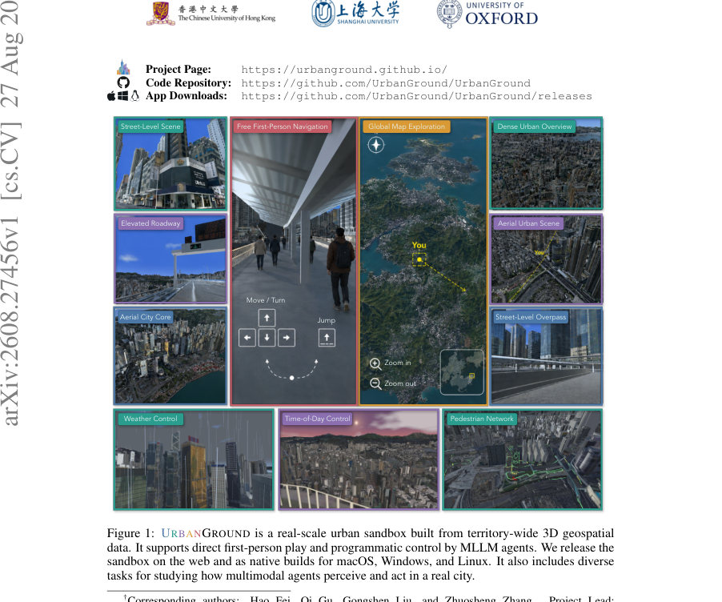
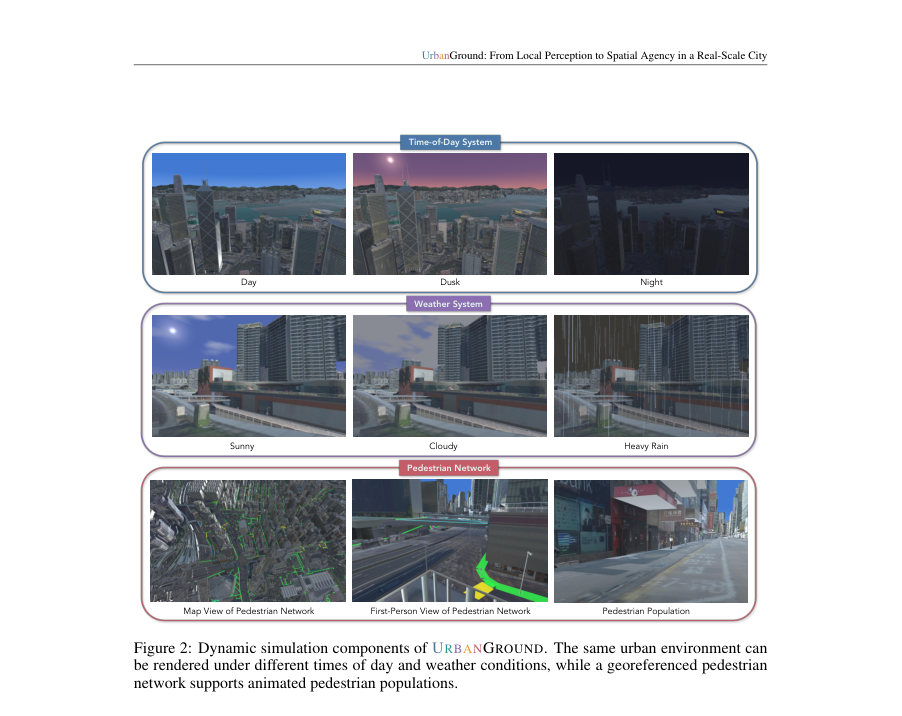
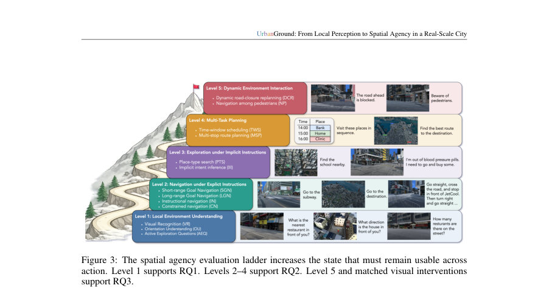

# UrbanGround: From Local Perception to Spatial Agency in a Real-Scale City

- **게시일:** 2026-08-30
- **arXiv:** [2608.27456v1](http://arxiv.org/abs/2608.27456v1) · [PDF](https://arxiv.org/pdf/2608.27456v1)
- **저자:** Tianjie Ju, Zheng Wu, Yueqing Sun, Yuhan Cui, Bobo Li, Shengqiong Wu, Pengzhou Cheng, Haodong Zhao, Zongru Wu, Xinbei Ma, Doris Zhang, Kunling Li, Mong-Li Lee, Wynne Hsu, Hao Fei, Qi Gu, Gongshen Liu, Zhuosheng Zhang
- **분야:** cs.CV
- **선정 점수:** 3.64
- **선정 이유:** 최근성 0.5, 인용 영향 0.0 (인용 0회), 저자 영향 0.0 (최고 h-index 0), AI 주제 적합성 2.6, 개발자 관심 0.2, 학술 신호 0.3, 오픈 웨이트·주요 연구조직 신호 0.0

[← 2026-08-30 목록으로 돌아가기](../daily/2026-08-30.html)

<!-- paper-visuals:start -->
## 주요 Figure

> 원문 PDF에서 실제 Figure 캡션과 그림 영역이 함께 확인된 자료만 자동 추출했다.

*Figure · 원문 PDF 1쪽 · Figure 1: URBANGROUND is a real-scale urban sandbox built from territory-wide 3D geospatial*

*Figure · 원문 PDF 6쪽 · Figure 2: Dynamic simulation components of URBANGROUND. The same urban environment can*

*Figure · 원문 PDF 7쪽 · Figure 3: The spatial agency evaluation ladder increases the state that must remain usable across*

<!-- paper-visuals:end -->

## 한 문장 요약

Hong Kong의 영토 규모 3D 지형 데이터를 Unity로 스트리밍해 실제 지리 프레임에서 MLLM 에이전트의 '로컬 인식 → 지속적 행동(공간 행위성)' 전이를 평가하는 URBANGROUND 샌드박스와 그에 따른 실험적 분석을 제시한다.

## 해결하려는 문제

현대의 멀티모달 대형언어모델(MLLM)은 단일 시점의 거리 풍경을 인식할 수 있지만, 에이전트가 연속적으로 이동할 때 초기 시점의 로컬 증거를 공간적 상태로 유지·갱신하여 목표지향적 행동(도보 네비게이션, 경로 수정 등)을 안정적으로 수행할 수 있는지 불명확하다. 기존 게임·실내·항공 기반 평가들은 상이한 제약(게임 메커닉, 경계가 좁은 실내 공간, 샘플링된 뷰포인트)으로 인해 '로컬 역량이 실제 도시 규모의 연속적 상호작용에서 어떻게 합성되는지'를 직접적으로 평가하지 못한다. 본 논문은 이 한계를 해소하고자 실제 지리(홍콩)를 보존한 실물 규모 도시 복제 환경에서 MLLM 에이전트의 공간 행위성을 체계적으로 측정한다.

## 핵심 기여

- URBANGROUND: 홍콩 전영역의 3D Visualisation Map과 3D Pedestrian Network(정부 데이터)를 기반으로 지리좌표를 보존하는 실물-규모(georegistered) 도시 샌드박스를 Unity로 구현하고 코드·빌드(Windows/macOS/Linux) 및 웹 프로젝트 페이지를 공개함.
- 공간 행위성 평가 사다리(spatial agency evaluation ladder)를 설계해 로컬 인식(시점 기반 QA)에서 시작해 명시적/암묵적 네비게이션, 다중 목표 계획, 동적 환경 적응까지 누적되는 과제를 체계적으로 구성하고 RQ1–RQ3로 연구문제를 정식화함.
- 810개의 수동 검증된 태스크 인스턴스를 도시 전역에 배포하여(다양한 지형·수직 보행 연결 포함) MLLM 에이전트들의 폐쇄형 루프(first-person + interactive map) 상호작용을 대규모로 평가함.
- 여러 최신 상용/연구용 MLLM(GPT-5.5/5.4/5.2, Claude-Opus-5/4.6, Gemini-3.6/3.1, Doubao-Seed-2.0-Pro, GLM-5V-Turbo, Kimi-K3 등)을 동일한 인터페이스·프롬프트로 평가해 '로컬 능력은 존재하지만 장거리/동적 상황에서 역량이 붕괴'한다는 경험적 결론을 제시함.
- 환경·데이터(시간대, 날씨, 보행자 모션, 도로폐쇄)를 통제 가능한 실험 설정을 제공하고, 행동 로그(지리좌표, 고도, heading, 보행자 충돌, 노출 등)를 기록해 실패 모드(예: 경로 회복 실패, 장소 지향성 상실)를 정량적으로 분석함.

## 접근 방법

* URBANGROUND는 세 계층으로 구성된다: (1) 지오스페이셜 레이어: 홍콩 Lands Department의 Cesium 3D Tiles 기반 3D Visualisation Map(텍스처드 메쉬)과 3D Pedestrian Network(연결된 3D 선 피처)를 동일 좌표계(WGS84 → 시뮬레이션 프레임)로 로드해 렌더·충돌 지오메트리를 제공하고, 에이전트 궤적을 지리 좌표로 기록한다.
* (2) 시뮬레이션 레이어: Unity에서 연속적인 1인칭 캐릭터 물리(충돌 포함), 시간-조명 시스템(시간대 고정/진행 가능), 날씨(비·안개 등으로 가시성·표면 변화), 애니메이션 보행자(Rocketbox 아바타 기반 경로를 따라 스폰)를 시뮬레이션한다.
* 보행자 네트워크는 '의도된 보행 가능 공간'을 제공하지만 에이전트를 그래프에 강제하지는 않는다.
* (3) 에이전트 레이어: 외부 MLLM과 클라이언트-서버로 통신하며, 모델이 받는 관측은 첫인칭 RGB(및 제한적 프레임버퍼 히스토리)와 필요시 인터랙티브 맵(경로 계산·하이라이트 없음)이다.
* 모델이 택할 수 있는 행동 공간은 first-person 행동(move/sprint/look/jump/open_map), map 행동(map_select/pan/zoom/orbit/close_map) 및 terminate로 고정되어 있다.
* 평가 사다리는 5레벨(로컬 이해 → 명시적 네비게이션 → 암묵적 탐색 → 멀티태스크 계획 → 동적 상호작용)로 구성되며, 각 레벨에서 동일한 인터페이스·100스텝(최대 약 200초 이동)에 따라 에피소드를 진행한다.
* 성과 지표는 QA 정답 정확도(주석과 일치), 네비게이션 성공(최종 위치가 목표로부터 15m 이내), 보행자 네트워크 준수 비율(PNA), 동적 이벤트별 지표(도로폐쇄 준수, 보행자 충돌 등)이다.
* 프롬프트와 ReAct 형식의 출력 규약, 행동 스키마는 본문과 부록에 상세히 규정되어 있다.

## 주요 결과

- RQ1(로컬 그라운딩): 시점 기반 시각 인식(VR)은 모델별 편차가 있으나 일반적으로 높은 정확도를 보임(예: Gemini-3.6-Flash VR 93.8%, Kimi-K3 92.5%, Claude-Opus-5 91.3%, GPT-5.5 82.5%). 반면 방향성/오리엔테이션(OU)은 전반적으로 낮아 모델마다 큰 차이를 보였고(예: GPT-5.5 OU 40.0%, Gemini-3.1-Pro OU 23.3%, Claude-Opus-5 OU 58.3%), 능동 탐색(AEQ)은 대체로 양호(모델별 46–93%대). 즉 '물체 인식은 잘되지만 방향성 유지가 약함'이 관찰됨. (데이터: Table 1).
- 로컬 행동과 실제 이동은 분리됨: 에이전트가 정답을 맞추는 동안도 보행자 네트워크 준수(PNA)는 완전하지 않았고, 로컬 QA 상황에서도 도로 횡단 등 비현실적 동작을 수행해 규제 위반 사례가 발견됨(예: 일부 AEQ에서 PNA < 70% 사례 존재, Table 1 PNA 열).
- RQ2(그라운딩 → 네비게이션 확장): 명시적 단거리 네비게이션(ShortNav)에서는 특정 모델이 의미있는 성공률을 보이나(예: GPT-5.5 ShortNav 75.0%, Claude-Opus-4.6 ShortNav 75.0%), 장거리(LongNav) 성공률은 거의 붕괴함(많은 모델에서 LongNav 0.0–3.8%). 전체 네비게이션 전반의 가중 평균 성공률도 낮음(e.g., 모델별 Overall navigation success 대체로 8–23% 범위, Table 2). 이로부터 로컬 능력의 '조합(합성)' 실패와 실행 중 오류 누적이 핵심 문제로 도출됨.
- 장거리 실패 상세: LongNav 에피소드의 57.5%는 최종 상태가 초기보다 목표에 가까워졌으나(예: GPT-5.5), 전체 도착 성공은 0%인 경우가 많아 '일시적 진전 후 퇴행'이 빈번함(부록 D: GPT-5.5 관찰값 — 'Closer than start' 57.5%, '≥20% 거리감소' 34.6%, 평균 남은 비율 98.9%). 실패 유형으로는 '도중 정지', '진전 없음', '진전 후 소실', '진전 유지하나 타임아웃'이 보고됨(부록 E).
- RQ3(동적 변화의 영향): 낮은 가시성(황혼·야간·비)은 로컬 QA 정답률을 감소시킴(예: Claude-Opus-5 clear 79.1% → dusk 66.4%), 그러나 단거리 네비게이션에 미치는 영향은 모델마다 일관되지 않음(Table 3). 도로폐쇄 실험에서는 에이전트들이 지도 상 폐쇄 표시는 확인하더라도 폐쇄 이후로 경로를 유효하게 재계획하지 못하는 경우가 많아 '안전한 경로 재계획(SPR)' 비율이 낮음(예: GPT-5.5 SPR 13.3%이지만 PNA는 94.7%로 높아 '지역적으로 그럴듯한 동작은 유지되나 전체 계획 수정은 실패'가 관찰됨). 보행자 충돌률(PCR)은 높은 편으로 실제성·안전성 관점에서 문제를 드러냄(예: GPT-5.5 PCR 83.8%). (표: Table 4).

## 한계

- 저자 명시 한계: URBANGROUND는 홍콩 Lands Department의 3D Visualisation Map·3D Pedestrian Network에 의존해 구축되었으며(데이터 출처 표기), 평가·분석은 해당 지리적·구조적 특성(복잡한 수직 보행 연결, 고밀도·급경사 지형)에 기반한다. 논문은 이 환경이 일반적인 도시 구조를 대표하나, 다른 도시·데이터셋으로의 직접적 일반화는 보수적으로 해석해야 한다고 암시한다.
- 저자가 명시적으로 밝힌 제약들: 평가 인터페이스는 모델에게 위치 좌표·잔여거리·자동 경로 계산 등을 제공하지 않으며(모델은 숨겨진 시뮬레이터 상태에 접근 불가), 보행자 네트워크는 '권장된 보행 가능 공간'으로서만 사용되고 에이전트를 그래프에 고정하지 않는다. 평가 예산은 에피소드당 100 스텝(≈최대 200초 이동)으로 제한된다.
- 본문 및 실험 범위에서 합리적으로 확인되는 추가 제약(추론적 한계): (1) 평가에 사용된 MLLM은 상용·사설 API 포함(예: GPT-5.x, Claude, Gemini) — 접근성·비용 이슈가 재현성에 영향. (2) 맵은 경로 계산을 하지 않도록 설계되어 있어, 실제 자율 네비게이션 시스템에서 사용되는 전통적 최단경로/로컬라이제이션 모듈과의 결합 평가는 이루어지지 않음. (3) 에이전트의 내적 상태(mt)는 모델의 상호작용 컨텍스트(대화 히스토리)에 의존하는데, 외부의 명시적 장기 메모리 또는 SLAM/로컬라이제이션 모듈은 실험에서 제공되지 않아 '장기 상태 보존' 문제의 원인이 모델 내부인지 인터페이스 제약인지 명확히 분리하기 어렵다.

## 개발자 관점

- 재현성·구현: 코드·빌드·프로젝트 페이지(논문 서두에 링크)와 함께 Unity 기반 런타임(3D Tiles 스트리밍, 충돌 지오메트리 생성, 보행자 스폰, 시간·날씨 제어)을 제공하므로 동일 환경 재현 가능. 다만 원저작의 지오데이터(홍콩 Lands Department)는 라이선스·접근 제약을 확인해야 함.
- 모델 접속·비용: 본 논문은 여러 상용 모델(API)를 사용하므로 재현하려면 해당 모델들에 대한 API 접근과 비용 예산이 필요하다. 평가 예산(에피소드당 최대 100 스텝)과 렌더링·시뮬레이션 비용(타일 스트리밍, 보행자 애니메이션)을 고려한 인프라(여러 동시 실험 시 GPU/CPU·네트워크 대역폭) 계획이 필요하다.
- 안전성·제약화: 실험에서 MLLM들이 보행자 네트워크를 벗어나거나 보행자 충돌을 자주 발생시켰으므로 실제 로봇/내비게이션 응용에선 행동 제약을 런타임에서 강제하는 '안전 필터'(collision controller, route legality checker)를 두고 모델 명령을 검증·수정하는 미들웨어가 필요하다.
- 인터페이스 설계: 본 환경은 모델에 위치·거리·경로 정보를 노출하지 않음. 실제 시스템에서 성능을 개선하려면 강한 로컬라이제이션(SLAM), 명시적 지리 메모리(경로 히스토리, 지오태깅), 그리고 맵-모션 동기화 모듈을 결합해 모델의 대화 컨텍스트와 물리 위치를 명시적으로 연결해야 함.
- 연구·개발 우선순위: 장거리 안정성(전역 오리엔테이션 유지), 온라인 재계획(도중 폐쇄·동적 장애물에 대한 빠른 경로 수정), 장소·방향성 보존을 위한 구조적 메모리(지오태그된 관찰 저장소) 개발이 URBANGROUND에서의 성능 향상에 직접적 영향이 클 것으로 보임.

**근거 범위:** 본 분석은 제공된 논문 PDF 본문(제공된 모든 페이지, 본문·표·부록 포함)의 텍스트와 표를 근거로 작성되었음. 인용한 정량값(정확도·성공률·PNA·SPR·PCR 등)은 논문 본문의 표(Table 1–6, 부록 D,E)에 표기된 수치에 기반한다. 논문에 명시되지 않은 내부 구현·하이퍼파라미터·비공개 모델의 세부 설정 등은 추정하지 않았으며, 모델별 API 세부 비용·실행 환경은 문서에 상세히 나오지 않아 재현시 별도 확인이 필요함.
