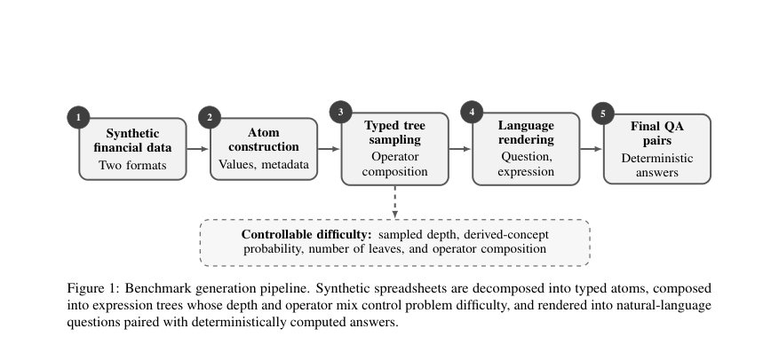
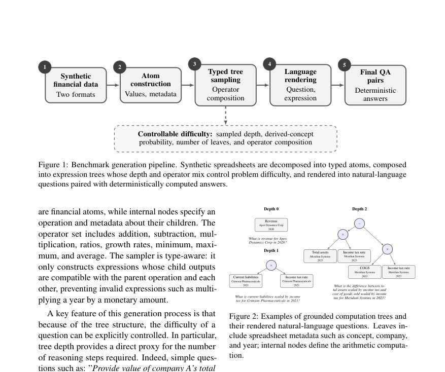

# V-FiLLM: Verified Financial LLM Reasoning Benchmark

- **게시일:** 2026-08-13
- **arXiv:** [2608.11047v1](http://arxiv.org/abs/2608.11047v1) · [PDF](https://arxiv.org/pdf/2608.11047v1)
- **저자:** Alicia Larsen, Victoire Laurent, Aulia Kharis Rakhamsari, Lara Turgut, Nino Antulov-Fantulin
- **분야:** cs.AI, cs.CE, cs.LG
- **선정 점수:** 4.59
- **선정 이유:** 최근성 0.7, 인용 영향 0.0 (인용 0회), 저자 영향 0.0 (최고 h-index 0), AI 주제 적합성 2.9, 개발자 관심 0.4, 학술 신호 0.6, 오픈 웨이트·주요 연구조직 신호 0.0

[← 2026-08-13 목록으로 돌아가기](../daily/2026-08-13.html)

<!-- paper-visuals:start -->
## 주요 Figure

> 원문 PDF에서 실제 Figure 캡션과 그림 영역이 함께 확인된 자료만 자동 추출했다.

*Figure · 원문 PDF 3쪽 · Figure 1: Benchmark generation pipeline. Synthetic spreadsheets are decomposed into typed atoms, composed*

*Figure · 원문 PDF 3쪽 · Figure 2: Examples of grounded computation trees and*

<!-- paper-visuals:end -->

## 한 문장 요약

V-FiLLM은 합성 스프레드시트에 근거한 실행 가능한 계산 트리로부터 자동 검증된 금융 QA 항목을 생성해 계산 깊이·폭·파생 개념·문맥 크기를 제어하며 LLM의 구성적 재무 추론과 강건성을 평가하는 프레임워크이다.

## 해결하려는 문제

기존 금융 QA 벤치마크는 인간 주석 또는 모델 보조 추출에 의존해 소스 수준의 잡음(형식 불일치, 결측, 모호한 문장)과 모델의 추론 실패를 혼동시키며, 난이도를 체계적으로 제어하기 어렵고 스케일 확장이 비용적으로 제한된다. 본 연구는 이러한 한계를 해결해 검증 가능한 정답을 가진 항목을 대규모로 생성하고, 계산(추론) 깊이·폭·도메인 개념 복잡성·문맥 변이성에 따라 LLM 성능을 정밀 진단하려고 한다.

## 핵심 기여

- 실행 가능한 계산 트리(executable computation trees)를 합성된 금융 스프레드시트의 셀(atom)에 바인딩해 자연어 질문과 자동 검증된 정답을 생성하는 결정론적 벤치마크 생성 파이프라인(V-FiLLM)을 제안함.
- 문제 난이도를 네 가지 독립 축(계산 깊이, 표현 폭(폭/균형 트리), 파생 금융 개념 사용 확률, 문맥/표현 변이)으로 명시적으로 제어할 수 있도록 설계하여 구성적 추론을 분리·검사할 수 있게 함.
- 멀티턴 확장(각 괄호화된 하위식 → 한 턴)과 현실적 오류를 모사한 적대적 표 편집(결측, 쓰레기값, OCR 유사 문자, 시트 간 오염, 단위/스케일 변경, 무관 문장 추가) 등 강건성 평가 축을 도입함.
- 여러 오픈소스 LLM에서 깊이 증가와 적대적 수치 변형이 성능에 미치는 영향을 실험적으로 규명하고(예: 유닛/스케일 변경으로 Gemma-31B가 10-Q에서 98.4%→3.0%로 추락), 멀티턴 분해가 일부 모델에서 큰 성능 향상을 가져옴을 보임(Qwen3.5-9B: 55.2%→86.8%).
- 검증된 체인오브쵸트(phase1: CoT 생성 후 정답 일치 추적, 688→608 예제(88% 유지))로 LoRA(어텐션·FFN 투영에 어댑터 적용)를 미세조정해 Qwen3.5-4B의 보유 벤치마크 성능을 81.1%→85.6%로 개선하고 FinQA에서 27/100→32/100으로 외부 일반화 가능성을 보인 점을 제시함.

## 접근 방법

* 파이프라인 구성 및 절차: (1) 금융 데이터 생성: 10-Q를 모사한 형식과 정규화된 재무 시트 두 가지를 합성한다.
* 정규 시트는 회사-연도 관측치(예: revenue, cogs, assets 등)와 메타데이터를 포함하며 값은 내부 일관성을 보존하도록 샘플링·파생 계산으로 생성된다.
* (2) 원자(atom) 구성: 각 셀을 값과 금융 개념·회사·연도·단위·량 타입을 포함한 typed financial atom으로 표현한다.
* (3) 타입 인지 이진 트리 샘플링: 잎은 atoms, 내부 노드는 연산자(add, sub, mul, ratio, growth rate, min, max, avg 등)를 갖는 typed binary expression tree를 샘플링한다.
* 연산자·타입 불일치(예: 통화×연도)는 허용하지 않는다.
* 파생 개념(예: gross profit)은 숨겨진 실행식으로 저장하고 보호된(protected) 개념에 대해 canonical 식을 재구성하는 템플릿은 거부(resample)한다.
* (4) 바인딩: 템플릿을 회사·연도 등 제약을 만족하는 실제 셀에 바인딩하여 완전한 실행식으로 만든다(동일 기간 연산, 성장률은 서로 다른 연도 선택 등).
* (5) 자연어 렌더링 및 증강: 바텀업 방식으로 메타데이터를 유지하며 질문을 렌더링하고 표면 변이를 위해 오탈자·대소문자·문장형 전환 등 의미 보존 변환을 적용한다.
* (6) 정답 검증: 실행 가능한 식을 기호적으로 평가해 정답을 계산·저장한다.
* (7) 멀티턴 변환: d(T)≥1인 트리에 대해 각 괄호화된 하위식을 순차적 턴으로 변환하고 최종 턴에서 원질문을 재진술한다.
* (8) 적대적 변형: 질문과 무관한 셀들에 대해 결측, 쓰레기값, OCR 유사 문자, 시트 간 행 교환, 무관 문장 추가, 단위/스케일 변경 등을 적용해 강건성 평가를 수행한다.
* (9) LoRA 미세조정: Phase1에서 모델이 생성한 CoT 중 최종 답이 검증된 트레이스만 보존(608/688, 88% 유지), Phase2에서 LoRA 어댑터만 학습(r∈{4,8,16}, α∈{4,8,16,32}, dropout∈{0.05,0.10,0.15})을 attention(q/k/v/o) 및 FFN(gate/up/down) 프로젝션에 적용해 파라미터 효율적 도메인 적응을 수행했다.
* 최고의 설정은 r=8, α=8, dropout=0.10로 보고됨.

## 주요 결과

- 모델 비교(혼합 깊이, n=250): Gemma-31B가 10-Q에서 98.4%, simplified에서 97.6%로 최상위, GPT-OSS-120B·Qwen3.7-Plus·DeepSeek-v4-Flash도 높은 성능을 보였으나 소형 모델(Qwen3.5-9B)은 simplified에서 55.2%까지 하락(표 2).
- 멀티턴 변환의 효과: Qwen3.5-9B는 single-turn에서 55.2%→multi-turn 86.8%로 큰 개선을 보였고 Llama-3.3-70B도 80.8%→86.8%로 향상(표 2, 본문 설명).
- 추론 깊이 영향(표 3, 각 깊이당 100문제): Simplified에서 Gemma-31B는 depth 6에서 85.0% → depth 8에서 55.0%로 하락; DeepSeek-v4-Flash는 depth 6에서 84.0% → depth 8에서 26.0%로 더 급격한 성능 저하를 보임. 10-Q 문서는 깊이 3–4에서 약 60–72% 수준으로, 동일 깊이에서 simplified보다 약 20포인트 더 어려움.
- 적대적 변형 결과(표 4): 평균적으로 Gemma-31B는 10-Q에서 perturbation 적용 시 정확도가 평균 −27.3 포인트 하락했고, simplified에서는 평균 −35.7 포인트 하락. 단위/스케일 변경(Unit/scale shift)은 특히 파괴적이어서 10-Q에서 Gemma-31B가 98.4%(clean) → 3.0%로 추락, DeepSeek-v4-Flash는 22.0%로 하락함.
- LoRA 미세조정(검증된 CoT 사용): Qwen3.5-4B의 held-out 벤치마크(n=90)에서 베이스라인(제로샷) 81.1% → LoRA(r=8, α=8, dropout=0.10) 적용 시 85.6%로 개선(표 5). FinQA 일반화 실험에서는 동일 LoRA로 27/100 → 32/100으로 향상(표 6).

## 한계

- 저자 언급: (i) 질문 번역(수학적 스텝 → 영어)에서 가끔 애매하거나 문맥이 부족한 표현이 있을 수 있음; (ii) 실험은 계산 자원 제약으로 여섯 개 모델만 평가했고 영어 문서와 단일 표 형식만 고려함; (iii) LoRA 하이퍼파라미터 탐색과 최적 구성 선택은 작은 검증집합(n=90)에 제한되어 있어 결과는 예비적임.
- 추가 관찰(본문 기반 합리적 제약): (i) 생성 데이터는 합성 스프레드시트 기반이므로 실제 배포 환경의 표 형식·노이즈 분포와 차이가 있을 수 있음(10-Q 모사와 정규화 시트로 일부 보완됨). (ii) 연산자 집합과 파생 개념은 설계된 범위(예: add, sub, mul, ratios, growth, min/max/avg 등)로 제한되어 있으며 더 복잡한 재무 추론(예: 비정형 텍스트 해석, 문서 간 집계)은 아직 미포함임. (iii) 단위/스케일 처리에 모델이 매우 민감해 전처리(단위 정규화)가 없으면 실제 적용에서 취약성이 큼. (iv) 멀티턴 변환은 깊이 d(T)≥1 항목에만 적용되며 대화식 오류 전파 양상·회복 전략은 추가 연구가 필요함.

## 개발자 관점

- 재현성: 코드·데이터 생성 파이프라인(링크가 본문 주석에 명시됨)을 바탕으로 샘플링 파라미터(최소/최대 깊이, 파생 개념 확률, 균형/선형 트리 등)를 고정하면 결정론적·검증 가능한 벤치마크를 대규모로 생성할 수 있어 라벨링 비용을 줄일 수 있다.
- 데이터·프롬프트 설계: 파생 개념을 보호(protected)하고 canonical 식을 재구성하는 템플릿을 거부하는 절차는 파생 개념 사용과 산술 재구성의 혼동을 피하므로 도메인 지식 평가를 명확히 한다. 렌더러는 회사·연도·단위를 중복 없이 유지하도록 메타데이터를 전파해야 한다.
- 전처리·파싱 중요성: 실험에서 단위·스케일 변경과 OCR 유사 문자 교체가 치명적이었으므로 실제 시스템 구현 시 표 단위 정규화, OCR 교정, 숫자-단위 페어링 검증 등 강건한 전처리가 필수적이다.
- 효율적 적응 전략: LoRA 같은 파라미터 효율적 미세조정은 소량의 검증된 체인오브쵸트 트레이스로도 성능 향상을 주며(학습 가능한 파라미터 약 0.5%), 하이퍼파라미터(α/r 비율)에 민감하므로 작은 검증셋에서의 과적합을 주의해야 한다.
- 운영·평가: 멀티턴 분해는 일부 모델에서 단일턴보다 큰 이득을 주므로 서비스 설계 시 복잡한 계산 질문에 대해 자동 분해·단계적 질의 전략을 적용하면 응답 신뢰성을 높일 수 있다. 또한 각 예제에 실행식·사용된 셀 목록·템플릿을 저장해 상세한 오류 진단·모델 개선에 활용하라.

**근거 범위:** 이 분석은 제공된 논문 PDF 본문(페이지 1–10)의 텍스트를 기반으로 작성되었다. 표(표 2–6)의 수치, 본문 설명(섹션 3–5)과 결론·한계(섹션 6–7)를 직접 참조했다. 논문이 언급했으나 본문에 상세 수치가 없는 하이퍼파라미터 외의 구현 세부(예: 학습 스텝 수, 배치사이즈, 랜덤 시드)와 실제 런타임·비용 수치는 PDF에서 제공되지 않아 포함하지 않았다.
