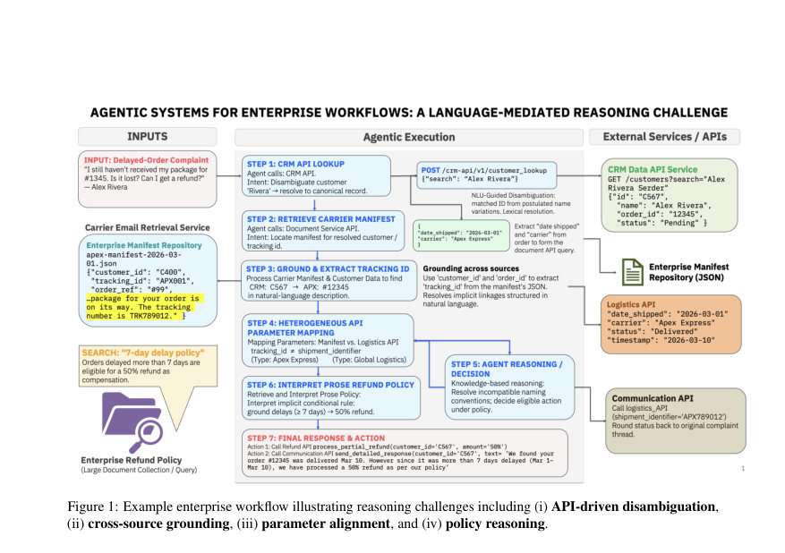
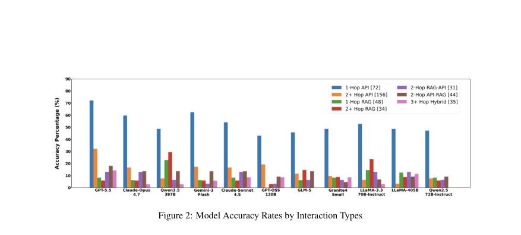
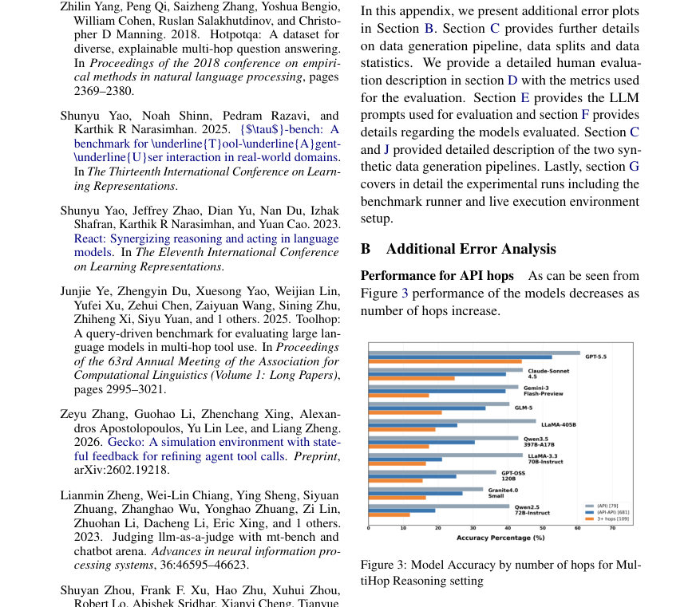

# VAKRA: Evaluating Multi-Hop Reasoning Across APIs and Retrieval Under Tool-Use Policies

- **게시일:** 2026-08-14
- **arXiv:** [2608.12282v1](http://arxiv.org/abs/2608.12282v1) · [PDF](https://arxiv.org/pdf/2608.12282v1)
- **저자:** Ankita Rajaram Naik, Anupama Murthi, Benjamin Elder, Siyu Huo, Raavi Gupta, Abhinav Jain, Praveen Venkateswaran, Abdulhamid Adebayo, Danish Contractor
- **분야:** cs.AI
- **선정 점수:** 6.73
- **선정 이유:** 최근성 0.8, 인용 영향 0.0 (인용 0회), 저자 영향 0.0 (최고 h-index 0), AI 주제 적합성 2.8, 개발자 관심 0.8, 학술 신호 0.8, 오픈 웨이트·주요 연구조직 신호 1.6

[← 2026-08-14 목록으로 돌아가기](../daily/2026-08-14.html)

<!-- paper-visuals:start -->
## 주요 Figure

> 원문 PDF에서 실제 Figure 캡션과 그림 영역이 함께 확인된 자료만 자동 추출했다.

*Figure · 원문 PDF 2쪽 · Figure 1: Example enterprise workflow illustrating reasoning challenges including (i) API-driven disambiguation,*

*Figure · 원문 PDF 8쪽 · Figure 2: Model Accuracy Rates by Interaction Types*

*Figure · 원문 PDF 11쪽 · Figure 3: Model Accuracy by number of hops for Mul-*

<!-- paper-visuals:end -->

## 한 문장 요약

VAKRA는 62개 도메인, 8,000개 이상의 실행 가능한 API와 도메인별 문서색인을 결합해 API 상호작용 스타일, 구조화된 다중홉 추론, 그리고 자연어 기반 도구 사용 정책 준수를 단일 궤적(trajectory) 수준에서 검증하도록 설계된 벤치마크이자 평가 프레임워크로, 고정된 ReAct 하네스를 통해 모델의 언어적 추론 능력을 도구 호출 아키텍처와 분리해 측정한다.

## 해결하려는 문제

기존 벤치마크는 도구 호출, 검색(RAG), 다중 홉 추론, 정책 준수 등 에이전트 능력을 개별적으로 평가하는 경향이 있어, 실제 엔터프라이즈 시나리오에서 요구되는 이질적 소스(구조화된 API + 비구조화 문서) 간의 다중 홉 조합 추론 및 자연어 도구-사용 정책(허용/금지)을 동시에 만족시키는 능력을 평가하지 못한다. 본 논문은(1) 다양한 API 인터페이스 스타일(작은 compositional 도구군, 확장된 선택형 함수 도구군, 엔드포인트 지향 대시보드), (2) API 간 합성(2–5홉) 및 (3) API↔RAG 혼합 체인에서의 언어적 불확실성(엔티티 중복해결, 스키마 정렬, 교차-소스 그라운딩)과 자연어 정책 준수를 재현 가능한 실행 환경에서 검증하는 것을 목표로 한다.

## 핵심 기여

- 도구-그라운디드 벤치마크: BIRD-SQL에서 파생한 62개 도메인, 8,000+ 실행 가능한 Python API(논문에서 도메인별 총 도구수 7,087로 명시)와 도메인 정렬 문서 컬렉션(ClapNQ, Wikidata5M 기반 ChromaDB 인덱스)을 포함한 실행 가능한 환경을 공개하고, 예측된 도구 호출을 라이브 API에 재실행(re-execute)하여 궤적 수준에서 정답을 검증하도록 구성함.
- 합성적 다중홉 과제 설계: SLOT(조합형), SEL(확장 함수형), Dashboard(엔드포인트형) 등 서로 다른 API 상호작용 스타일과 2–5홉의 API 체인, API와 문서 검색이 혼합된 멀티-소스 체인을 포함하는 과제 집합을 제시함.
- 정량·추적 기반 평가 프레임워크: (i) 도구 시퀀스 검증(프로그램적 포함 검사 + LLM 기반 판정), (ii) 최종 응답의 근거성/정답성 LLM 판정, (iii) 정책 위반 여부의 결정적 검사라는 단계적 워터폴 평가를 도입하고, 여러 유효 경로를 허용하는 재실행 방식을 통해 실패 원인을 언어적 추론(엔티티 불명확성·교차-소스 그라운딩 등)으로 국한해 분석함.
- 광범위한 실험 분석: 고정 ReAct 하네스 하에서 여러 폐쇄·오픈체크포인트 모델(GPT-5.5, Claude 계열, Gemini, Qwen, GPT-OSS-120B 등)을 평가하여 API 스타일별 성능 역전 현상, 홉 수 증가에 따른 성능 급감(대부분 모델이 홉 증가 시 정확도 50% 이상 저하), 자연어 정책이 적용된 경우의 심각한 실패(예: '정책으로 인해 답변 불가'인 경우 모델별 성공률이 2.4%까지 떨어짐) 등의 실증적 발견을 제시함.

## 접근 방법

* 데이터·환경 구성: Elder et al. (2026) 파이프라인을 확장해 BIRD-SQL 쿼리로부터 파생한 8,000+ 실행 가능한 Python API(도메인별 SQLite DB 백엔드)를 준비하고, 도메인별로 ClapNQ·Wikidata5M 문서를 ChromaDB에 인덱싱해 검색 도구를 제공한다.
* 세 가지 과제 설정(i) API Styles: SLOT(조합형, 9개 도구), SEL(확장형, 26개 도구), Dashboard(엔드포인트형, 대량(샘플당 최대 116) 도구) (ii) Multi-hop Reasoning: 2–5 홉 API 체인 (iii) Multi-source Multi-hop: API와 RAG를 혼합한 체인, 일부 샘플에는 자연어 기반 도구-사용 정책을 추가한다.
* 질의 생성 파이프라인: LLM 기반 4단계(엔티티→Wikidata QID 매핑으로 KG 구성→쿼리 연결 그래프 탐색(DFS)으로 1–3홉 체인 생성→Wikipedia/ClapNQ 페이싱을 접목해 API+RAG 문항 생성→교차-소스 답변 가능성 필터링)로 다중홉·혼합 소스 질문을 생성하고, 소규모 인간 심사(다섯 가지 루브릭)를 통해 품질을 점검함.
* 실행·평가 인프라: 모든 도구를 하나의 Docker 이미지로 자가 호스팅(benchmark_environ), 각 기능별 컨테이너(MCP 서버)를 띄워 stdio 기반 MCP 프로토콜로 에이전트와 통신.
* 에이전트 하네스는 고정된 ReAct LangGraph 구현(모델은 provider-agnostic 팩토리로 연결)이며, MCP의 JSON Schema를 Pydantic으로 변환해 LangChain StructuredTools로 노출한다.
* 평가 워크플로우: (Stage1) 예측된 도구 호출을 라이브 환경에 재실행하고 프로그램적 포함 검사 및 LLM 판정(GPT-OSS-120B, temp=0)으로 도구 시퀀스 검증, (Stage2) Stage1 통과 시 LLM-심사로 최종 응답의 근거성과 정답성 판단, (Stage3) 정책 문항은 결정적으로 불허된 소스 사용 여부 검사.
* 재현성 장치: 도구 표면 무결성 검사용 SHA-256 체크섬, 데이터는 별도 마운트(이미지에는 코드만 포함), HuggingFace에 데이터·이미지 배포, 단일 명령(make setup)으로 재현 가능하게 구성.

## 주요 결과

- 데이터셋·규모: 62개 도메인, 총 도구 7,087개(평균 도구 수 도메인당 116, 중앙값 106). 테스트 분할 샘플 수(논문 Table 2): BI(SEL) 549, BI(SLOT) 1,397, Dashboard 1,597, Multi-hop 869, Multi-source Multi-hop 644 (튜닝·테스트 분할 별도 표기).
- API 스타일 성능(상위 모델): GPT-5.5는 Dashboard(엔드포인트형)에서 Gnd(근거성) 70.4%를 기록했으나 BI API의 SEL/SLOT(조합형/확장형)에서는 각각 Gnd 약 51.0% 및 50.0%로 성능이 하락(논문 Table 4의 sieve-of-success 수치; GPT-5.5의 Tool/ArgN/ArgV/Gnd: 92.8 / 92.6 / 81.8 / 70.4(대시보드) 및 BI SEL Gnd 51.0, BI SLOT Gnd 50.0).
- 다중홉 민감도: 대부분 모델은 홉 수 증가 시 정확도가 급감하여 '대부분의 모델이 홉 수 증가에 따라 정확도 50% 이상 감소'하며(본문), GPT-5.5를 제외한 모델들이 체인 길이 증가에 큰 타격을 받음(본문 기술).
- 멀티-소스·정책: RAG가 섞인 문항과 정책 제약을 추가하면 성능이 추가로 저하됨. 정책으로 '질문이 답변 불가'인 경우 일부 모델의 성공률은 매우 낮음(예: Claude Opus 4.7의 해당 카테고리 성공률 2.4%, 논문 본문).
- 오류 분석(언어적 실패 집중): 실패는 도구 호출 메커닉보다는 언어-매개 단계에서 집중됨(엔티티 불명확화, 교차-소스 그라운딩, 스키마 정렬). 예시 수치: Gnd 오류 버킷에서 환각(hallucination)이 큰 비중을 차지(논문 Table 5, BI API에 대해 GPT-5.5의 Gnd 오류 내 환각 비율 95.5% vs 추출 실패 4.5%; Dashboard에서는 추출 실패 비중 증가 예시도 보고). 또한 툴 식별→인수 이름→인수 값→근거성으로 이어지는 'sieve'에서의 단계별 손실 양상은 API 스타일별로 상이(논문 Table 4).

## 한계

- 저자 언급: 자동화된 LLM 기반 질의 생성의 한계(홀로큐이션, 불일치, 잘못된 제약 등)를 인지하고 있어 Multi-hop 관련 샘플에 대해 소규모 인간 검수를 수행했으나 자동 생성 프로세스의 편향·오류 가능성을 인정함(본문 §3.2 및 Appendix D에 인간 평가 결과와 재현성 수치 제시).
- 저자 언급: 평가에 LLM-as-Judge(GPT-OSS-120B)를 사용했으며, 선행 연구를 근거로 채택했지만 평가자(LLM) 자체의 오류·편향이 결과에 영향 줄 가능성이 존재함(본문 §4, LLM-as-Judge 근거 기술).
- 확인된 제약(본문 근거): 성능 저하는 주로 '언어적 추론' 단계(엔티티 중복해결, 교차-소스 그라운딩, 스키마 정렬)에 집중되어 있어 도구 호출 API 레벨의 문제보다는 자연어→구조화 파라미터 변환의 한계가 병목임(본문 결과·분석 섹션).
- 확인된 제약(범위): 자가 호스팅된 BIRD-SQL 유래 API와 ClapNQ/Wikidata5M 기반 인덱스로 구성된 정적·결정적 환경에서 평가를 수행하므로(의도적 장점) 실제 외부 API의 동적 변동성·실제 유저 데이터·실서비스 로그에서 발생하는 노이즈는 반영되지 않음(환경 설명·비교표 참조). 또한 고정 ReAct 하네스를 사용해 에이전트 아키텍처 영향을 배제했으나 다른 에이전트 설계(플래너·대화형 디버거 등)에선 결과가 달라질 수 있음.

## 개발자 관점

- 재현성: 논문은 단일 Docker 이미지(benchmark_environ)와 make 기반 one-command(setup→build→start→validate)로 전체 환경을 재현 가능하게 제공함. 데이터는 이미지에 포함하지 않고 볼륨으로 마운트하므로 코드/데이터 분리와 버전 관리를 쉽게 재현할 수 있음(본문 H.1/H.2).
- 도구 노출·타입화: MCP로 도구를 stdio로 노출하고, 각 도구의 JSON Schema를 Pydantic으로 변환해 LangChain StructuredTools로 제공함으로써 에이전트가 완전한 파라미터 시그니처를 보도록 구성. 실제 구현 시 유사한 스키마→타입 전환이 도구 안전성과 호출 정확도에 중요함(본문 G).
- 평가 설계: 예측된 도구 호출을 라이브 환경에 재실행해 여러 유효 경로를 허용하는 검증(프로그램적 포함 검사 + LLM 판정) 방식은 단일 정답 기준의 한계를 극복하므로 궤적(trajectory) 로그(툴 호출, 응답, 최종 응답)를 저장해 사후 분석을 수행할 것. 정책 준수는 도구 호출 추적만으로 결정적으로 검사 가능하므로 정책 위반시 실패로 처리해야 함(본문 §4).
- 운영·비용: 오픈 모델은 vLLM+NVIDIA GPU 인프라로 서빙했고(논문 Appendix F), 폐쇄형 최첨단 모델은 각 클라우드 API(예: Azure/OpenAI, AWS Bedrock, GCP Vertex AI)를 사용함. 대규모 비교 실험은 폐쇄형 모델 호출 비용과 오픈 모델 GPU 비용을 모두 고려해야 함(본문 표 및 Appendix F 참고).
- 안전·신뢰성: 본 실험에서 근거성 오류와 환각이 크므로(예: Gnd 오류 내 환각 비율 높음) 실 서비스에 적용하려면 (i) 추론 결과의 도구-응답 근거성 검사, (ii) 정책-검증 로직의 결정적 검사, (iii) 사용자에게 근거 문서·툴 응답을 함께 제시하는 설계가 필요함.

**근거 범위:** 이 분석은 제공된 논문 PDF 본문(페이지와 Appendix 포함)에서 직접 인용·요약한 내용에 기반한다. 실험 수치(예: 모델 성능, 데이터셋 분할, 도구 수, Table의 수치)는 본문 및 부록의 표/텍스트에서 가져왔으며, 저자가 부록에서 명시한 평가 설정·환경 구성(도커 이미지, MCP, LangGraph ReAct 등)을 근거로 기술했다. 표의 일부는 논문 내 포맷으로 인해 해석이 복잡한 부분이 있어(예: Table 3의 열 레이블 정렬 등) 가능한 한 본문 서술과 표 값을 교차 확인해 기재했으며, 만약 표의 특정 셀에 대해 추가 원문 확인이 필요하면 해당 표·행·열을 지정해 재검증해 드릴 수 있다.
