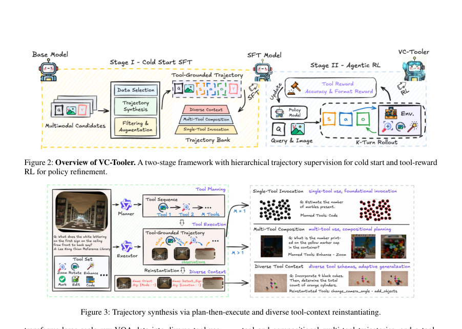

# VC-Tooler: Learning Compositional and Adaptive Visual Tool Use

- **arXiv:** [2608.02217v1](http://arxiv.org/abs/2608.02217v1) · [PDF](https://arxiv.org/pdf/2608.02217v1)
- **저자:** Yizheng Wu, Jiashen Hua, Bing Deng, Jieping Ye
- **분야:** cs.CV
- **선정 점수:** 9.82
- **선정 이유:** 최근성 0.6, 핵심어: reasoning, 핵심어: inference, 핵심어: multimodal, 핵심어: efficient

### 한 문장 요약

VC-Tooler는 시각적 도구 사용을 구성적이고 적응적으로 학습하는 멀티모달 에이전트로, 계층적 궤적 합성과 두 단계 학습으로 도구 grounding, 도구 조합(composition), 도구 반환 관찰에 대한 적응(adaptation)을 모두 달성하며 일반-목표 및 에이전트 벤치마크에서 우수한 성능을 보인다.

### 해결하려는 문제

시각적 도구 사용 연구가 고정된 도구 공간과 고정 호출 패턴에 머물러 도구 간 조합과 관찰에 따른 적응성을 확보하기 어렵고, 다양한 도구 인터페이스를 다룰 수 있는 학습 데이터의 부족이 일반화와 전이의 한계로 작용한다.

### 핵심 기여

- - 계층적 궤적 합성 파이프라인으로 단일 도구 grounding, 다중 도구 조합, 다양한 도구 맥락을 포괄하는 SFT 궤적 은행을 구축(수백 개의 도구 인터페이스 및 1,000여 개 이상의 도구 컨텍스트 포함).
- - 냉-start 학습과 강화학습(RL) 두 단계 학습으로 도구-grounding, 구성, 적응 능력을 jointly 학습하는 학습 프레임워크 제시. SFT 단계에서 토큰 수준 교차 엔트로피 손실로 행동 정책을 초기화하고, GRPO 기반 도구 보상으로 정책을 미세조정.
- - Diverse Tool-Contexts 재인스턴에 의해 도구 인터페이스 다양성을 확대하여 미시적인 도구 스키마에 의존하지 않는 일반화된 도구 활용 능력을 강화.
- - 일반-목표 및 에이전트 벤치마크에서 오픈 소스 중 최상위 성능 달성: V*에서 95.8, VTC-Bench에서 35.3 등 다수 벤치에서 강력한 성능 및 제로샷 전이 가능성 시사.
- - 도구 사용 행동 분석 및 ablation 연구를 통해 SFT 데이터 구성(ST, MT, DTC)과 RL 설계(표준 보상 vs 도구 보상)의 효과를 체계적으로 확인하고, 도구 보상이 구성적 도구 사용을 촉진함을 확인.

### 접근 방법

* VC-Tooler의 핵심은 세 가지 도메인 능력(grounding, composition, adaptation)을 학습 데이터와 학습 절차에 통합하는 것에 있다.
* 구체적으로: 1) 계층적 궤적 합성 파이프라인을 통해 단일 도구 grounding, 다중 도구 조합, 다양한 도구 맥락의 trajectories를 합성하고, plan-then-execute 구조로 계획과 실행을 분리하여Robust한 인터랙션을 확보한다.
* 2) Diverse Tool-Contexts 재인스턴화를 통해 동일한 underlying 시각 작업을 여러 도구 스키마로 재구성하여 적응성을 강화한다.
* 3) 두 단계 학습으로 SFT로 기반 정책을 확보한 뒤, 도구 보상(Rtool)을 사용하는 GRPO 기반의 RL로 도구 피드백을 실제 추론에 반영하도록 정책을 미세조정한다.
* 4) 보상 구조는 Rtotal = 0.8Racc + 0.2Rtool + 0.2Rfmt으로, Rtool은 도구 반환 관찰의 활용 여부, 호출의 필요성, 중복 호출 회피, 실행 오류에 대한 반응성, 시각적 기초를 통한 매개변수 근거 등을 평가하는 다섯 가지 이진 지표의 평균으로 정의된다.
* 5) 데이터 소스는 LLaVA-OneVision, DeepVision, VisualProbe 등에서 후보 샘플을 수집하고 도구 관련성 및 난이도 기준으로 필터링한다(S1, S2, S4, S5).

### 주요 결과

- - 일반-목표 벤치마크에서의 성능: V*에서 VC-Tooler-RL 95.8, SFT 92.1. HRBench-4K에서 SFT 82.9, RL 83.9. HRBench-8K에서 SFT 78.6, RL 83.8. CharXiv(RQ)에서 SFT 83.8, RL 84.0. MME-RealWorld에서 SFT 51.7, RL 54.1. VTC-Bench에서 SFT 62.9, RL 69.5. TIR-Bench에서 SFT 27.8, RL 35.3. 4K에서 SFT 20.2, RL 21.0.
- - 다중-단계 도구 사용에서의 이점: VTC-Bench에서 RL이 SFT보다 큰 폭으로 개선되어 다중-스텝에서의 도구 관찰을 이용한 추론 능력이 강화됨.
- - 도구-공간의 확장성에 대한 강건성: Original, Seen, Mixed 설정에서 VC-Tooler는 Seen/Mixed에서도 원래 설정과 대등하거나 상회하는 성능을 보여, 학습 시 보지 않은 도구 인터페이스에 대한 제로샷 전이 가능성을 시사.
- - 도구 보상의 효과: 도구 보상(Tool) 실험에서 표준 보상(Standard) 대비 성능이 향상되며, 단순 도구 호출 증가를 유도하는 도구 존재 보상(TE)보다 바람직한 효과를 보임.
- - ablation: ST+MT+DTC가 RL 후 최종 정책에서 최상위 성능(예: V* 95.8, VTC-Bench 69.5, CharXiv 84.0)을 달성, 초기 학습에서 MT/DTC가 즉시 성능을 항상 끌어올리진 않으나 RL 이후에 큰 시너지를 발휘.

### 한계

- - 연구 규모의 제약: 궤적 합성 및 RL 학습의 규모가 도메인-복잡성에 비해 상대적으로 작아 확장 여지가 남아 있음.
- - 한정된 도구 공간과 짧은 인터랙션 호라이즌: 실제 개방형 도구 환경에서의 확장성 및 장기간 추론에 대한 검증 필요.
- - 구체적 구현 세부와 운영 비용: supplementary에 상세한 데이터 구성, 프롬프트, 도구 스키마, RL 데이터의 구성 및 처리 방식이 다수 기술되어 있으나, 이는 본문에 비해 접근성이 떨어질 수 있음.
- - 실제 배포 시 안정성, 보안 및 비용 문제에 대한 직접 제시가 제한적.

### 개발자 관점

- - 재현성 확보를 위한 이중 학습 파이프라인 구성: SFT로 기초 정책을 확립한 뒤 RL로 개선하는 방식은 도구-수행의 일관성을 유지하는 데 유리하다.
- - 데이터 생성을 위한 plan-then-execute와 도구 컨텍스트 재인스턴화의 조합: 다양한 도구 인터페이스를 노출시켜 상이한 도구 스키마에 대한 적응성을 키운다.
- - 도구 보상 설계의 중요성: 도구 반환 관찰의 활용과 계획-실행의 일관성을 강화하는 보상 신호가 성능에 기여하며, 단순 호출 증가를 유도하는 보상은 성능 저하를 초래할 수 있다.
- - RL 데이터 구성의 중요성: RL 데이터는 ChartVerse, DeepEyes, DRIM, VisualProbe 등에서 수집되어 정책 개선에 기여하며, 데이터 난이도와 구성의 균형이 성능에 큰 영향을 미친다.
- - 제로샷 일반화의 가능성: 학습 도중 보지 않은 도구 인터페이스에 대해도 스키마 수준의 일반화가 가능하므로, 도구 공간이 확장되는 배경에서도 안정적인 전이가 가능하다.

## 주요 Figure

> 원문 PDF에서 실제 Figure 캡션과 그림 영역이 함께 확인된 자료만 자동 추출했다.

*Figure · 원문 PDF 1쪽 · Figure 1: Existing methods often ground a single familiar tool*

*Figure · 원문 PDF 3쪽 · Figure 2: Overview of VC-Tooler. A two-stage framework with hierarchical trajectory supervision for cold start and tool-reward*

*Figure · 원문 PDF 3쪽 · Figure 3: Trajectory synthesis via plan-then-execute and diverse tool-context reinstantiating.*

<!-- paper-visuals:end -->

<!-- paper-visuals:start -->
## 주요 Figure

> 원문 PDF에서 실제 Figure 캡션과 그림 영역이 함께 확인된 자료만 자동 추출했다.

*Figure · 원문 PDF 1쪽 · Figure 1: Existing methods often ground a single familiar tool*

*Figure · 원문 PDF 3쪽 · Figure 2: Overview of VC-Tooler. A two-stage framework with hierarchical trajectory supervision for cold start and tool-reward*

*Figure · 원문 PDF 3쪽 · Figure 3: Trajectory synthesis via plan-then-execute and diverse tool-context reinstantiating.*

<!-- paper-visuals:end -->

**근거 범위:** 논문 PDF 본문 기반 분석. 초록은 보조 정보로 활용했으며, 본문 및 보조 자료의 수치와 절차를 주로 참조했다. 표의 열 매핑은 본문에 제시된 순서를 바탕으로 해석했으나 일부 수치 매핑은 표 구성에 따라 다소 차이가 있을 수 있다. 보충 자료(S1–S7)의 구체 데이터 구성, 프롬프트 및 RL 세부 내용은 본문에 제시된 요약 외 추가 서술이 있으므로 분석에 반영하되 본문 수치 위주로 정리했다.

---

- **소개 날짜:** 2026-08-05
- [← 2026-08-05 논문 목록으로 돌아가기](../daily/2026-08-05.md)
- [일별 아카이브 보기](../daily/index.md)

