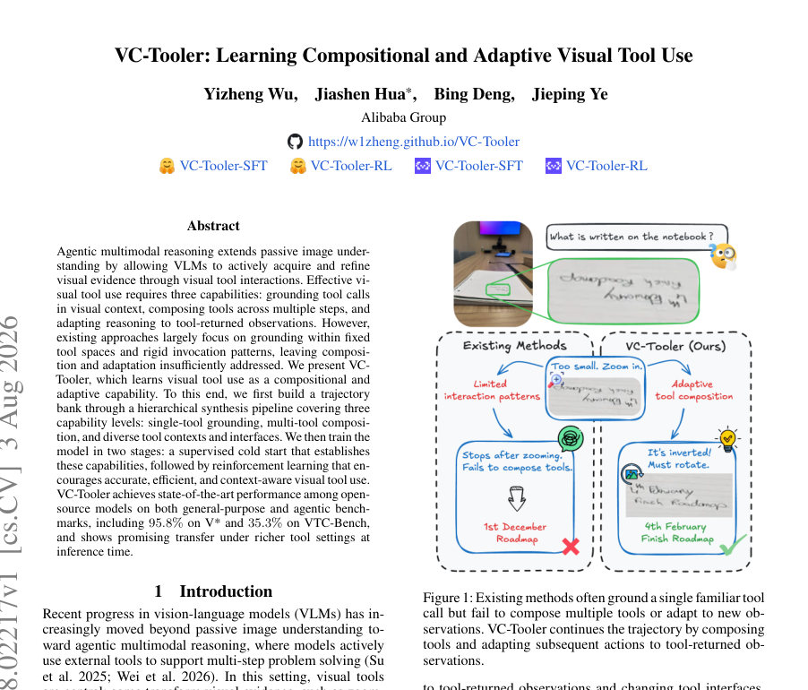
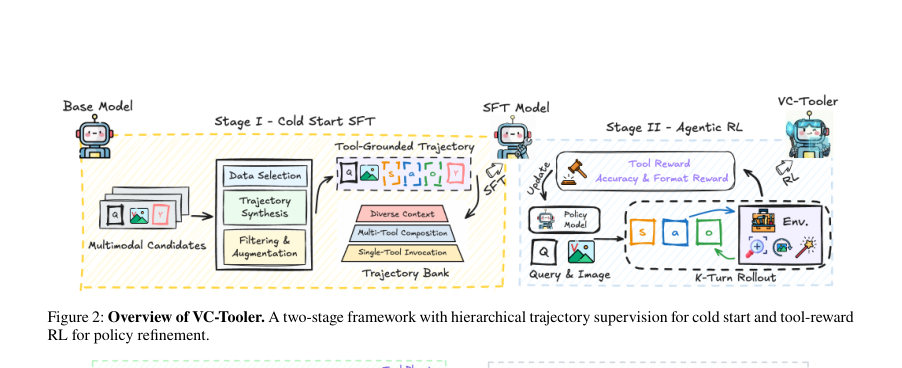

# VC-Tooler: Learning Compositional and Adaptive Visual Tool Use

- **arXiv:** [2608.02217v1](http://arxiv.org/abs/2608.02217v1) · [PDF](https://arxiv.org/pdf/2608.02217v1)
- **저자:** Yizheng Wu, Jiashen Hua, Bing Deng, Jieping Ye
- **분야:** cs.CV
- **선정 점수:** 9.82
- **선정 이유:** 최근성 0.6, 핵심어: reasoning, 핵심어: inference, 핵심어: multimodal, 핵심어: efficient

<!-- paper-visuals:start -->
## 주요 그림·그래프·표

> 원문 PDF에서 자동 추출한 자료다. 정확한 해석은 원문 캡션과 본문을 함께 확인해야 한다.

*그림·그래프 · 원문 PDF 1쪽 · Figure 1: Existing methods often ground a single familiar tool*

*그림·그래프 · 원문 PDF 3쪽 · Figure 2: Overview of VC-Tooler. A two-stage framework with hierarchical trajectory supervision for cold start and tool-reward*

*그림·그래프 · 원문 PDF 3쪽 · Figure 3: Trajectory synthesis via plan-then-execute and diverse tool-context reinstantiating.*

<!-- paper-visuals:end -->

### 한 문장 요약

VC-Tooler는 시각적 도구 호출을 상황에 맞게 지칭(grounding)하고, 여러 도구를 단계적으로 결합하며, 도구가 반환한 관찰을 바탕으로 추론을 적응시키는 능력을 학습하도록 설계된 시각적 도구 사용 에이전트이다.

### 해결하려는 문제

기존의 VLM(비전-언어 모델) 기반 에이전트는 이미지 이해를 넘어서 능동적으로 시각적 도구와 상호작용해 증거를 획득·정제하는 기능이 필요하다. 효과적인 시각 도구 사용을 위해서는 (1) 시각적 문맥에 맞는 도구 호출(grounding), (2) 여러 단계에 걸친 도구들의 조합(composition), (3) 도구가 준 관찰을 반영해 추론을 적응(adaptation)시키는 능력이 필요하지만, 기존 접근법은 대개 고정된 도구 공간과 경직된 호출 패턴에 집중해 조합성·적응성을 충분히 다루지 못한다.

### 핵심 기여

- 시각 도구 사용을 '조합적(compositional)이고 적응적(adaptive)'인 능력으로 학습하도록 설계한 VC-Tooler를 제안함.
- 세 수준(단일 도구 grounding, 다중 도구 조합, 다양한 도구 컨텍스트 및 인터페이스)을 포괄하는 계층적 합성(hierarchical synthesis) 파이프라인으로 궤적(trajectory) 뱅크를 구축함.
- 두 단계 학습 절차를 채택: (i) 슈퍼바이즈드한 '콜드 스타트'로 기본 능력들을 확립하고, (ii) 그 후 강화학습으로 정확성·효율성·문맥 인식성을 장려하여 능력을 향상시킴.
- 오픈소스 모델들 중에서 일반 목적 및 에이전트형(agentic) 벤치마크에서 최첨단 성능을 기록했다고 보고함(예: V*에서 95.8%, VTC-Bench에서 35.3%).
- 추론 시 더 풍부한 도구 설정으로의 전이(transfer) 가능성을 보였다고 서술함.

### 접근 방법

초록에 따르면 VC-Tooler는 (1) 계층적 합성 파이프라인을 통해 다양한 난이도와 맥락을 아우르는 실행 궤적을 수집·구성(trajectory bank)하고, (2) 먼저 슈퍼바이즈드 학습으로 도구 호출 기반 능력의 기초를 마련한 뒤, (3) 강화학습으로 도구 사용의 정확성, 효율성, 문맥 적합성을 보상하여 모델을 미세조정한다. 계층적 파이프라인은 단일 도구 grounding, 다중 도구 조합, 다양한 도구 컨텍스트·인터페이스라는 세 능력 수준을 다룬다. 구체적인 모델 아키텍처, 보상 설계, 도구 인터페이스(예: API 형식)와 같은 구현 세부사항은 초록만으로는 확인하기 어렵다.

### 주요 결과

- 오픈소스 모델 중에서 일반 목적 및 에이전트형 벤치마크에서 최첨단 성능을 달성했다고 보고함.
- 보고된 성과 예시: V*에서 95.8%, VTC-Bench에서 35.3%.
- 추론 시 더 풍부한(더 다양한) 도구 설정으로의 전이 능력을 보였다고 서술함.

### 한계

- 초록만으로는 모델 아키텍처(예: 백본 네트워크, 토크나이저/비전 인코더 등)와 구체적 학습 하이퍼파라미터를 확인하기 어렵다.
- 강화학습의 보상 함수, 샘플 효율성, 안정화 기법(예: 클리핑, 탐험 전략) 등 RL 관련 구체적 설계는 초록만으로 확인하기 어렵다.
- 어떤 도구(검색, 크롭, 확대, 설명 생성 등)를 사용했는지, 도구의 API·입출력 포맷과 그 다양성에 대한 상세 내용은 초록만으로 확인하기 어렵다.
- 벤치마크들의 전체 구성(데이터셋 크기, 난이도 분포, 비교 대상 모델 목록 등)과 실험 반복성·통계적 유의성은 초록만으로 확인하기 어렵다.

### 개발자 관점

- 계층적 합성 파이프라인: 단일 도구 신뢰성 → 도구 조합 시나리오 → 다양한 인터페이스·컨텍스트로 확장하는 단계적 궤적 생성 설계를 고려하라. 단계별로 데이터·시나리오를 분리해 궤적 뱅크를 구축하면 학습 초기와 후속 고도화에 유리하다.
- 두 단계 학습 전략: 먼저 슈퍼바이즈드 학습으로 안정적 정책과 도구 호출 grounding을 확보한 뒤, RL로 정확성·효율성을 보상하도록 하는 접근은 불안정한 RL 학습 초기에 효과적일 수 있다. 실제 구현 시에는 안정화 기법(프리트레이닝 체크포인트, 보상 스케일링, 경험 리플레이 등)을 준비하라.
- 보상 설계의 중요성: RL 단계에서는 '정확성', '도구 호출 횟수(효율성)', '문맥 부합성'을 균형 있게 보상하도록 설계해야 한다. 보상 신호의 스케일과 지연성에 따라 매우 다른 행동이 유도될 수 있으므로 신중한 보상 공학이 필요하다.
- 도구 인터페이스 추상화: 다양한 도구 컨텍스트와 인터페이스를 다룰 수 있도록 명확한 API 추상화 레이어(입출력 스키마, 에러 핸들링, 지연/비동기 처리)를 설계하라. 추상화는 모델이 도구를 일반화해서 사용할 가능성을 높인다.
- 데이터·로그 관리: 궤적 뱅크와 RL 경험을 재사용·분석하기 위해 도구 호출 기록, 관찰-행동-보상 로그를 체계적으로 저장하고 버전 관리하라. 이를 통해 오류 분석과 안전성 검증이 쉬워진다.

**근거 범위:** 이 분석은 제목과 초록에만 근거해 작성되었으며, 모델의 아키텍처, 정확한 도구 목록, 학습·실험의 상세한 구현(보상 함수, 하이퍼파라미터, 데이터셋 구성 등)은 초록만으로 확인하기 어렵다. 자세한 구현·실험 내용은 논문 본문과 공개 코드를 확인해야 한다. 프로젝트 페이지(초록에 제시됨)는 추가 정보 확인에 유용할 것이다.

---

- **소개 날짜:** 2026-08-05
- [← 2026-08-05 논문 목록으로 돌아가기](../daily/2026-08-05.md)
- [일별 아카이브 보기](../daily/index.md)

