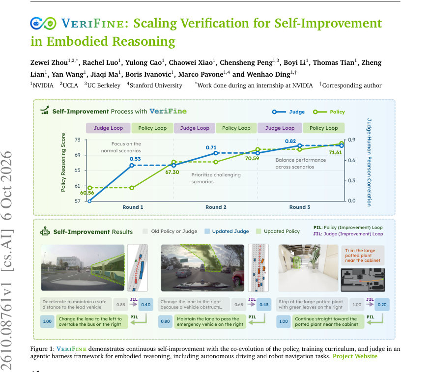
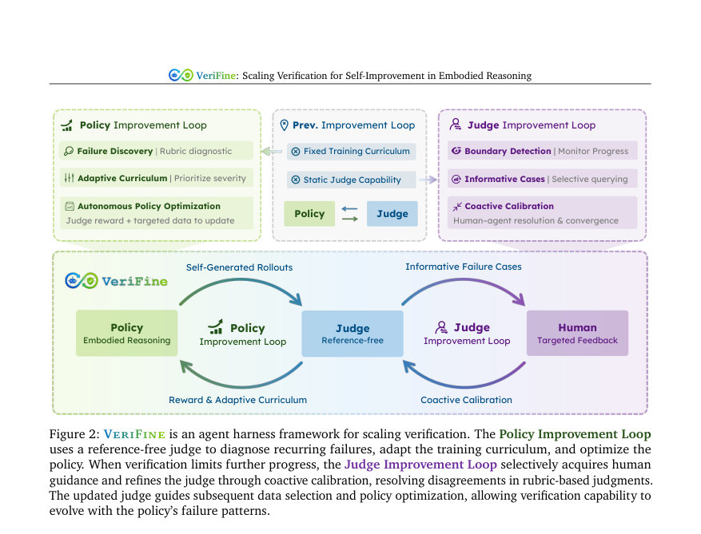
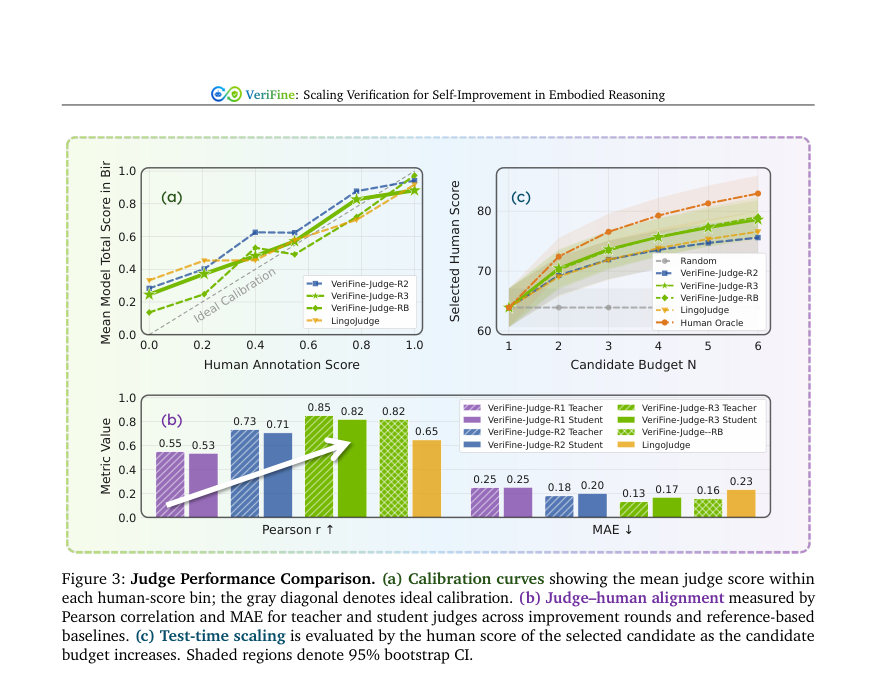

# VeriFine: Scaling Verification for Self-Improvement in Embodied Reasoning

- **게시일:** 2026-10-07
- **arXiv:** [2610.08761v1](http://arxiv.org/abs/2610.08761v1) · [PDF](https://arxiv.org/pdf/2610.08761v1)
- **저자:** Zewei Zhou, Rachel Luo, Yulong Cao, Chaowei Xiao, Chensheng Peng, Boyi Li, Thomas Tian, Zheng Lian, Yan Wang, Jiaqi Ma, Boris Ivanovic, Marco Pavone, Wenhao Ding
- **분야:** cs.AI, cs.RO
- **선정 점수:** 4.92
- **선정 이유:** 최근성 1.4, 인용 영향 0.0 (인용 0회), 저자 영향 0.0 (최고 h-index 0), AI 주제 적합성 2.8, 개발자 관심 0.2, 학술 신호 0.5, 오픈 웨이트·주요 연구조직 신호 0.0

[← 2026-10-07 목록으로 돌아가기](../daily/2026-10-07.html)

<!-- paper-visuals:start -->
## 주요 Figure

> 원문 PDF에서 실제 Figure 캡션과 그림 영역이 함께 확인된 자료만 자동 추출했다.

*Figure · 원문 PDF 1쪽 · Figure 1: VeriFine demonstrates continuous self-improvement with the co-evolution of the policy, training curriculum, and judge in an*

*Figure · 원문 PDF 4쪽 · Figure 2: VeriFine is an agent harness framework for scaling verification. The Policy Improvement Loop*

*Figure · 원문 PDF 8쪽 · Figure 3: Judge Performance Comparison. (a) Calibration curves showing the mean judge score within*

<!-- paper-visuals:end -->

## 한 문장 요약

정형화된 루브릭 기반의 참조-비의존 판단자(teacher→student)와 두 개의 상호보완적 개선 루프(Policy Improvement Loop, Judge Improvement Loop)를 결합해 판정 능력과 학습 커리큘럼을 공동 진화시키며 자가 개선되는 임베디드(reasoning-in-physical-world) 에이전트를 제안한다.

## 해결하려는 문제

자가 개선(self-improvement) 정책은 지속적으로 새로운 실패 패턴을 드러내어 판정자(judge)의 요구가 변하는데, 기존 방식은 고정된 판정자와 정적인 훈련 데이터에 의존해 판정 능력이 병목이 되면 잘못된 피드백(보상 해킹, 분포 변화)으로 이어지고 이후 유용한 학습 샘플을 찾기 어렵다. 특히 공간적 근거, 인과성, 안전성 판단이 필요한 임베디드 추론(운전·로봇 네비게이션)에서는 참조 기반 평가가 확장성이 낮고 비용이 크므로, 판정자·커리큘럼·정책이 공동 진화하도록 검증을 확장하는 방법이 필요하다.

## 핵심 기여

- 정책, 훈련 커리큘럼, 판정자(참조-비의존)를 공동 진화시키는 에이전트 하네스 프레임워크 VeriFine을 제안.
- 판정자가 식별한 반복적 실패 패턴을 기반으로 적응적 커리큘럼을 구성하고 인간 개입 없이 정책을 최적화하는 Policy Improvement Loop를 설계·검증.
- 판정자가 성능 병목이 될 때 선별적 인간 지도 질의와 인간·에이전트의 반복 상호작용(coactive calibration)을 통해 판정자를 개선하는 Judge Improvement Loop를 제시.
- 프론트티어 VLM 기반의 루브릭-판정자(teacher)를 학생(student) 모델로 증류해 대규모 학습·추론 비용을 줄이며 구조화된 진단(z_i)과 설명을 제공하는 참조-비의존 판정자 설계 및 실험적 검증(운전·로봇 네비게이션)을 수행.

## 접근 방법

* VeriFine은 두 개의 상호연동 루프를 중심으로 작동한다.
* (1) Policy Improvement Loop: 고정된 앵커 평가셋 P(운전: 2,134 샘플)를 사용해 현재 정책 π_{θ_t}의 롤아웃을 판정자 J_{φ_t}로 평가하고 구조화된 진단(z_i)과 점수(s_i)를 집계하여 반복적 실패 패턴을 발견한다.
* 발견된 패턴을 기반으로 대규모 후보 풀 𝒰에서 선택 규칙(타깃 품질·학습 가능성·카테고리 기준 등)을 적용해 적응적 커리큘럼 𝒟_t를 구성한다.
* 운전 과제는 GRPO 기반의 강화학습(RFT)을 사용하며 판정자 전체 점수가 보상으로 들어간다(예: 수식 (5), KL 정규화 포함).
* 네비게이션 과제는 고품질 시연을 판정자로 필터링한 후 감독학습(SFT)으로 최적화한다.
* (2) Judge Improvement Loop: 정책 개선이 정체되거나 판정 보상 증가가 실제 성능 향상으로 이어지지 않으면(매 150 스텝마다 점검, 윈도우 K=4, 임계치 0.5 등) 경계 탐지로 활성화한다.
* 에이전트는 불확실·불일치·영향 큰 사례 ℋ_t를 선별해 누적 판정 집합 𝒥_t에 추가하고 인간 전문가와의 coactive calibration을 통해 루브릭을 반복 수정한다.
* 판정자 아키텍처는 teacher–student 설계: Claude Opus 5 같은 프론트티어 VLM이 루브릭(주요 차원: Action·Component의 하위 이진/서브스코어)을 사용해 진단·설명을 출력하고, 그 평가 능력을 Qwen3-VL 기반의 compact student로 증류해 실시간 보상·커리큘럼 구성·테스트타임 선택에 사용한다.
* 학생 모델은 루브릭 차원별 분류(head)로 학습(예: 35K teacher-labeled 샘플, 등가 가중 이진 크로스엔트로피)되며 학생은 teacher보다 약 300× 빠른 추론(latency: teacher ≈20.92s/sample, student ≈0.07–0.08s/sample)을 보인다.
* 루브릭 집계 예: 운전 종합점수 s = 0.6*A + 0.4*C(식 (10)–(12)), 네비게이션은 안전성 게이트를 통해 점수 부여(식 (15)).

## 주요 결과

- 주요 데이터: 내부 운전-추론 풀 약 2M 클립, 앵커 평가셋 P=2,134, 정책 테스트셋 P_test=2,772. 판정자 개선용 ℋ1(433 사례), ℋ2(179 사례), 누적 판정 테스트셋 𝒥_test 합계 732 사례(ℋtest1 514, ℋtest2 218).
- 운전 과제(강화학습): 고정 reference-based 평가자(VeriFine-Judge-RB) 하에서 정책 추론 점수가 베이스 60.56 → 라운드1 R1 67.30 → R2 70.59 → R3 71.61로 최종 18.2% 상대 개선(표 1). 동일 정책을 최종 reference-free 판정자로 평가하면 R3에서 22.2% 상대 개선 보고.
- 정량적 정책 결과(표 1): 베이스 ADE=2.139m, minADE6=1.049m; VeriFine-Judge-R3 정책 ADE=2.117m, minADE6=1.029m(테이블 수치).
- 판정자 성능: teacher 판정자의 Pearson r가 라운드별로 0.55 → 0.85로 증가, MAE는 0.25 → 0.13으로 감소. 증류된 student는 최종 판정자에서 r=0.82, MAE=0.17으로 VeriFine-Judge-RB(r=0.82, MAE=0.16)와 유사하거나 우수. LingoJudge 대비(VeriFine-Judge-RB r=0.82 vs LingoJudge r=0.65) 우수성 보고(Fig.3).
- 테스트타임 스케일링(후보 선택): 후보 예산 6개에서 최종 판정자는 인간 평가 기반 평균 reasoning score 78.6을 선택해 R2 및 LingoJudge보다 우수하고 VeriFine-Judge-RB와 유사한 성능을 보임(섹션 4.3). 이는 향상된 선택 능력이 정책 개선 외부에서도 일반화됨을 시사함(생성정책 고정 상황).

## 한계

- 저자 명시 한계: (i) 프레임워크는 고정된 앵커 정책 평가셋을 유지해 비교의 안정성을 확보했으나 이는 적응적 평가셋과의 결합 연구 여지가 있으며, (ii) 여전히 인간 검증된(reasoning-annotated) 데이터에 의존함(정책 평가와 판정자 보정에 인간 라벨 필요), (iii) 향후에는 인간 수정을 재사용 가능한 guidance 모델로 증류해 인간 개입을 더 줄여야 함(Appendix A.5).
- 본문·실험에서 드러나는 제약(근거 기반 관찰): (i) teacher VLM(Claude Opus 5)과 대규모 내부 데이터 사용으로 초기 구축 비용·API 비용이 크고 접근성이 제한됨(프라이빗 데이터·백본 사용), (ii) 계산 자원 요구가 높음(운전 RFT에 20 NVIDIA H100 GPU 노드, 2,700 스텝 등), (iii) 판정자·커리큘럼 설계(루브릭 세부항목, 임계치 등)는 도메인 전문 지식과 반복적 인간 보정이 필요해 자동화 범위가 제한적임, (iv) reference-free 판정자는 다수의 타당한 대안 행동에 대해 보다 관대할 수 있어(논문 언급) 기록된 행동과의 일치성(reference)에 민감한 평가 목적에는 부적절할 수 있음.

## 개발자 관점

- 루브릭(구조화된 서브스코어) 기반 판정자를 설계하면 단일 스칼라 대비 오류 진단·커리큘럼 설계에 유용하므로 Action·Component와 같은 도메인별 하위 차원을 명시할 것(논문 예: 운전 5개 이진 차원, 네비게이션 4개 차원).
- 프론트티어 VLM을 teacher로 쓰되 정책 최적화·테스트타임에는 비용·레이턴시를 줄이기 위해 student로 증류하라(학생은 300× 빠름; student 학습 데이터: teacher-labeled 35K 등). teacher는 주기적 coactive calibration·루브릭 수정에만 사용해 비용을 절감하라.
- 판정자 개선 트리거와 모니터링을 도입하라: 정책 성능 변화 ΔP_t와 판정 보상 변화 ΔRjudge_t의 차이 G_t을 계산해 경계 탐지(예: 체크 주기 150 스텝, K=4, 임계치 0.5)로 인간 질의 시점을 선별적으로 결정하면 인간 비용을 줄이면서 판정자 병목을 해소할 수 있다.
- 커리큘럼 선택 규칙은 후보 품질·학습 가능성·시나리오 카테고리로 순위화하라(운전 예: 400K 후보에서 25K 선택). 동일 보상자 하에서도 judge-guided selection이 무작위 선택보다 정책 성능을 크게 향상시켰음(라운드별 4.5–14.6% 차이 보고).
- 안전 관련 설계: 판정 루브릭에서 안전성은 게이트로 처리(운전: action-match gate로 행동 신뢰성 보장; 네비게이션: 안전성 게이트로 전체 점수 차단). 실제 시스템에서 안전 관련 판정 차원은 엄격한 규칙으로 구현해야 함.

**근거 범위:** 이 분석은 제공된 논문 PDF 본문(초록·본문·표·부록 포함, 페이지 1–27)의 내용만을 기반으로 작성했다. 논문이 내부 데이터(2M 클립)와 사내 백본(Alpamayo, Opus 5 등)을 사용함에 따라 공개 재현 가능성은 제약되며, 일부 세부 구현(예: 루브릭의 텍스트 규칙·인간 질의 UI)은 본문에서 개괄적으로 기술되어 있어 세부 파라미터는 부록·코드에 의존할 수 있다. 본문에 명시되지 않은 수치나 미확인 구현 세부사항은 추가로 생성하지 않았다.
