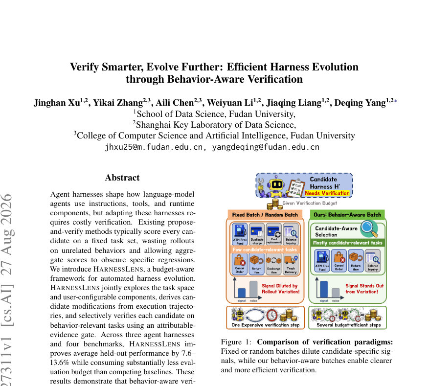
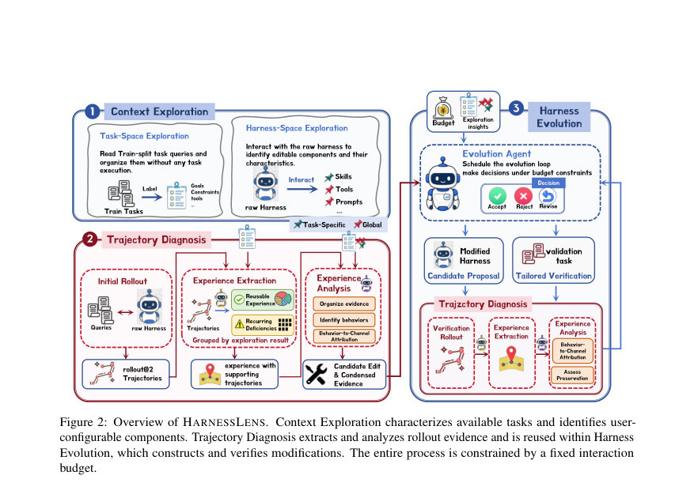
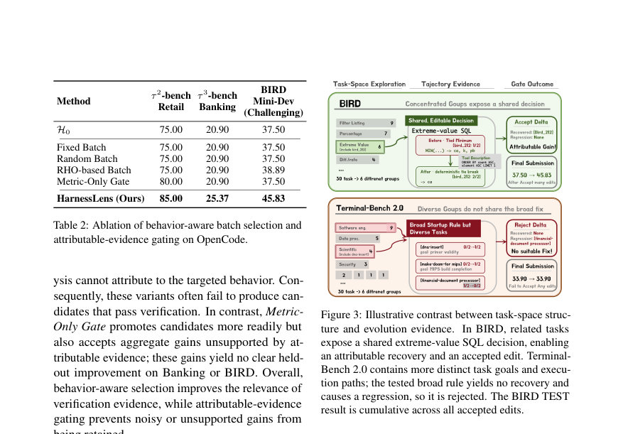

# Verify Smarter, Evolve Further: Efficient Harness Evolution through Behavior-Aware Verification

- **게시일:** 2026-08-29
- **arXiv:** [2608.27311v1](http://arxiv.org/abs/2608.27311v1) · [PDF](https://arxiv.org/pdf/2608.27311v1)
- **저자:** Jinghan Xu, Yikai Zhang, Aili Chen, Weiyuan Li, Jiaqing Liang, Deqing Yang
- **분야:** cs.AI
- **선정 점수:** 4.15
- **선정 이유:** 최근성 0.7, 인용 영향 0.0 (인용 0회), 저자 영향 0.0 (최고 h-index 0), AI 주제 적합성 2.2, 개발자 관심 0.8, 학술 신호 0.5, 오픈 웨이트·주요 연구조직 신호 0.0

[← 2026-08-29 목록으로 돌아가기](../daily/2026-08-29.html)

<!-- paper-visuals:start -->
## 주요 Figure

> 원문 PDF에서 실제 Figure 캡션과 그림 영역이 함께 확인된 자료만 자동 추출했다.

*Figure · 원문 PDF 1쪽 · Figure 1: Comparison of verification paradigms:*

*Figure · 원문 PDF 3쪽 · Figure 2: Overview of HARNESSLENS. Context Exploration characterizes available tasks and identifies user-*

*Figure · 원문 PDF 8쪽 · Figure 3: Illustrative contrast between task-space struc-*

<!-- paper-visuals:end -->

## 한 문장 요약

행동 인식 검증을 통해 제한된 상호작용 예산 하에서 에이전트 하네스(harness)를 비용 효율적으로 자동 진화시키는 HARNESSLENS 프레임워크를 제안한다.

## 해결하려는 문제

하네스(지시문, 툴 설명, 스킬, 런타임 컴포넌트 등)는 LLM 에이전트의 동작을 결정하지만 하네스를 적응·개선하려면 검증을 위한 다수의 롤아웃이 필요하다. 기존 제안-검증 방식은 모든 후보를 고정된(또는 무작위) 행위 검증 집합에 대해 평가하여 후보와 무관한 태스크에 예산을 낭비하고, 전체 집계 지표가 특정 행위 회귀를 가릴 수 있다는 한계가 있다. 핵심 질문은 상호작용 증거에서 자동으로 하네스를 연속적으로 진화시킬 때 제한된 예산 안에서 어떻게 신뢰성 있고 샘플 효율적으로 검증할 것인가이다.

## 핵심 기여

- 행동 인식(behavior-aware) 검증 개념을 제안하여 각 후보 수정에 대해 관련성이 높은 검증 태스크를 선택하고 롤아웃을 할당함으로써 불필요한 롤아웃을 줄이고 후보별 신호를 보존함.
- HARNESSLENS: (1) Context Exploration(태스크-스페이스·하네스-스페이스 탐색), (2) Trajectory Diagnosis(경험 추출·분석) 및 (3) Harness Evolution(후보 생성·행동 인식 검증·검토/업데이트)를 결합한 예산 인식·하네스 독립적 프레임워크를 설계·구현함.
- 행동에 귀속 가능한(evidence-attributable) 게이트를 도입하여 단순 집계 성능 개선이 아닌, 추론된 궤적 근거로 개선을 입증한 후보만 누적 적용하도록 함.
- 세 가지 오픈 하네스(OpenCode, Codex, Pi)와 네 개의 벤치마크(τ2-bench Retail, τ3-bench Banking Knowledge, Terminal-Bench 2.0, BIRD Mini-Dev Challenging)에서 평가하여 제한된 총 상호작용 예산 하에서도 기존 방법보다 테스트 성능을 높이고 예산을 절약함.
- 행동-민감 배치 선택과 귀속 근거 게이트의 상호 보완적 효과를 실험적·절단(ablation) 분석으로 확인함.

## 접근 방법

* HARNESSLENS는 예산 B(LLM 세션과 태스크 롤아웃을 '단위'로 계수)에 제약된 상황에서 현재 하네스 h0을 반복적으로 개선한다.
* 전체 파이프라인은 세 단계로 구성된다.
* 1) Context Exploration: TRAIN 쿼리와 하네스 문서/런타임을 검사하여 태스크를 목표·그룹별로 조직하고(hierarchy), 하네스 프레임워크 F에서 업데이트 가능한 사용자 구성 가능 컴포넌트 목록과 수정 가능 범위를 식별한다(태스크 실행 없이 메타데이터만 사용).
* 2) Trajectory Diagnosis: 초기 롤아웃과 이후 검증 롤아웃의 궤적을 수집하여 Experience Extraction(재사용 가능한 경험과 반복 결핍을 추출, 각 경험과 이를 지지하는 궤적을 연결) 및 Experience Analysis(추출된 근거와 태스크 그룹·컴포넌트 맵을 결합해 행동 목표·지원 궤적·수정 가능 컴포넌트를 명시하는 제안 생성 및 근거 검사)를 수행한다.
* 3) Harness Evolution: evolution agent(모델 기반 역할)가 하나의 제안을 선택하고 해당 제안의 지원 궤적에 연결된 태스크 및 관련 태스크·회귀 노출 태스크를 포함하는 행동-인식 검증 배치를 구성(검증 배치는 최소 5개 태스크, 각 태스크 K=2 재현 시 사용)한다.
* 후보 하네스는 런타임 체크로 적용 성공 여부를 확인한 뒤 현재 하네스와 매칭된 조건으로 쌍(쌍대 롤아웃)평가를 수행한다.
* Trajectory Diagnosis를 재적용하여 '귀속 가능한 개선(attributable recovery or stable success with increased pass count)'과 '귀속 가능한 회귀'를 판정한다.
* 귀속 개선이 있고 회귀가 없으면 확인(confirmation) 배치(대부분 신규 태스크, 최대 2개의 검증 태스크 유지)로 추가 검증을 수행하며, 확인 배치에서 주 지표(primary metric)의 개선이 있어야 최종 수용한다.
* 컨트롤러는 각 이터레이션의 비용(C1, C2 예산 항목 포함)과 재시도 버퍼를 계산하여 전체 예산을 관리하고, 초기 H0 롤아웃(예: 30 TRAIN 태스크 × K=2 → 60 단위)이 재사용될 수 있도록 설계되어 예산을 절감한다.

## 주요 결과

- 평가 벤치마크: τ2-bench Retail, τ3-bench Banking Knowledge, Terminal-Bench 2.0, BIRD Mini-Dev(Challenging). 각 벤치마크에서 TRAIN은 무작위로 30개 태스크를 샘플링(테스트는 공식/잔여 분할).
- 평가 하네스·모델: OpenCode v1.17.13, Codex CLI v0.144.4, Pi v0.80.10; 모든 에이전트 및 evolution 역할은 deepseek-v4-flash-preview를 사용(외부 검색 등 도구는 비활성화).
- 비교군·예산: HARNESSLENS는 총 예산 B=200 단위(LLM 세션 및 롤아웃 포함)로 제한. 비교 기법들은 구성상 더 큰 예산을 사용(구성 최대치: Self-Harness 4,800 TRAIN 롤아웃, Meta-Harness 660, HarnessFix 300).
- 정량적 성과: 표 1 기준(held-out TEST pass@1 단일 시도) HARNESSLENS는 12개 하네스–벤치마크 쌍 중 8곳에서 최상위 또는 공동 1위를 기록. 하네스별 평균(AVG) 결과: OpenCode H0 41.83 → HARNESSLENS 47.53, Codex H0 40.94 → HARNESSLENS 44.06, Pi H0 45.49 → HARNESSLENS 49.67. 논문 본문은 ‘평균 held-out 성능이 하네스별로 7.6–13.6% 향상’한다고 보고하며 “OpenCode 최대 13.6%, Codex 7.6%, Pi 9.2%까지 성공률 개선”을 제시함.
- 절단(ablation) 결과: 행동-인식 배치 선택과 귀속 근거 게이트를 각각 제거하면 성능이 현저히 저하됨(Table 2 및 분석). 행동-인식 선택은 검증 증거의 관련성을 높이고, 귀속 게이트는 잡음·근거 없는 개선의 누적을 방지함을 확인함.

## 한계

- 저자가 직접 언급한 한계: 실험은 하나의 모델 계열(deepseek-v4)과 세 개 하네스, 네 개 공개 벤치마크에 대한 평가에 국한되어 있으며 더 넓은 모델·하네스 구조·개방형 배치에서의 일반화는 검증되지 않았음. 또한 예산 단위를 LLM 세션과 태스크 롤아웃으로 계수하지만 토큰 사용량, 지연(latency), 금전적 비용 등으로 정규화하지는 않았음(본문 직접 언급).
- 본문에서 합리적으로 확인되는 한계: 행동-인식 검증은 ‘지원 궤적’과 태스크 그룹 구조에 의존하므로 태스크 다양성이 높아 관련성 있는 반복적 결함 패턴이 부족하면 효과가 떨어짐(Terminal-Bench 사례로 설명됨). 수정이 검증 중에 실제로 호출되지 않으면(예: 새 스킬이 검증 배치에서 호출되지 않음) 귀속 증거가 없어 거부될 수 있음(C.1 사례). 또한 하네스 수정은 런타임에서 적용 가능하고 감지 가능한 컴포넌트에 한정되어 있어 모든 종류의 수정(예: 비가시적 구성 변경)은 다루기 어려움.
- 추가적 고려사항(논문 범위에 명시적 설명 없음): 예산·비용 계산에서 LLM 세션과 롤아웃을 동일 단위로 취급하므로 실제 화폐 비용·클라우드 비용·지연 최적화에는 추가 설계가 필요함.

## 개발자 관점

- 하네스 진화 시스템 구현 시 하네스 내부의 ‘사용자-수정 가능 컴포넌트’와 그 업데이트 메커니즘을 명확히 노출·문서화해야 한다(Harness-Space Exploration 요구).
- 초기 대규모 검증 집합 대신 후보별로 관련 태스크만 선별하는 행동-인식 배치를 설계하면 예산을 절약하고 후보별 신호를 명확히 할 수 있다(검증 배치 최소 5개 태스크, 태스크별 역할: Conversion/Positive control/Preservation/Diagnostic 라벨 사용).
- 귀속 근거(attributable-evidence) 판정(궤적 비교 기반의 'recovered'·'stable success'·'regressed' 등 레이블)과 확인 배치(신규 시드·신규 태스크)를 필수로 하여 집계 지표만으로 인한 거짓 개선 누적을 방지해야 한다.
- 예산 회계 정책을 설계할 때 LLM 세션(진단·편집·진화 역할)과 태스크 롤아웃을 모두 추적하고, 초기 H0 롤아웃을 재사용하는 메커니즘을 도입하면 큰 예산 절감 효과가 있다(예: 초기 30×K=2 롤아웃 재사용).
- 재현 및 확장: 논문은 코드 저장소(논문 초록에 링크)를 공개했다고 명시하므로 개발자는 제공 코드와 익명 보조자료(프로프트·스키마·분할 ID)를 확인해 구현 세부를 따라야 하며, 실제 배포에서는 토큰·지연·금전 비용 정규화와 안전성(권한·도구 사용 제어) 설계를 추가해야 함.

**근거 범위:** 이 분석은 제공된 논문 PDF 본문(및 부록 포함)에 근거하여 작성되었다. 본문과 부속 섹션에서 명시된 수치(표 1, 표 2, 예산 최대치 등)와 절차를 직접 인용·요약했다. 소스 문서에서 직접 확인하기 어려운 산업적 비용(토큰·금전적 비용)이나 구현 외부 요인은 재구성하지 않았다. 추가 구현·실험 세부(코드·런타임 로그·정밀 예산 항목)는 저자가 공개한 보조자료와 저장소를 통해 확인할 것을 권장한다.
