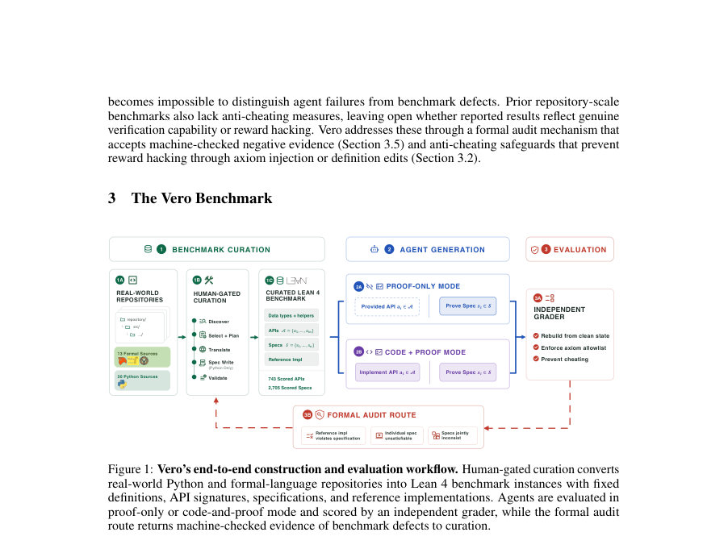
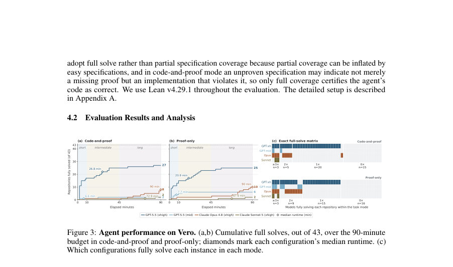
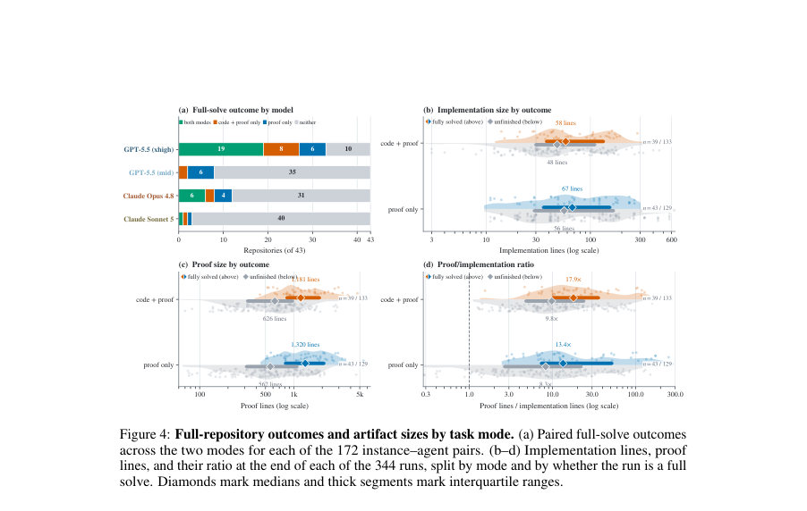

# Vero: Can AI Agents Build Formally Verified Software Repositories?

- **게시일:** 2026-08-15
- **arXiv:** [2608.13522v1](http://arxiv.org/abs/2608.13522v1) · [PDF](https://arxiv.org/pdf/2608.13522v1)
- **저자:** Zhe Ye, Hantao Lou, Yuechun Sun, Peiyang Song, Zhengxu Yan, Timothe Kasriel, Qingyang Zhang, Kaiyu Yang, Soonho Kong, Jingxuan He, Dawn Song
- **분야:** cs.LG, cs.AI, cs.LO, cs.PL, cs.SE
- **선정 점수:** 6.16
- **선정 이유:** 최근성 0.5, 인용 영향 0.0 (인용 0회), 저자 영향 1.6 (최고 h-index 15), AI 주제 적합성 2.2, 개발자 관심 0.8, 학술 신호 1.1, 오픈 웨이트·주요 연구조직 신호 0.0

[← 2026-08-15 목록으로 돌아가기](../daily/2026-08-15.html)

<!-- paper-visuals:start -->
## 주요 Figure

> 원문 PDF에서 실제 Figure 캡션과 그림 영역이 함께 확인된 자료만 자동 추출했다.

*Figure · 원문 PDF 4쪽 · Figure 1: Vero’s end-to-end construction and evaluation workflow. Human-gated curation converts*

*Figure · 원문 PDF 8쪽 · Figure 3: Agent performance on Vero. (a,b) Cumulative full solves, out of 43, over the 90-minute*

*Figure · 원문 PDF 9쪽 · Figure 4: Full-repository outcomes and artifact sizes by task mode. (a) Paired full-solve outcomes*

<!-- paper-visuals:end -->

## 한 문장 요약

Vero는 Lean 4로 번역된 43개의 실제 멀티모듈 저장소 인스턴스와 수동 검토된 명세·API 골격을 제공하여 에이전트가 저장소 수준에서 구현과 기계검증(proof)을 공동 합성할 수 있는지를 측정하는 최초의 벤치마크이자, 기계검증 증거를 이용해 벤치마크 자체 결함을 찾아내는 감사(audit) 경로를 포함한 평가 파이프라인을 제안한다.

## 해결하려는 문제

기존의 검증 코드 생성 벤치마크는 단일 함수 수준이나 고정된 구현에 대한 증명 완성에 치중해 저장소 단위로 구현과 증명이 상호의존적인 실제 멀티모듈 코드베이스에서 에이전트가 일관된 구현·증명 선택을 할 수 있는지를 평가하지 못한다. 따라서 에이전트가 저장소 전체의 일관성(교차모듈 불변식, 재사용 가능한 보조 보조정리 등)을 추론하고 구현 변경이 전역 증명에 미치는 영향을 관리할 수 있는지 검증할 필요가 있다.

## 핵심 기여

- Vero: Lean 4로 구성된 43개 멀티모듈 인스턴스(총 743 scored API, 2,705 scored specifications)를 포함하는 저장소 수준의 검증 코드 생성 벤치마크와 이를 구성·확장하는 인간 검증(gated) 다단계 큐레이션 파이프라인을 제시함.
- 벤치마크 품질 문제(참여 명세의 불만족성, 참조 구현의 불일치, 명세 간의 모순)를 기계검증된 '부정적' 증거(unsat / disprove / joint-unsat)를 통해 표면화하고 큐레이터가 수정하도록 유도하는 형식적 감사(audit) 메커니즘을 설계하고 도입함.
- 코드+증명(code-and-proof)과 증명 전용(proof-only) 두 가지 모드를 정의해, 구현 선택의 자유가 증명 난이도에 미치는 영향을 측정하고 저장소 규모의 공동 구현·증명 합성을 요구하는 최초의 공개 평가를 수행함.
- 시험에 사용한 에이전트 구성(도구 접근 포함, Lean toolchain v4.29.1)으로 광범위한 실험을 수행해 상세한 실패 원인 분석(공유 보조정리 필요성, 깊은 보조정리 체인, 구현 고정 시점 등)을 제공함.
- 채점기(grader)에 대한 반부정 행위(axiom allowlist, slot-scoped re-rendering, 선언 검사 등) 방어층을 설계·적용하여 증명 속임수(예: axiom 주입, @[implemented_by]로 증명만 매핑 등)를 차단함.

## 접근 방법

* Vero의 인스턴스는(1) 공유 데이터 타입·헬퍼 정의, (2) API 시그니처 집합 A와 각 API의 참조 구현, (3) RepoImpl 구조체(각 API에 대응하는 필드), (4) RepoImpl → Prop 형태의 명세 집합 S, (5) canonical : RepoImpl(참조 구현 또는 에이전트가 제출한 구현으로 채워짐)으로 구성된다.
* 명세는 특정 구현에 고정되지 않고 RepoImpl을 파라미터로 받아 구현을 교체해 증명 대상을 바꿀 수 있게 설계되었다.
* 에이전트는 두 모드 중 하나를 수행한다.
* proof-only 모드에서는 canonical이 참조 구현으로 채워지고 에이전트는 각 S(canonical)에 대한 Lean 4의 기계검증된 증명만 제출하면 된다.
* code-and-proof 모드에서는 에이전트가 모든 API의 구현 본문을 작성하고 자신의 canonical에 대해 모든 S(canonical)를 증명해야 한다.
* 큐레이션은 두 트랙(Track 1: formal 언어(Dafny/Verus/Coq) → Lean 4 번역, Track 2: 비형식 소스(Python) → Lean 4 번역 + 명세 작성)을 따르는 다단계(발견·선택·계획·번역·명세작성·검증) 파이프라인으로 이루어진다.
* 감사 메커니즘은 에이전트가 다음 세 유형의 기계검증된 부정적 증거를 제출하면 이를 큐레이터 검토로 회부한다: (1) 참조 구현이 모든 명세를 위배함을 보이는 증명, (2) 어떤 단일 명세 S가 어떤 구현에도 만족 불가능함을 보이는 증명(unsat), (3) 명세 집합의 부분집합이 서로 모순되어 동시에 만족 가능한 구현이 존재하지 않음을 보이는 증명(joint_unsat).
* 채점기는(1) 에이전트가 수정 가능한 영역만을 채점에 반영하는 slot-scoped re-rendering, (2) 허용된 공리(allowlist)만 허용하는 axiom 검사(디폴트 허용: Classical.choice, propext, Quot.sound), (3) 에이전트가 도입한 선언을 규칙 기반 필터+LLM 판정으로 검사하는 선언 스크리닝을 적용한다.
* 평가에서는 Codex 기반 인터페이스로 GPT-5.5(mid/xhigh)와 Claude Code로 Claude Opus 4.8/Claude Sonnet 5(xhigh)를 사용했고, 모든 에이전트에 파일시스템·빌드·Lean 도구 접근을 허용했다.

## 주요 결과

- 데이터셋 구성: 43 인스턴스(Track1 formal 13, Track2 Python 30), 총 743 scored APIs, 2,705 scored specifications, 원천 언어로 Dafny/Verus/Coq/Python을 포함함.
- 최강 구성(GPT-5.5 xhigh)은 code-and-proof 모드에서 43중 27개 인스턴스를 완전 해결(fully solve)했고 proof-only 모드에서는 25개를 완전 해결함. 반면 10개 인스턴스는 모든 구성에서 미해결로 남음.
- 개별 명세 관점에서 최강 구성의 통과율은 code-and-proof에서 87.3%, proof-only에서 85.8%였음(논문 본문에 보고된 수치). 그러나 높은 per-spec 통과율에도 불구하고 저장소 전체 완전 해결로 이어지지 않음(공유 불변식·재사용 보조정리 부족이 병목).
- 에이전트는 구현을 초반에 고정하고(대부분 구현량이 실행 초반에 완결됨) 남은 시간 대부분을 증명에 사용함(그 결과 증명 텍스트는 실행 내내 증가). 이는 구현 재설계로 돌아가지 않는 탐색 패턴을 의미함.
- 완전 해결된 저장소에서는 보조정리(helper theorem)가 증명 텍스트의 중앙값 약 71–74%를 차지하며(코드+증명 median 73.6%, proof-only median 71.6%), 보조정리는 여러 명세에서 재사용됨(대부분의 보조정리가 적어도 2개 이상의 명세에 기여). 깊은 보조정리 체인(helper-chain depth ≥4)을 요구하는 명세는 다른 구성에서 통과율이 크게 낮음(예: depth 0 통과율 ~80%대였으나 depth ≥4는 39–50% 수준). 예: GPT-xhigh의 분석에서 깊은 체인이 실패 예측에 강하게 상관됨(본문 Figure 5).

## 한계

- 저자가 명시한 한계: (1) 현재 Vero는 Lean 4만을 대상으로 한다; Track 1은 Dafny/Verus/Coq 출처를 번역했지만 타격타깃 언어로 확장은 필요함. (2) 코퍼스는 Lean으로 '깔끔하게' 번역 가능한 코드에 편향되어 있으며, 동시성·시간적 프로토콜과 같이 번역이 어렵고 규모가 큰 분야는 배제됨. (3) 감사 메커니즘은 명세의 형식적 만족 가능성(unsat/disprove/joint_unsat)을 증명할 수는 있지만, 명세가 의미적으로 '옳고 완전한지'를 보장하지는 못하므로 모든 명세는 수동으로 검토되어야 한다(본문 명시).
- 본문으로부터 확인되는 추가 제약(논문 본문 근거): (1) 현재 에이전트들의 한계는 지역적 증명 능력 부족이 아니라 저장소 수준의 조직화(공통 보조정리 구축, 전역 불변식 발견)에 있음. (2) code-and-proof 모드는 에이전트가 구현을 바꿀 수 있어 단순화된(증명하기 쉬운) 알고리즘을 선택해 성공할 수 있으나 이 경우 성능·복잡도 속성이 보장되지 않는다(예: munkres, sortedcontainers 사례). (3) 일부 에이전트 구성은 구현 의무 때문에 초기 증명 단계가 지연되어 proof-only보다 불리해질 수 있음(Claude Opus의 사례). (4) 평가 비용과 시간 제한(90분 예산)이 실험 결과에 큰 영향을 미침(본문의 런타임·비용 분석).

## 개발자 관점

- 저장소 수준의 검증 자동화에서는 단일 목표 증명보다 재사용 가능한 보조정리(lemma library)를 자동으로 발견·구성하는 능력이 핵심 성능 결정 요인이다. 에이전트 설계자는 보조정리 발견과 모듈화 전략을 명시적으로 지원해야 한다.
- 실패한 증명 패턴을 분석해 구현을 재설계하는 루프가 필요하다. 본문 관찰처럼 에이전트가 한 번 구현을 고정하면 이후 증명 노력만 늘어나므로, 반복적 탐색에서 '구현 수정 후 재시도' 전략을 도입해야 한다.
- 벤치마크·도구 측면에서는 slot-scoped re-rendering, axiom allowlist, 선언 스크리닝(예: 빈 바디 타입클래스, priority 오버라이드, @[implemented_by] 차단) 같은 다층 방어를 채택해 '증명 속임수'를 차단해야 한다.
- 큐레이션·검증 파이프라인에 감사(audit) 경로를 포함시키면 인간 검토에서 놓치는 사소한 번역·명세 오류를 기계적으로 찾아내고 수정하는 데 매우 유용하다(논문에서 curation 단계에서 다수의 잠재 결함을 발견하고 수정함).
- 운영적 고려: 저장소 수준 검증은 비용과 시간 소모가 크다. 논문 수치에 따르면 GPT-5.5(xhigh) 구성의 전체 실험 집계비용은 수천 달러 단위이고(표에 제시됨), '완전 해결 1건'당 비용은 구성·모드에 따라 크게 다르므로(예: GPT-xhigh code+proof $106/풀솔브로 보고됨) 예산·시간 계획이 중요하다. 또한 많은 비용이 전혀 해결되지 않는 난제 인스턴스에 소모될 수 있다(전체 지출의 상당 부분이 아무 해결도 얻지 못한 인스턴스에 쓰임).

**근거 범위:** 이 분석은 제공된 논문 PDF 본문(본문과 부록 포함)에서 직접 인용·요약한 내용을 근거로 작성되었음. 모든 수치(예: 인스턴스 수 43, 743 scored APIs, 2,705 scored specifications, GPT-5.5(xhigh) 풀솔브 27/43 등), 비용 표, 감사 사례 및 실험 관찰은 본문에 명시된 값을 사용했다. 논문은 일부 비용 추정(일부 런의 소비량이 중간값으로 추정되었음)을 자체적으로 보고하고 있으므로 비용 관련 수치는 논문 보고 방식을 따랐다. 본 분석은 본문에 명시되지 않은 구현 세부(예: 내부 하이퍼파라미터, 에이전트 내부 상태)나 본문에 없는 추가 실험 결과를 생성하지 않았음을 밝힌다.
