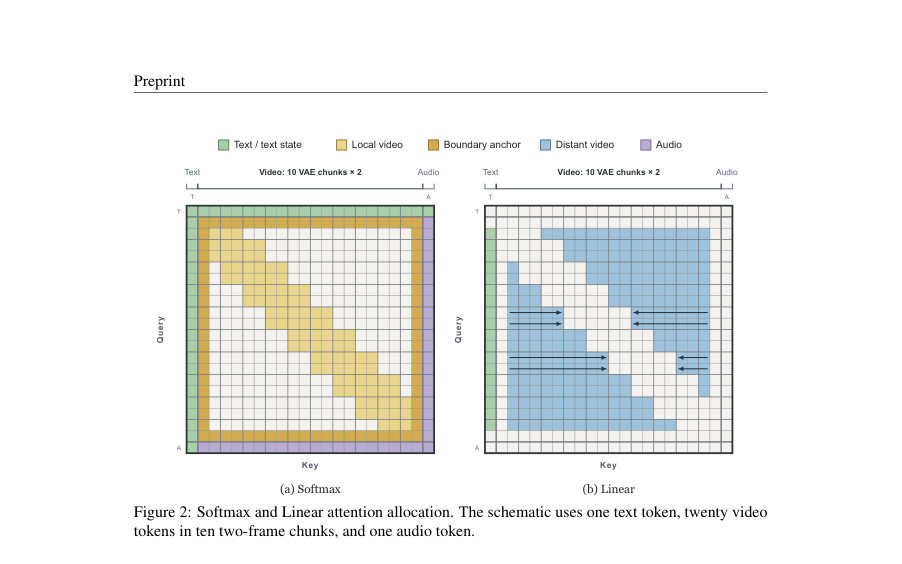
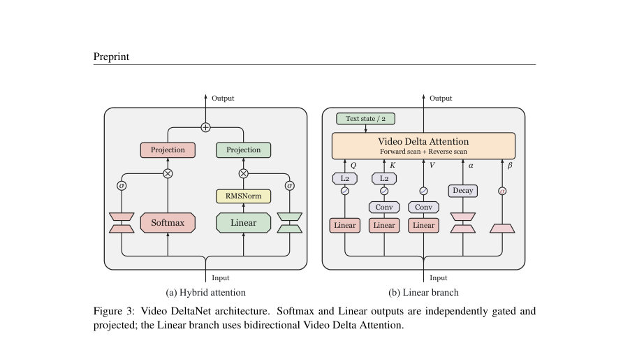
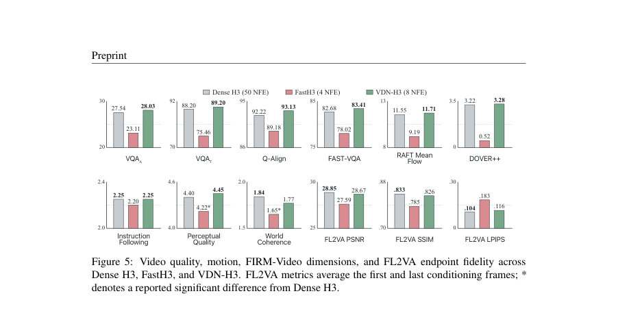

# Video DeltaNet: A Video-Native Hybrid Attention for Livestream Video Generation

- **게시일:** 2026-09-19
- **arXiv:** [2609.20744v1](http://arxiv.org/abs/2609.20744v1) · [PDF](https://arxiv.org/pdf/2609.20744v1)
- **저자:** Haocheng Xi, Yiming Xie, Hexu Zhao, Yiwen Zhang, Michael Liu, Thomas Creavin, Kurt Keutzer, Xiuyu Li, Zhaoyang Lv, Chenfeng Xu, Haiwen Feng
- **분야:** cs.LG
- **선정 점수:** 6.59
- **선정 이유:** 최근성 0.8, 인용 영향 0.0 (인용 0회), 저자 영향 1.9 (최고 h-index 31), AI 주제 적합성 1.8, 개발자 관심 0.2, 학술 신호 0.6, 오픈 웨이트·주요 연구조직 신호 1.4

[← 2026-09-19 목록으로 돌아가기](../daily/2026-09-19.html)

<!-- paper-visuals:start -->
## 주요 Figure

> 원문 PDF에서 실제 Figure 캡션과 그림 영역이 함께 확인된 자료만 자동 추출했다.

*Figure · 원문 PDF 3쪽 · Figure 2: Softmax and Linear attention allocation. The schematic uses one text token, twenty video*

*Figure · 원문 PDF 5쪽 · Figure 3: Video DeltaNet architecture. Softmax and Linear outputs are independently gated and*

*Figure · 원문 PDF 8쪽 · Figure 5: Video quality, motion, FIRM-Video dimensions, and FL2VA endpoint fidelity across*

<!-- paper-visuals:end -->

## 한 문장 요약

비디오 생성에서 로컬 Softmax와 프레임 단위의 양방향 선형 메모리(Video Delta Attention)를 결합해 장기 문맥을 선형 복잡도로 처리하여 대형 사전학습 비디오 디퓨전 모델의 추론 지연을 크게 줄이는 하이브리드 주의 아키텍처를 제안한다.

## 해결하려는 문제

기존 비디오 디퓨전 모델의 비병렬적 연산에서 주의(attention)가 전체 디노이저 런타임의 대부분을 차지하며(시퀀스 길이에 대해 쌍별 연산이 제곱적으로 증가) 이는 실시간·저지연 서비스에 큰 병목이 된다. 단순히 선형(재귀) attention으로 대체하면 장기 문맥을 고정 크기 상태로 압축하면서 고해상도·미세한 공간상 상호작용(외형, 경계, 정교한 움직임)이 손실되어 생성 품질이 저하된다. 또한 (1) 고정 크기 상태의 용량 제한, (2) 자연스러운 비디오 단위(한 프레임의 모든 공간 토큰)를 무시하고 토큰 단위로 상태를 갱신하는 불일치, (3) 사전학습된 Softmax 경로에 랜덤 초기화된 선형 경로를 추가할 때 발생하는 활성 통계·정보 흐름 변화 때문에 사전학습 모델에 바로 적용하기 어렵다는 문제가 있다.

## 핵심 기여

- 로컬 Softmax(슬라이딩 윈도우)와 양방향 선형 메모리(선형 분기) 및 시작/끝(boundary) 앵커를 결합한 비디오 네이티브 하이브리드 주의 아키텍처(Videos DeltaNet).
- 프레임 단위로 모든 공간 토큰을 함께 반영해 한 프레임에서 나오는 쓰기(=보정)를 공동으로 해결하는 Video Delta Attention(VDA)의 수식화와 효율적 배치 구현(작은 행렬 역산·블록 Gauss–Jordan 레지스터 구현 포함).
- 두 분기의 출력 스케일을 보정하는 분기별 출력 프로젝션, 게이트, RMS 정규화 및 채널별 감쇠 게이트 등을 포함한 실용적 설계.
- 사전학습 모델에 선형 분기를 점진적으로 도입하는 3단계 적응 레시피(레이어별 정렬 A1, 종단간 정렬 A2, Q/K/V/O에 대한 LoRA 공동적응 Stage B)와 50→8 스텝의 DMD2 스타일(무GAN) 소수 단계 증류 파이프라인.
- 서빙·추론 최적화: VDA를 위한 4개 Triton 퓨전 커널, 청크 단위 스캔, 레지스터 내 작은 행렬 역산, 헤드 샤딩, MXFP8 연산 활용 등으로 실제 GPU(H200/B200)에서 대규모 가속 달성 및 공개 체크포인트/리포지토리 제공 계획. 

## 접근 방법

* 아키텍처: 각 하이브리드 블록은 (1) 로컬(슬라이딩 윈도우) 비디오–비디오 Softmax와 시작/끝 앵커(첫·마지막 latent 프레임)를 통한 글로벌 참조, (2) 윈도우 밖의 장거리 문맥을 담당하는 양방향 선형 분기(앞쪽/뒤쪽 스캔)를 병렬로 유지.
* 두 분기는 동일한 QKV 입력을 공유하되 선형 분기에서는 K/V에 깊이별(5×5 공간, 5-탭 시간) separable convolution 및 SiLU, Q/K에 L2 정규를 적용한다.
* 합성: Softmax 출력에는 내용-의존 sigmoid 게이트를, 선형 출력에는 RMSNorm과 sigmoid 게이트를 적용하고 분기별 출력 프로젝션을 따로 두어 잔류(residual) 스트림에 더해 넣음.
* Video Delta Attention (VDA): 프레임의 모든 키·값·쓰기 게이트를 사용해 다음 상태 St를 argmin 형태의 결합 목적식으로 정의하고 닫힌형 해(St = (¯St + Bt)(I + At)^{-1})로 갱신 — 이로써 동일 프레임 내부 키 상관을 반영하고 상속 상태를 팽창시키지 않음.
* 선형 메모리는 텍스트 상태(ST)를 앞뒤 스캔 초기화 값으로 포함해 텍스트 조건을 정확히 한 번 카운트함.
* 학습·적응 절차: (A1) 레이어별 선형 분기 정렬(200 step, 백본 동결), (A2) 종단간 정렬(500 step, 백본 동결), (B) QKVO에 LoRA(랭크 64) 추가해 선형 분기·게이트·LoRA 공동 학습(2000 step).
* 그 후 50→8 NFE로 DMD2 계열 목표(무GAN)로 증류(발행 체크포인트는 250 generator steps 사용).
* 추론 최적화: VDA-Prep/Stats/Gather/Epilogue 4개 퓨전 Triton 커널, 청크 합성으로 스캔 깊이 축소, 작은 행렬 역산을 레지스터 블록 Gauss–Jordan 단일 커널로 수행, 헤드별 샤딩 및 MXFP8로 QKV/출력/FFN GEMM 가속.
* 구현상 역산과 재귀 상태는 FP32로 유지.

## 주요 결과

- 데이터: 학습 데이터셋은 1만15개 비디오 클립(해상도 1344×768, 각 345 프레임, 24 fps, 약 14.375 s). 평가에 고정된 제3자 프롬프트 103개 사용. 실험 환경: PyTorch 2.13, CUDA 12.9, NVIDIA H200/B200 클러스터.
- 추론 지연(효율): 14.3s·768p DiT 작업에서 VDN-H3는 (논문 기술값) 8×B200, 8 NFE로 디노이징을 6.70초에 완료한다고 보고하였고(논문 초록·본문), 이는 '같은 GPU 수의 50-step Dense H3(50 NFE) 대비 14.5×'로 제시됨. 백본 최적화만으로는 한 H200에서 전체 트랜스포머 평가 지연을 35.35s → 11.16s(3.2×), 한 B200에서 16.0s → 6.16s(2.6×)로 단축함(본문, 표 2–3). 50→8 NFE 증류와 분산 추론을 포함한 전체 경로에서는 단일 B200에서 307.9s → 49.3s(8 NFE)로 줄이고, 8×B200 분산 추론에서 최종 6.70s(표에 따른 누적 speedup 보고).
- 품질(정량): 제시된 다수의 no-reference/조건부 지표에서 8-step VDN-H3는 50-step Dense H3와 '대체로 동등하거나 약간 우수'하다고 보고됨. 본문 수치 요약: VDN-H3는 5개 no-reference 품질 지표에서 Dense H3 대비 +0.06 ~ +1.00 범위의 차이를 보였고(그림 5), RAFT 평균 유동(모션 크기)은 VDN-H3 11.71 픽셀 vs Dense H3 11.55 픽셀으로 유사. FL2VA(조건 프레임 일치)에서는 VDN-H3가 PSNR 28.67 vs 28.85(밀도 대비 −0.18 dB), SSIM 0.826 vs 0.833(−0.007), LPIPS 0.1156 vs 0.1044(+0.011)로 소폭 열세. FIRM-Video 항목(Instruction Following, Perceptual Quality, World Coherence)도 Dense H3와 유사한 값(예: Instruction Following 약 2.25)을 보고.
- 연산·커널 속도: VDA 관련 퓨전 커널들이 대폭 개선을 가져옴 — VDA-Prep: H200 18.02→1.58 ms, B200 17.07→3.37 ms; 작은 행렬 역산 경로를 단일 퓨전 커널로 바꾼 결과 H200에서 7.8→1.7 ms, B200에서 6.3→1.3 ms로 4.6–5.0× 가속(그림 6, 본문).

## 한계

- 저자가 명시한 제약: 본 연구는 사전학습된 MiniMax H3 백본을 전제로 하여 '완전히 새로운 재학습'을 요구하지 않는 적응 레시피를 제안하며, 공개 릴리스에 재현을 위한 메타데이터(무작위 시드, 토크나이저·프레임 정렬, GPU 토폴로지, 타이밍 프로토콜 등)를 포함하겠다고 명시함(재현성 보조 의도).
- 본문 기반으로 확인되는 한계(추론적·검증 가능한 제약): (1) 평가·학습 데이터와 지표가 본 논문이 수집한 코퍼스(10,015개의 클립, 평가 103 프롬프트)에 국한되어 있어 다른 도메인·해상도·길이에서 일반화가 추가 검증 필요함. (2) 일부 핵심 연산(프레임 역산, 재귀 상태)은 FP32로 유지되어 메모리·연산 비용이 완전히 낮정밀도로 대체되기 어려움. (3) 최적화(퓨전 커널, SGLang 서빙, 헤드 샤딩, MXFP8 등)가 H200/B200 및 특정 소프트웨어 스택에 맞춰져 있어 다른 하드웨어·서빙 환경에서 동일한 속도·효율을 얻으려면 추가 구현 노력이 필요함. (4) FL2VA 등 일부 조건부 엔드포인트 일치도에서 소폭 품질 저하가 존재함(PSNR/SSIM/LPIPS 차이).

## 개발자 관점

- 사전학습 백본 활용: VDN은 Dense 모델을 재학습하지 않고 선형 분기를 단계적으로 도입하므로 기존 거대 체크포인트 위에서 효율 개선을 시도할 때 유용함. 제시된 3단계(A1 200 step, A2 500 step, B 2000 step)는 안정적 적응을 위한 실무 가이드라인임(하이퍼파라미터는 논문 Appendix A.4).
- 핵심 구현 포인트: VDA를 효율화하려면 K/V 전처리(짧은 separable conv + SiLU + L2 정규), 프레임별 At/Bt 통계의 배치 계산, 작은 dk×dk 역행렬의 퓨전(레지스터 내 Gauss–Jordan) 구현, 그리고 VDA-Prep/Stats/Gather/Epilogue 같은 퓨전 커널 설계가 필수적임. 역산·재귀 상태는 FP32로 유지해야 수치 안정성을 보장함.
- 서빙·분산: 낮은 레이턴시를 위해 헤드 단위 샤딩(분산 실행), 청크 단위 스캔(청크 크기 5, 반경 1 사용), SGLang 같은 서빙 스택과 MXFP8을 조합하면 실환경에서 큰 이득을 얻을 수 있음. 다만 이러한 최적화는 구현·디버그 비용과 하드웨어 제약을 수반함.
- 품질-비용 트레이드오프: 전체 가속은 (1) 선형 분기(아키텍처) + (2) 소수 스텝 증류 + (3) 분산 추론(헤드 샤딩) 세 요소의 복합 결과임. 단일 요소만 적용하면 균형이 달라질 수 있으므로 단계별 성능·품질 측정을 권장함.
- 재현성·검증: 논문이 릴리스 예정인 아티팩트(체크섬, 데이터·프롬프트 매니페스트, 시드, 타이밍 프로토콜)를 포함하므로 이를 확보해 동일 환경에서 추적 실험을 수행할 것. 또한 다른 도메인·해상도·길이에 대한 추가 평가(엔드포인트 일치, 안정성, 편향·안전성 검사)를 필수로 권장함.

**근거 범위:** 이 분석은 제공된 논문 PDF 본문(본문, 표, 그림, 부록 A)을 근거로 작성되었음. 수치는 본문 표와 그림에서 직접 추출했으며(예: 표 2·3, 그림 5–6, Appendix A.4), 구현 세부사항이나 환경 종속 최적화(예: Triton 커널 내부 최적화의 정확한 코드)와 같이 PDF에 명시되지 않은 내부 구현은 생성하지 않았음. 추가적인 재현 실험이나 소스 코드·릴리스 아티팩트를 확인하면 더 높은 확신을 제공할 수 있다.
