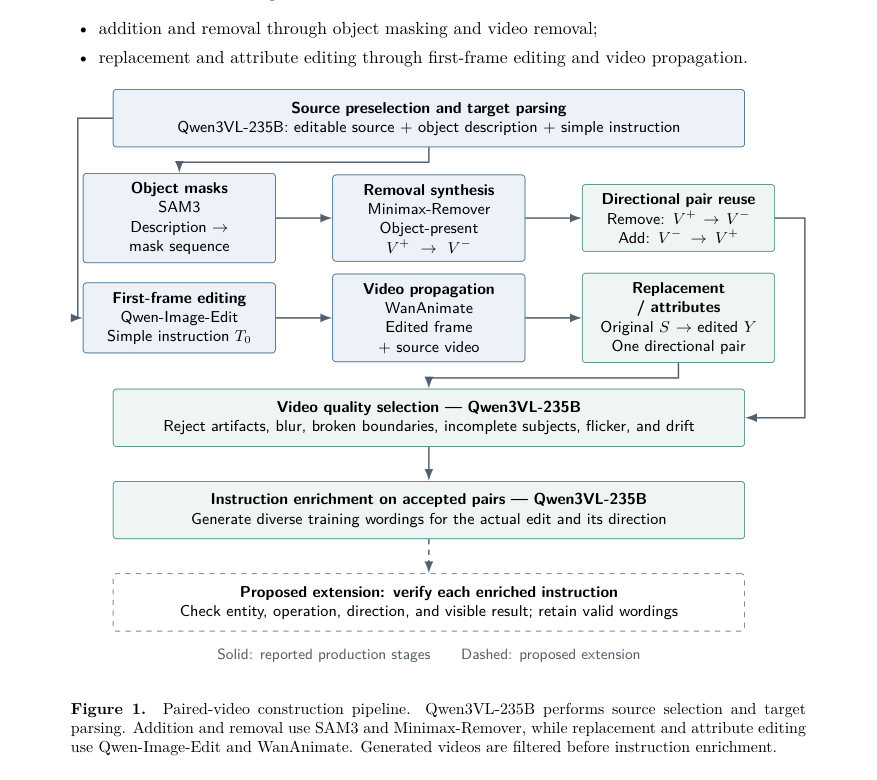
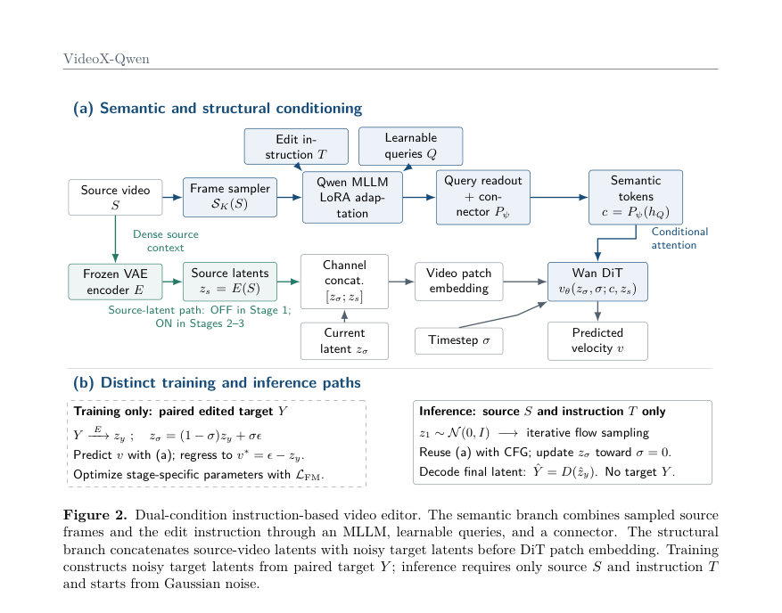
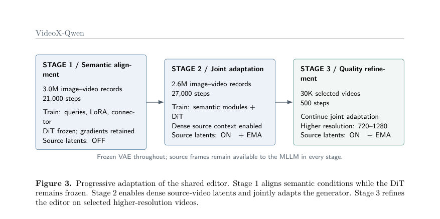

# VideoX-Qwen: Data-Centric Instruction-Based Video Editing

- **게시일:** 2026-09-23
- **arXiv:** [2609.26015v1](http://arxiv.org/abs/2609.26015v1) · [PDF](https://arxiv.org/pdf/2609.26015v1)
- **저자:** JJiahang Li, Dingbao Shao, Xinyu Chen, Song Wu, Jiang Lin, Duo Li, Yuhang Liu, Jiaxin Hu, Shengrong Gu, Ying Tai, Zili Yi
- **분야:** cs.AI, cs.GR
- **선정 점수:** 5.04
- **선정 이유:** 최근성 1.1, 인용 영향 0.0 (인용 0회), 저자 영향 0.0 (최고 h-index 0), AI 주제 적합성 2.1, 개발자 관심 0.0, 학술 신호 0.3, 오픈 웨이트·주요 연구조직 신호 1.5

[← 2026-09-23 목록으로 돌아가기](../daily/2026-09-23.html)

<!-- paper-visuals:start -->
## 주요 Figure

> 원문 PDF에서 실제 Figure 캡션과 그림 영역이 함께 확인된 자료만 자동 추출했다.

*Figure · 원문 PDF 4쪽 · Figure 1. Paired-video construction pipeline.*

*Figure · 원문 PDF 7쪽 · Figure 2. Dual-condition instruction-based video editor. The semantic branch combines sampled source*

*Figure · 원문 PDF 9쪽 · Figure 3. Progressive adaptation of the shared editor. Stage 1 aligns semantic conditions while the DiT*

<!-- paper-visuals:end -->

## 한 문장 요약

대규모 합성 paired 비디오 데이터를 자동 생산하는 파이프라인과 멀티모달·소스-조건부 학습을 결합한 통합 프레임워크로, 지시문 기반(텍스트) 비디오 편집을 위한 범용 편집기(VideoX-Qwen)와 1.2M+ 방향성 편집 레코드를 제안한다.

## 해결하려는 문제

기존 비디오 편집 시스템은 (1) 정밀한 before–after 감독(pair supervision)이 부족하여 편집 대상 변화와 보존해야 할 장면·대상·운동·시간적 연속성을 동시에 학습하기 어렵고, (2) 사전학습된 비디오 생성 백본은 강한 appearance·motion priors를 가지나 소스 비디오를 이해하고 자연언어 지시를 해석해 소스의 구조를 보존하면서 지정된 변화만 합성하도록 설계되지 않아 지시문-기반 편집으로 직접 전이하기 어렵다는 두 가지 병목을 해결하려 한다.

## 핵심 기여

- 전문화된 생성·이해 모델을 작업별 루트로 조직하고 품질 검수·지시문 확장을 거쳐 대규모 방향성( directional ) paired 비디오 레코드를 자동 생산하는 확장 가능한 다중 작업 데이터 파이프라인을 개발함.
- 추가(addition), 제거(removal), 교체(replacement), 속성(attribute) 편집을 포함해 총 >1.2M 방향성 편집 레코드(각 주요 그룹별 >400K)를 일관된 (S, T, Y) 소스–지시–타깃 포맷으로 구성한 대규모 구조화 코퍼스를 구축함(자동 수용율 89%).
- 멀티모달 의미 조건과 밀집 소스-비디오 잠재(latent) 가이던스를 결합한 통합 Qwen–Wan 편집기 아키텍처를 설계하고, 점진적 이미지→비디오 학습(semantic alignment → source-conditioned joint adaptation → 고해상도 정제)의 프로그레시브 트레이닝 레시피를 제안해 실무적 지시문 기반 편집 능력을 확보함.

## 접근 방법

* 데이터 파이프라인: Qwen3-VL-235B로 편집 가능한 소스 비디오와 대상 묘사(do)·간단 지시(T0)를 선별하고, 소스는 두 루트로 라우팅된다.
* 추가/제거: SAM3로 마스크 Mo를 얻고 Minimax-Remover로 객체 제거 비디오 V−를 합성하여 방향성 쌍(V+, V−)을 만들고 양방향(제거·추가) 레코드로 저장한다.
* 교체/속성: Qwen-Image-Edit로 첫 프레임 편집 I*를 생성하고 Wan-Animate로 편집된 외형을 시퀀스에 전파하여 Y*를 얻는다.
* 생성된 비디오는 프레임이 아닌 전체 비디오 수준에서 시각적 품질 필터링(요청 편집 결여·오류 객체 편집·불필요 변경·경계 파손·깜박임·심한 블러/아티팩트 등)을 적용한 뒤 지시문 확장을 수행한다.
* 모델 아키텍처: 입력 (S, T)에서 두 경로를 사용한다.
* 의미 분기(semantic branch)는 SK(S)로 샘플한 K개의 소스 프레임, 편집 지시 T, learnable queries Q를 Qwen MLLM(Fφ)에 넣어 쿼리 읽기값 hQ를 얻고 connector Pψ로 generator-조건 토큰 c를 만든다(구현: 이미지 쿼리 256, 비디오 쿼리 512; MLLM은 LoRA로 적응).
* 구조 분기(structural branch)는 고정된 VAE 인코더 E로 전체 소스 클립의 잠재 zs를 계산하고, 학습 중 noisy target latent zσ와 채널 방향으로 concat(Concatchannel(zσ,zs))하여 Wan DiT의 패치 임베딩으로 투입한다.
* 손실/학습: 흐름-매칭(flow-matching) 목적 L_FM = E[w(σ) \|\| vθ(zσ,σ; c, zs) − (ϵ − zy) \|\|^2]로 예측 속도(velocity)를 학습하고, 추론 시에는 z1∼N(0,I)에서 스케줄러로 노이즈를 줄여가는 샘플링을 사용하며 classifier-free guidance로 조건/무조건 분기를 결합한다.
* 프로그레시브 트레이닝: 세 단계로 진행.
* Stage1(semantic alignment): 약 3.0M 이미지·비디오 레코드, 21,000 steps, DiT 고정, queries·LoRA·connector만 학습(소스-잠재 경로 OFF).
* Stage2(joint adaptation): 약 2.6M 레코드, 27,000 steps, DiT 해동·학습, 소스-잠재 경로 ON, EMA 0.9995.
* Stage3(refinement): 수동 선별 30K 비디오로 500 steps 고해상도(720–1280) 정제.
* VAE는 전 단계 동안 고정.

## 주요 결과

- 구성 데이터셋: 총 >1.2M 방향성 편집 레코드(추가 >400K, 제거 >400K, 교체·속성>400K), 파이프라인 자동 수용율 89% (본문 보고치).
- 정량비교: 동일한 100개 예제에 대해 UniVideo·Kling O1·VideoX-Qwen을 비교(자동 평가 파이프라인). Book-keeping 표(Table 3)에 제시된 평균값은 다음과 같음(볼수치 그대로 기재). Instruction following: UniVideo 6.91, Kling O1 7.61, VideoX-Qwen 7.70. Editing quality: 7.11 / 7.69 / 7.86. Content preservation: 7.01 / 7.51 / 7.70. Background consistency: 0.9512 / 0.9455 / 0.9535. Aesthetic quality: 0.5098 / 0.5248 / 0.5067. Imaging quality: 0.6130 / 0.6973 / 0.6294. Kiwi-Edit Score: 3.797 / 3.942 / 3.960. VFID-I3D (↓): 26.5066 / 36.2155 / 25.9629. VFID-ResNeXt (↓): 1.3501 / 1.0782 / 0.9253. SSIM: 0.5723 / 0.6701 / 0.7658. LPIPS (↓): 0.2399 / 0.2367 / 0.1966.
- 해석: 저자 보고에 따르면 VideoX-Qwen은 11개 지표 중 9개에서 평균 최고 성능을 달성했으며(특히 지시문 준수, 편집 품질, 콘텐츠 보존, 구조·지각적 유사성, 분포 품질 등), Kling O1은 미적·이미징 품질 지표에서 우세함을 명시함.
- 정성: 본문에 6개 대표 사례(교체, 색상 편집, 객체 추가, 복합 지시, 국부 속성 변경)를 제시해 소스 보존·부분 편집 실패·부분 성공 등을 예시로 제시함.

## 한계

- 저자 명시 한계: Kling O1이 미적(aesthetic) 및 이미지 품질(imaging quality) 지표에서 여전히 우세하여 시각적 마감(visual polish)에서 추가 개선 여지가 있음을 인정함.
- 저자가 제안했으나 자동화되지 않은 항목: 본문 Figure 1의 점선으로 표기된 '확장 제안'에는 지시문 확장(enriched instructions)의 추가 검증(엔티티·연산·방향·가시적 결과 확인)이 포함되나 이는 제안으로 표현되어 현재 파이프라인에 전부 적용되었는지 명확하지 않음.
- 실험 범위·평가 제약(본문에서 확인 가능한 관찰): 비교 평가는 100개 예제로 수행되어 대규모·다양한 실세계 분포에 대한 일반화 평가가 제한적이며, 자동 메트릭과 모델-기반 평가(Qwen2.5-VL-7B 등)를 중심으로 해석되어 인간 주관적 평가의 범위가 제한적임.
- 데이터·구성 의존성: 합성·전문가 모델(SAM3, Minimax-Remover, Qwen-Image-Edit, Wan-Animate, Qwen3-VL 등)에 크게 의존하므로 해당 구성요소의 한계와 편향이 최종 코퍼스·모델 성능에 반영될 수 있음(저자는 전문가 모델을 통해 파이프라인을 확장 가능하다고 기술).

## 개발자 관점

- 데이터 파이프라인 구현: 소스 선별·대상 묘사 추출(MLLM 기반), SAM3로 마스크 시퀀스 추출, Minimax-Remover로 제거 합성, Qwen-Image-Edit로 첫 프레임 편집, Wan-Animate로 외형 전파 등 전문 모듈을 조합해 (S,T,Y) 방향성 레코드를 생산하되, 전체 비디오 수준에서 품질 필터링 규칙을 엄격히 적용해야 함(편집 누락·잘못된 객체·불필요 변경·경계 파손·깜박임·블러 등).
- 데이터 규모·저장·검수 비용: >1.2M 방향성 레코드, 자동 수용율 89%에 따른 대량 저장소와 데이터 파이프라인 비용(생성·검수 연산)이 필요하며 Stage3를 위한 수동 선별 30K 비디오도 필요.
- 모델·학습 재현 포인트: MLLM은 LoRA로 적응, learnable queries(문헌상 이미지 256·비디오 512 쿼리 사용), connector를 통해 DiT 조건 토큰 생성, 전체 VAE는 학습 중 고정, Stage1에서 DiT를 고정한 채 queries·LoRA·connector만 학습 후 Stage2에서 DiT 해동·학습, Stage3에서 고해상도 정제(500 steps) 및 EMA(0.9995) 적용. 채널-컨캐트(Concatchannel)로 zσ와 zs를 결합하고 flow-matching 손실을 사용하는 점이 핵심 구현세부임.
- 추론·배포: 배포 시에는 입력으로 소스 비디오 S와 지시문 T만 필요(마스크·편집된 첫 프레임 불필요). 추론은 노이즈 샘플(z1)에서 디퓨전/flow-matching 샘플러로 z를 갱신하고 최종 VAE 디코딩(ˆY=D(ˆzy))을 수행하며 classifier-free guidance를 적용해 조건 강도를 조정함.
- 재현성·의존성 주의: 핵심 파이프라인·모듈(예: Qwen3-VL-235B, Qwen-Image-Edit, Wan-Animate, SAM3, Minimax-Remover, Wan DiT 등)이 공개/상용 여부에 따라 재현 난이도가 크게 달라질 수 있으므로 대체 오픈 소스 도구·대신 학습된 전문가 모델 준비가 필요함(구성요소 의존은 결과에 직접 영향). 또한 계산 비용(수백만 레코드·수만~수만 단계 학습)과 저장·검수 워크플로 비용을 고려해야 함, 실무적으로 인물·허위 편집 악용 가능성에 대한 안전 정책·모니터링 필요.

**근거 범위:** 이 분석은 제공된 논문 PDF 본문(페이지 전체)의 텍스트에 근거해 작성되었다. 표·그림·본문에 명시된 수치(데이터 규모, 수용율, Table 2의 학습 설정, Table 3의 비교 결과 등)를 그대로 인용했다. 논문 본문에 명시되지 않은 세부 구현(예: 전체 하이퍼파라미터 표, GPU/시간 비용, 랜덤 시드, 일부 내부 모듈의 공개 상태)은 PDF에서 확인되지 않아 기술하지 않았으며, 논문이 참조하는 외부 구성요소(Qwen3-VL, Wan 등)의 내부 구현·가용성은 본문에 의존해 기술했음을 밝힌다.
