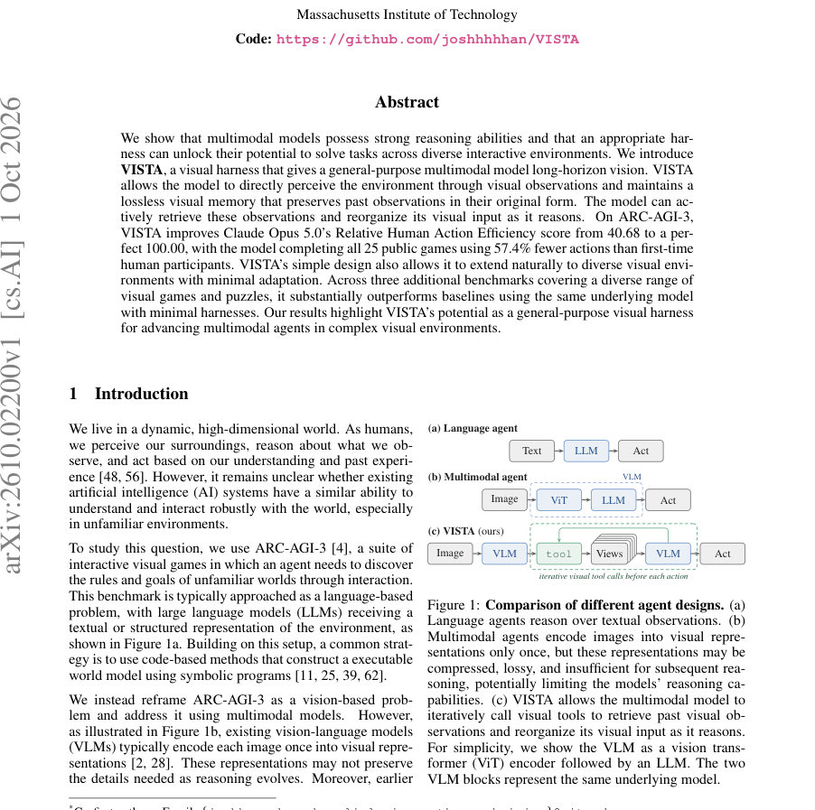
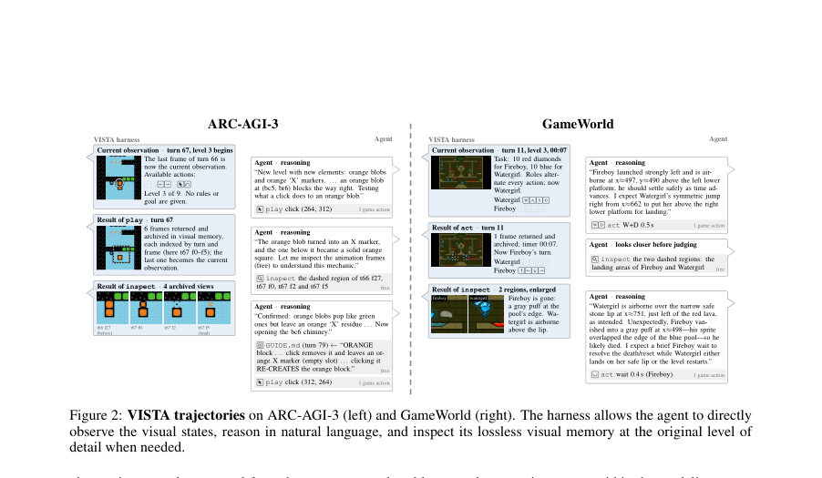
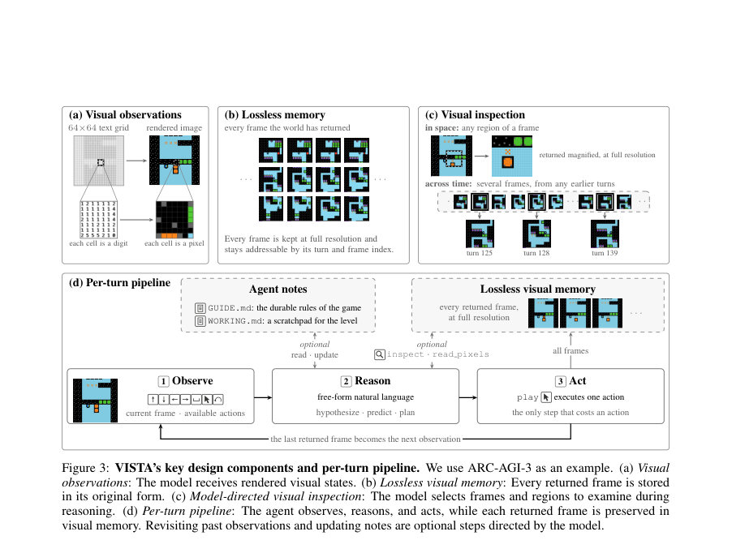

# VISTA: A Visual Harness for Reasoning in an Interactive World

- **게시일:** 2026-10-03
- **arXiv:** [2610.02200v1](http://arxiv.org/abs/2610.02200v1) · [PDF](https://arxiv.org/pdf/2610.02200v1)
- **저자:** Qiushi Han, Keya Hu, Linlu Qiu, Cathy Wu, Kaiming He
- **분야:** cs.AI, cs.CV
- **선정 점수:** 6.28
- **선정 이유:** 최근성 0.8, 인용 영향 1.0 (인용 4회), 저자 영향 1.3 (최고 h-index 6), AI 주제 적합성 2.7, 개발자 관심 0.2, 학술 신호 0.3, 오픈 웨이트·주요 연구조직 신호 0.0

[← 2026-10-03 목록으로 돌아가기](../daily/2026-10-03.html)

<!-- paper-visuals:start -->
## 주요 Figure

> 원문 PDF에서 실제 Figure 캡션과 그림 영역이 함께 확인된 자료만 자동 추출했다.

*Figure · 원문 PDF 1쪽 · Figure 1: Comparison of different agent designs. (a)*

*Figure · 원문 PDF 2쪽 · Figure 2: VISTA trajectories on ARC-AGI-3 (left) and GameWorld (right). The harness allows the agent to directly*

*Figure · 원문 PDF 4쪽 · Figure 3: VISTA’s key design components and per-turn pipeline. We use ARC-AGI-3 as an example. (a) Visual*

<!-- paper-visuals:end -->

## 한 문장 요약

VISTA는 모든 환경 프레임을 원본 해상도로 보존하는 손실 없는 시각 메모리와 모델이 능동적으로 과거 프레임을 재검사·확대할 수 있는 시각 검사 도구를 결합해, 멀티모달 모델에 장기적 시각 관찰과 재-주의(re-attention)를 부여하여 상호작용형 시각 환경에서 복잡한 추론·계획을 수행하게 하는 범용 시각 하니스이다.

## 해결하려는 문제

기존 멀티모달 시스템은 각 이미지를 한 번만 인코딩하고 압축된 표현만을 문맥에 유지하는 방식으로 장기 상호작용 중 필요한 세부 정보를 보존하지 못하거나, 문맥 한계로 과거 관찰을 잃어 추론이 제한된다. 특히 ARC-AGI-3 같은 상호작용형 시각 게임에서는 규칙 탐색과 장기 상태 기억이 중요하지만, 기존 방법은 텍스트化·프로그램 합성 또는 요약에 의존해 비가시적·손실적인 정보 표현으로 한계를 보였다.

## 핵심 기여

- VISTA라는 단순하고 범용적인 시각 하니스를 제안: 원본 이미지를 손실 없이 보관하는 시각 메모리와 모델이 필요할 때 임의 프레임 및 영역을 확대하거나 픽셀 값을 읽을 수 있는 검사 도구(inspect, read pixels)를 제공한다.
- 모델 주도형 재-주의(re-attention) 파이프라인을 제시: 매 턴 observe → free-form reasoning → (선택적)inspect/read pixels → play 순으로 상호작용하며, GUIDE.md와 WORKING.md 노트를 통해 지속 가능한 게임 모델과 작업용 스크래치패드를 유지한다.
- 프로그램 합성 없이 이미지 기반으로 ARC-AGI-3의 25개 공개 게임을 완전 해결(Claude Opus 5.0으로 RHAE 100.00)을 달성하고, 인간 참조 대비 전체 행동 수를 57.4% 절감함을 보였다.
- 같은 하니스가 최소한의 적응으로 GameWorld, AI GameStore, BabyVision 등 다양한 시각 환경에 적용되어 정량적으로 기존 최소 하니스 기반의 동일 모델들을 일관되게 능가함을 보여 범용성을 입증했다.
- 하니스 구성요소(이미지 관찰, 손실 없는 시각 메모리, 모델-지시 검사)가 성능에 기여하는 바를 단계적 ablation으로 정량화하여 각 구성의 기여도를 분석했다.

## 접근 방법

* VISTA는 하드웨어·소프트웨어적으로 별도의 '기계적' 하니스를 두고 멀티모달 모델과 도구 호출 인터페이스로 상호작용한다.
* 핵심 설계는 (1) Visual observation: 환경으로부터 렌더된 이미지를 관찰(기본은 64×64를 8× NN 업스케일 → 512×512 PNG), (2) Lossless visual memory: 환경이 반환한 모든 프레임(중간 애니메이션 프레임 포함)을 원본 형태로 보관하고 각 프레임을 (turn, frame)으로 인덱싱, (3) Visual inspection: 모델이 inspect(임의 프레임·영역을 잘라 확대된 이미지로 반환)와 read pixels(지정 영역을 셀 그리드로 쪼개어 각 셀의 RGB 값을 수치로 반환) 등을 호출해 공간·시간 차원의 증거를 능동적으로 조회.
* 에이전트는 자연어로 자유형(reasoning) 서술을 하며 GUIDE.md(지속 규칙·지식)와 WORKING.md(레벨별 스크래치) 파일을 유지한다.
* 대화는 턴 단위로 진행되며 한 턴 내에서 여러 도구 호출이 가능하지만 실제 환경을 변경하는 것은 play/act 호출뿐이다.
* 문맥이 가득 차면 compact checkpoint를 저장해 새 컨텍스트에서 재개하는 방식으로 장기 상호작용을 관리한다.
* VISTA는 모델-중립적으로 설계되어 Claude Opus 5.0, GPT-5.6 Sol, 공개 가중치 GLM-5.3 Flash 320B 등 다양한 백엔드에서 평가되었다.

## 주요 결과

- ARC-AGI-3(25 공개 게임): VISTA + Claude Opus 5.0 (xhigh effort)로 RHAE 100.00 달성; 총 행동 수 7,302 (인간 기준 17,135 대비 57.4% 적음).
- 동일 과제에서 VISTA + GPT-5.6 Sol (max effort) 은 RHAE 99.00, 총 행동 9,126으로 모든 게임을 완료함.
- 공식 최소 하니스(텍스트 그리드 관찰) 대비 단계적 하니스 추가 실험: 텍스트→이미지 관찰으로 RHAE 13.33→47.32, 액션/시간 한도 증가로 51.66, 연속 대화 추가로 65.82, GUIDE/WORKING 노트 추가로 70.05, 손실 없는 메모리+검사 추가로 94.10, 픽셀 읽기까지 포함한 전체 VISTA로 99.00(=Figure 5의 GPT-5.6 Sol 실험 순서).
- 관찰 표현 비교: 텍스트 그리드(64×64)는 토큰 집중 비용이 크며(게임당 평균 토큰 약 71.9M), 이미지(512×512) 관찰은 동일 작업에서 토큰 효율이 좋아 게임당 평균 약 30.7M 토큰을 사용하면서 유사한 성능을 냄.
- 문맥 크기 및 화상 해상도 민감도: 기본 최대 컨텍스트 200K 토큰에서 RHAE 99.00으로 최적을 보였고(780K는 토큰 사용량을 크게 증가시켜 게임당 105.7M 토큰 소비), 입력 이미지 스케일은 4×(256px)와 8×(512px) 사이에서 성능/토큰 사용의 트레이드오프가 관찰됨(4×가 기본 8× 대비 이미지 토큰 75% 절감하면서 유사 성능). (Figure 7 참고.)

## 한계

- 저자가 명시한 한계: 성공에는 모델 자체의 능력이 큰 요인으로 작용하며(즉, 하니스가 모델 능력을 끌어내는 역할), 사용한 상용 모델들이 공개 벤치마크에 포함된 게임을 사전학습에 포함했을 가능성을 배제할 수 없음. 따라서 private/미공개 게임으로의 추가 평가가 필요하다고 저자가 밝힘.
- 본문 실험에서 확인되는 범위상의 제약(저자와 구분): 상위 성능은 대형·상용 폐쇄형 모델(Claude, GPT-5.6)에 의존했고 공개 가중치 GLM-5.3에서는 RHAE가 낮게 나타나는 등(본문에 GLM-5.3로는 VISTA RHAE 66.93), 최종 성능의 재현은 모델 접근성에 좌우됨.
- 연산·토큰 비용이 매우 높음: 대규모 컨텍스트와 고해상도 이미지 사용 시 게임당 수십~수백만 토큰, 수만 개 프레임을 저장·전송해야 해 비용·지연·저장소 부담이 큼.
- 복잡한 3D 렌더링에서는 행동 수와 난이도가 증가하며 성능이 하락(2D 대비 3D RHAE 84.12, 총 행동 20,640)해 더 복잡한 시각 표현에는 추가 적응이 필요함.

## 개발자 관점

- 재현성·구현: VISTA 구현은 모델 내부 수정 없이 외부 도구 서버(하니스)로 가능 — 모든 프레임을 저장하는 아카이브, inspect/read_pixels/play 같은 구조화된 함수형 API, GUIDE.md/WORKING.md 파일 관리, 컨텍스트 컴팩션 훅(save compact checkpoint)을 구현하면 된다.
- 프롬프트·인터페이스: 간단한 템플릿(각 턴 기대 전후 서술, 노트 유지)을 통해 모델에게 장기적 게임 모델을 만들고 갱신하도록 유도하면 성능 향상에 큰 도움이 된다.
- 리소스·비용: 기본 설정에서 이미지 관찰(512×512), 최대 컨텍스트 200K 토큰, 게임당 수천~수만 번의 도구 호출로 토큰 소비가 매우 크므로 실험·배포 시 토큰·시간 비용을 사전 계산하고 중간 해상도(예: 256px)로 절충을 고려하라.
- 안전·운영: 도구 호출만으로 환경을 조작하고 외부 접근을 차단하는 샌드박스가 필요하다(Claude Code에서는 MCP, Codex 통합 시 도구 등록). 파일·시스템 접근은 차단하고 도구 실행은 엄격한 파싱된 함수 호출로만 허용해야 한다.
- 응용성: VISTA는 다양한 비주얼 환경(2D·간단한 3D·정적 시각 질의)에 최소한의 적응으로 적용 가능하므로 새로운 시각 상호작용 태스크에 대해 하니스 측면 개선부터 시도해볼 것을 권장한다.

**근거 범위:** 이 분석은 제공된 논문 PDF 본문을 근거로 작성되었음. 주요 수치(예: ARC-AGI-3 RHAE, 총 행동 수, ablation 수치, 토큰 사용량 등)는 본문·표·그림에서 직접 확인 가능한 값만 포함했음. 도표의 작은 글자·시각적 요소는 OCR 해석 한계로 인해 일부 세부값 해석이 어려울 수 있으므로, 표나 본문에 명시된 숫자를 우선으로 사용했고 해석이 불확실한 시각적 막대그래프의 세부 수치는 포함하지 않았다.
