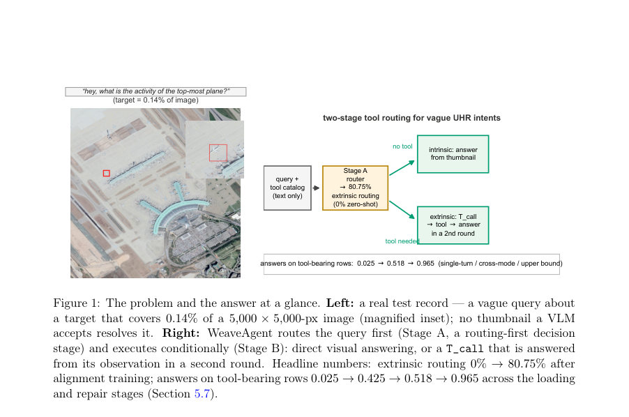
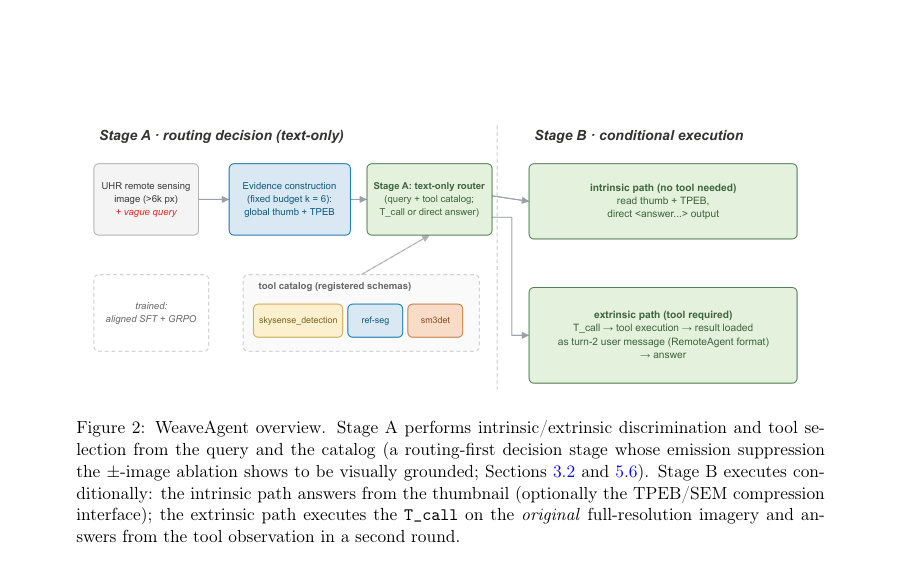
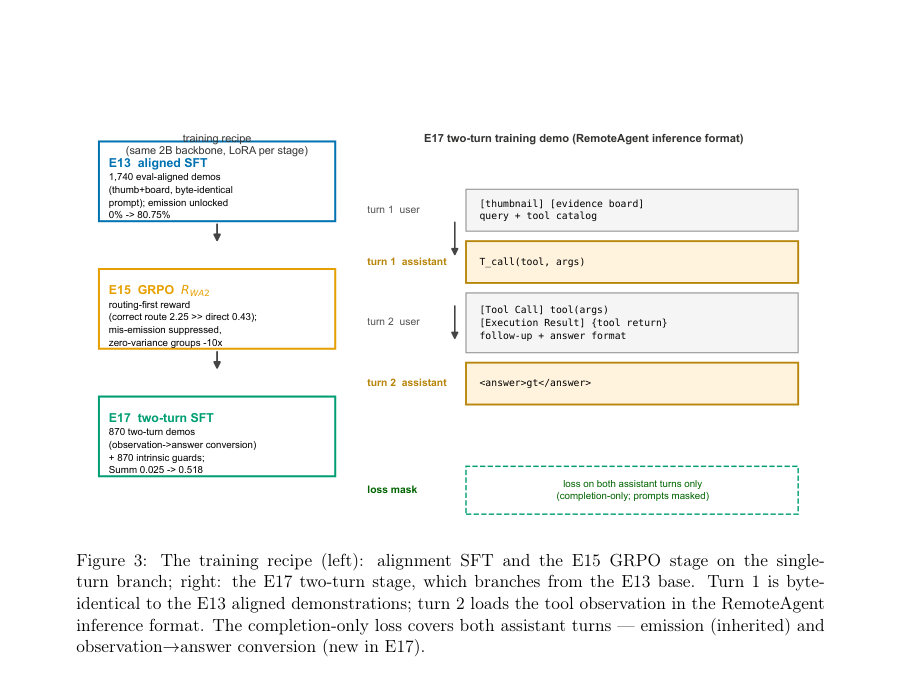

# WeaveAgent: A Two-Stage Tool-Routing Agent for Ultra-High-Resolution Remote Sensing Imagery

- **게시일:** 2026-09-28
- **arXiv:** [2609.31234v1](http://arxiv.org/abs/2609.31234v1) · [PDF](https://arxiv.org/pdf/2609.31234v1)
- **저자:** Zhongyu Pang
- **분야:** cs.CV
- **선정 점수:** 5.19
- **선정 이유:** 최근성 0.4, 인용 영향 0.0 (인용 0회), 저자 영향 0.0 (최고 h-index 0), AI 주제 적합성 2.6, 개발자 관심 0.5, 학술 신호 1.1, 오픈 웨이트·주요 연구조직 신호 0.6

[← 2026-09-28 목록으로 돌아가기](../daily/2026-09-28.html)

<!-- paper-visuals:start -->
## 주요 Figure

> 원문 PDF에서 실제 Figure 캡션과 그림 영역이 함께 확인된 자료만 자동 추출했다.

*Figure · 원문 PDF 2쪽 · Figure 1: The problem and the answer at a glance. Left: a real test record — a vague query about*

*Figure · 원문 PDF 7쪽 · Figure 2: WeaveAgent overview. Stage A performs intrinsic/extrinsic discrimination and tool se-*

*Figure · 원문 PDF 12쪽 · Figure 3: The training recipe (left): alignment SFT and the E15 GRPO stage on the single-*

<!-- paper-visuals:end -->

## 한 문장 요약

초고해상(UHR) 원격감시 질의에서 시각 토큰 비용과 도구 호출의 형식 신뢰성 문제를 분리해, 텍스트 기반의 Stage A 라우터로 호출 여부·도구 선택을 먼저 결정하고 Stage B에서 조건부로 원본 고해상도 이미지에 도구를 실행해 두-턴 관찰 기반으로 응답하는 WeaveAgent 아키텍처와 그 학습·평가 파이프라인을 제안한다.

## 해결하려는 문제

UHR 원격감시는 (1) 모델 입력으로 고해상도 시각 토큰을 직접 넣을 경우 토큰 비용이 급격히 커지고(이미지 측면: median 6,044px, max 27,328px), 축소된 썸네일은 작은 객체를 잃어버려 해결 불가한 질의가 많다; (2) 사전학습 모델은 제로-샷으로 도구 호출을 거의 하지 않아(논문: 0% 호출) 도구 기반 해결이 필요한 '모호한(vague) 의도'에 대응하지 못한다. 연구 질문은 텍스트만으로 먼저 '도구 호출이 필요한가/어떤 도구인가'를 결정해 시각 토큰 소비를 절감하면서도, 도구 호출을 형식적으로 신뢰할 수 있게 만드는 훈련·보상 설계와 관찰→응답 전환(Observation→Answer) 문제를 어떻게 해결할 것인가이다.

## 핵심 기여

- C1: UHR 원격감시에 특화된 두-단계(WeaveAgent) 도구 라우팅 에이전트 아키텍처 제안 — Stage A는 텍스트(질의 + 도구 카탈로그)만으로 intrinsic/extrinsic 판별과 도구 선택(T_call)을 수행하는 routing-first 결정 단계, Stage B는 조건부로 intrinsic은 썸네일/증거보드로 답하고 extrinsic은 원본 고해상도에서 도구를 실행해 관찰을 두 번째 턴에 불러와 답하는 구조.
- C2: 고정 토큰 예산의 압축 시각 인터페이스 재위치화 — WeaveEarth 스타일의 TPEB+SEM 증거보드를 '정확도 부스터'가 아닌 '고정-토큰 압축 인터페이스'로 위치시키고 세 가지 벤치마크에서 paired 델타(−1.0 / −3.4 / −2.9)와 1.31× 디테일 한계를 정직하게 보고함.
- C3: VagueUHR 듀얼-스플릿 코퍼스 공개(논문 기준) — 합성 파이프라인으로 생성된 5,000/3,273/1,000 레코드(테스트: 600 intrinsic + 400 tool-required), 테스트에 툴-미등장 도구와 5개의 퍽(10개 task shape 중 5개 미등장)을 포함해 라우팅 일반화 측정 가능하게 구성.
- C4: 훈련 레시피(Alignment SFT → RWA2 기반 GRPO)와 설계 근거 실험 — SFT로 호출 행동을 시드(외적 라우팅 0 → 80.75%, 323/400), 이후 RWA2 보상으로 라우팅-우선 인센티브를 부여해 잘못된 내재적 호출을 일부 억제(9개 mis-emission 억제)하고 학습 동역학 개선.
- C5: 관찰→응답 전환 문제 진단과 부분적 수리 — 관찰(도구 반환)을 컨텍스트에 로딩하면 외적 응답 정확도가 0.025 → 0.425로 크게 상승하며, 추가로 두-턴 SFT 수리 단계는 교차-모드(마커-프리) 평가에서 0.425 → 0.518(+9.3)로 개선(훈련-분포 상한은 0.965)됨을 보임.

## 접근 방법

* 아키텍처: WeaveAgent는 Stage A(텍스트 전용 라우터)와 Stage B(조건부 실행)로 분리된다.
* Stage A는 입력으로 질의 q와 도구 카탈로그 C(선언적 스키마)를 받고 aroute를 출력(ANSWER 또는 T_call(ek,p)).
* Stage B는 intrinsic 경로에서 2048-px 전장 썸네일(선택적으로 TPEB/SEM 증거보드 ≈5k 토큰)을 모델에 넣어 직접 응답하고, extrinsic 경로에서는 Stage A가 방출한 T_call을 실제로 원본 고해상도 이미지에서 실행한 뒤(검출/분할/카운트 등의 텍스트화된 관찰 o) 그 관찰을 두 번째 턴의 사용자 메시지처럼 컨텍스트에 불러와 observation-masked 방식으로 최종 응답을 생성하는 두-턴 궤적을 사용한다.
* 증거보드: WeaveEarth 파이프라인(GCC, MSES, TPEB/SEM)을 재구현하되 목적은 '고정 토큰 예산 압축 인터페이스'로 한정(디테일 한계 1.31×).
* 훈련: (1) Alignment SFT — 870 도구 궤적 데모 + 870 intrinsic 밸런싱 데모로 방출(emission) 행동을 시드(LoRA r=32, α=64, 1,000 steps 등 상세 구성 서술됨); (2) GRPO로 RWA2(라우팅-우선 보상 함수) 최적화(G=4, rollout temp=0.95, lr=1e-6, 300 steps)해 라우팅-우선 인센티브 부여.
* 추가로 관찰→응답 변환 갭을 보수하기 위해 두-턴 관찰 불입 포맷을 사용한 SFT(1,740 행: 870 two-turn 데모 + 870 intrinsic) 분기(E17)를 수행해 관찰 로딩 및 관찰→응답 학습을 진행.

## 주요 결과

- 외적 라우팅(call emission): 제로-샷(unaligned) 모델은 T_call을 전혀 방출하지 않음(0%). Alignment SFT로 외적 라우팅이 0% → 80.75% (323/400)로 상승했고(툴 선택 정확도 0.905 보고), GRPO(RWA2)는 9개의 intrinsic 잘못 방출을 억제함(툴 선택은 불변).
- 전체 성능 비교: 훈련한 2B 시스템은 전체 정확도에서 제로-샷 8B 기준을 이기지 못함(논문 수치: 0.263 vs. 0.250 — 진단적 관찰).
- 관찰→응답 오라클 귀속: 관찰을 컨텍스트에 로딩하면 외적 응답 정확도가 0.025 → 0.425로 상승하며, 두-턴 SFT 수리를 더하면 0.425 → 0.518(교차-모드/마커-프리 평가, McNemar p = 3.8×10^-5). 훈련-분포 상한(oracle/training-distribution returns)은 0.965로 보고됨(모든 반환은 주석/오라클에 근거).
- 증거보드/압축 인터페이스: 세 벤치마크에서 증거보드가 썸네일 대비 paired 델타는 −1.0 (LRS-VQA), −3.4 (MME-RS), −2.9 (XLRS)로 정확도 향상 효과가 없음을 보고하며, 압축 인터페이스는 토큰 비용을 고정(두 뷰 ≈5k 토큰)하고 단일-패스 증거 생성은 RTX 4090에서 샘플당 7.31초로 측정됨.
- 라이터블 결과·코퍼스·범위: VagueUHR 코퍼스는 5,000(템플릿 합성 기반)/3,273(라우팅 학습, 870 툴 데모 포함)/1,000(테스트: 600 intrinsic + 400 툴 필요)로 구성되며, 테스트에 툴 미등장(sm3det 62개 레코드)과 LLM-시각-재작성(992 유지) 분할을 포함.

## 한계

- 저자 명시 한계 — 백본 규모: 8B 모델에 대한 GRPO 훈련은 24GB GPU 메모리에 맞지 않아 본 연구의 두-단계 훈련 및 평가는 Qwen3-VL-2B로 수행됨. 8B 스케일에서 레시피 재측정은 향후 작업으로 남음.
- 저자 명시 한계 — 진정한 텍스트-온리 라우터 미달성: ±-이미지 실험(E19)에서 이미지 토큰 제거는 extrinsic 라우팅은 유지하나 intrinsic 라우팅이 붕괴(0.985 → 0.022)하고 거의 모든 레코드에서 호출이 재개되어(987/1,000) '시각 신호 없이 언제 호출하지 말아야 하는지'를 결정하는 능력은 시각에 시달림.
- 저자 명시 한계 — 변환 수리(end-to-end)가 실서비스에 대해 완료되지 않음: E16/E17 실험은 주석/오라클 기반 반환을 사용(평가 A의 fallback rate = 1.0). 라이브 전문가 백엔드에 대한 엔드투엔드 성공률은 측정되지 않음.
- 저자 명시 한계 — p(지역) 파라미터 평가 미비: T_call(ek, p)의 region 파라미터에 대한 평가가 보고되지 않음(도구들이 본 논문 실험에서는 전체 이미지 또는 쿼리 텍스트를 프롬프트로 사용). 지역-정확도(지역이 올바른지) 메트릭은 미측정으로 남음(핵심 UHR 난제임). (본문에서 명시된 한계.)

## 개발자 관점

- 재현·훈련 리소스: 논문은 두-단계 훈련을 Qwen3-VL-2B + LoRA(r=32, α=64)로 수행하며 GRPO 단계는 단일 24GB GPU에서(생성 배치·그룹 규격 포함) 가능하다고 보고한다. 8B GRPO는 ≥48GB 이상 메모리가 필요해 향후 리소스 계획에 반영해야 함.
- 프롬프트·형식 민감도: 프롬프트 바이트-레벨 변경이 라우팅을 완전히 파괴할 수 있음(E12 감사). 평가와 동일한 프롬프트/이미지 형식으로 Alignment SFT를 수행해야 하며, 배포에서 프롬프트 변형·업데이트 시 회귀 검증이 필수다.
- 보상 설계(RWA2)의 중요성: 일반적인 answer-first 보상은 '항상 직접 답하기'로 수렴할 수 있으므로 라우팅-우선 보상(RWA2: answer+tool+format 가중치 재설계)이 라우팅 행동을 유도하는 실용적 방법임 — 도구 호출을 훈련으로 열어야 할 경우 보상 구조를 면밀히 설계할 것.
- 관찰 불입(observation backfill) 포맷 필요: 관찰→응답 변환 갭을 줄이려면 도구 관찰을 컨텍스트에 적절히 '불어넣는' 형식(RemoteAgent의 [Tool Call]/[Execution Result] 루프처럼)이 필요하며, 두-턴 SFT(관찰을 포함한 데모)로 이 전환을 학습시켜야 함.
- 도구 등록은 가시성만 보장: 선언적 스키마로 도구를 카탈로그에 등록하면 '보이게'는 되나 바로 사용할 수 있는 것은 아님 — 논문에서는 훈련 미등장 도구(sm3det)에 대해 0/62 라우팅으로 일반화가 실패함. 실서비스에 신규 도구 투입 전엔 별도 유효성 검증 필요하다.  
(훈련/테스트에서 혼합된 실제·시뮬레이션 백엔드를 명시적으로 확인하고 배포할 것.)

	
	
	
	
	
	
	
	
	

	
	
	
	
	
	
	
	
	
	
	
	
	
	
	
	
	
	
	
	
	
	
	
	
	
	
	
	
	
	
	
	
	

	

	

**근거 범위:** 이 분석은 제공된 논문 PDF 본문(논문 본문, 부록 및 표·그림 포함)의 텍스트를 기반으로 작성되었음. 본문에 명시된 수치·설정(예: 외적 라우팅 0→80.75% (323/400), 증거보드 paired 델타, 7.31s/이미지 등)만 인용했으며, PDF에 포함되지 않은 구현 세부사항이나 추가 실험 수치는 생성하지 않았다. 일부 세부(예: 표의 전체 셀 값, 하드웨어-간 정확한 비교 세부)는 본문에 요약·인용된 수준으로만 접근 가능했으므로 구현·배포 전 원문 표·코드(저자 공개 예정)를 교차 검증할 것을 권장한다.
