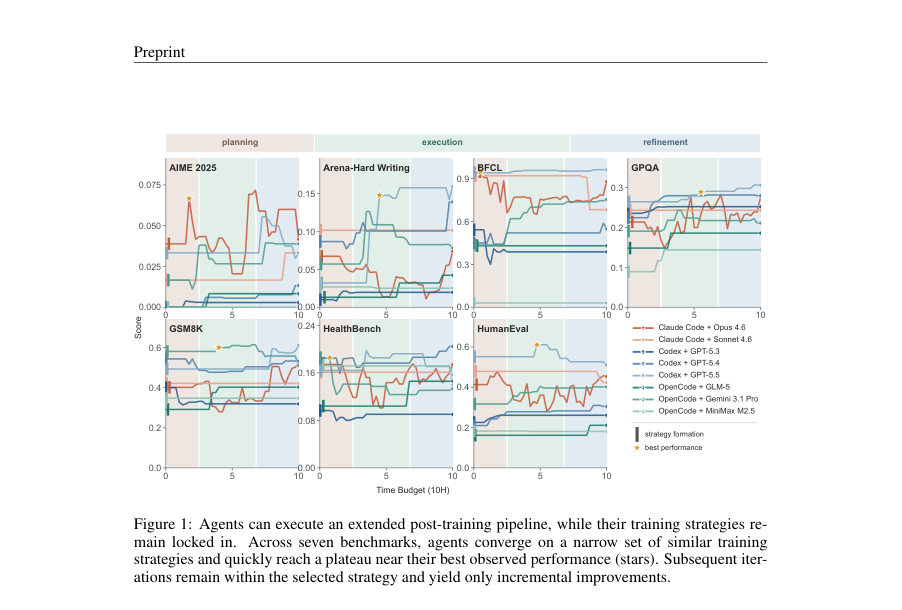
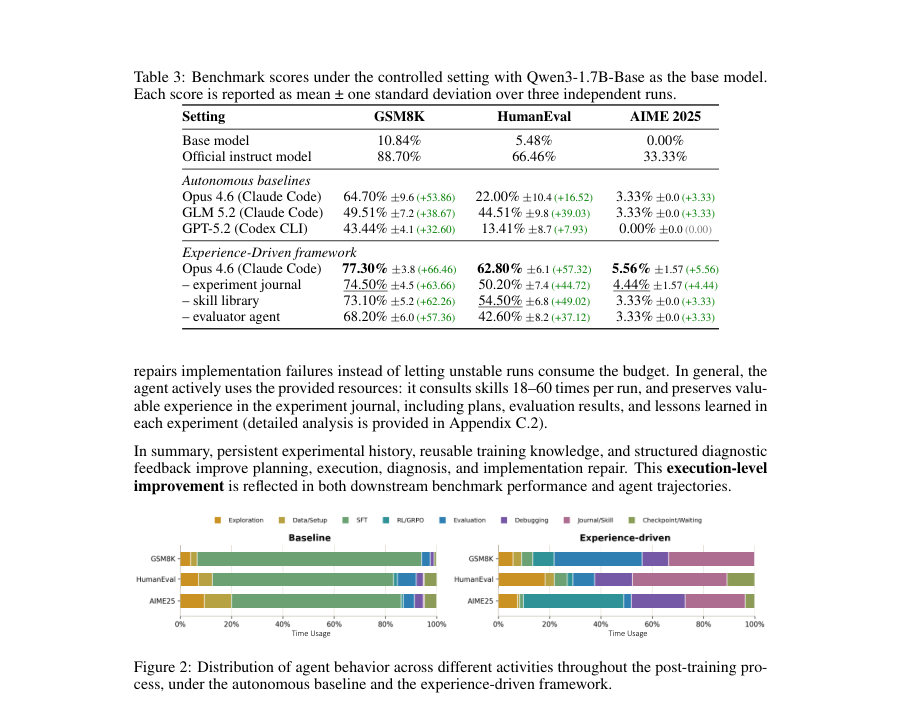
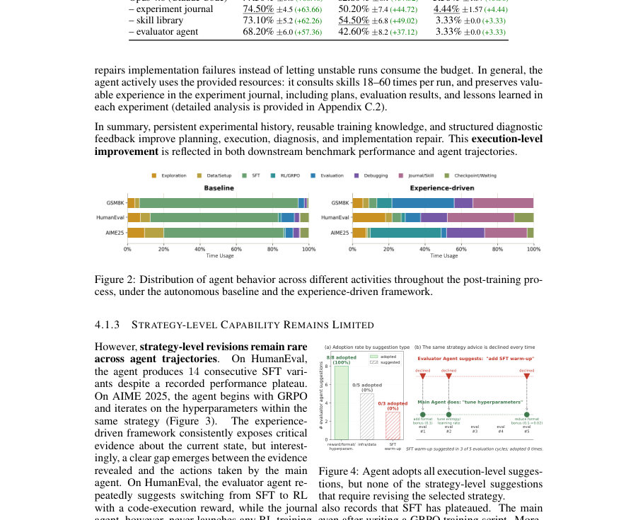

# What is Missing from AI Post-Training AI: An Empirical Analysis

- **게시일:** 2026-08-20
- **arXiv:** [2608.19072v1](http://arxiv.org/abs/2608.19072v1) · [PDF](https://arxiv.org/pdf/2608.19072v1)
- **저자:** Joy Jia Yin Lim, Xin Huang, Hao Peng, Yaxi Lu, Xin Cong, Zhong Zhang, Maosong Sun, Yankai Lin
- **분야:** cs.AI, cs.CL, cs.LG
- **선정 점수:** 7.07
- **선정 이유:** 최근성 0.8, 인용 영향 0.0 (인용 0회), 저자 영향 1.7 (최고 h-index 17), AI 주제 적합성 3.0, 개발자 관심 0.8, 학술 신호 0.3, 오픈 웨이트·주요 연구조직 신호 0.6

[← 2026-08-20 목록으로 돌아가기](../daily/2026-08-20.html)

<!-- paper-visuals:start -->
## 주요 Figure

> 원문 PDF에서 실제 Figure 캡션과 그림 영역이 함께 확인된 자료만 자동 추출했다.

*Figure · 원문 PDF 2쪽 · Figure 1: Agents can execute an extended post-training pipeline, while their training strategies re-*

*Figure · 원문 PDF 6쪽 · Figure 2: Distribution of agent behavior across different activities throughout the post-training pro-*

*Figure · 원문 PDF 6쪽 · Figure 4: Agent adopts all execution-level sugges-*

<!-- paper-visuals:end -->

## 한 문장 요약

LLM 에이전트들이 LLM 후속학습(post-training)을 실행하는 능력은 충분하지만, 대규모 궤적 분석과 통제된 개입 실험을 통해 전략(훈련 패러다임·데이터·단계 구조)을 사전에 고착(lock‑in)시키고 실행 중 자발적으로 재평가하지 못하는 '전략 수준' 재고(reevaluation) 메커니즘의 부재를 규명하고, 경험·가이드·추론 자원별로 점증적 개입을 시험해 원인을 규명했다.

## 해결하려는 문제

기존 논의는 에이전트의 ‘AI-for-AI’ 능력을 하나로 묶어 보지만, 본문은 이를 실행 수준(execution-level)과 전략 수준(strategy-level) 능력으로 분리한다. 관찰된 문제는 (1) 에이전트들이 후속학습 파이프라인을 구현하고 반복 실험을 수행하는 실행 능력은 갖추었으나, (2) 훈련 전략을 실행 초기에 고정(lock‑in)하고 이후 예측·평가 결과가 쌓여도 상위 전략(예: SFT↔PEFT↔RL 전환)을 스스로 재평가·전환하지 못해 전반적 성능 상한이 초기 전략에 의해 정해진다는 것임.

## 핵심 기여

- 대규모 공개 에이전트 후속학습 궤적(1,338개 궤적, 5,111회 검증된 훈련 실험)을 분석해 에이전트가 실행 수준에서는 유능하지만 전략 수준에서는 초기 계획에 고착된다는 실증적 패턴을 제시함.
- 실험 설계(통제 환경)에서 경험 스캐폴드(실험 저널, 기술(스킬) 라이브러리, 독립 평가자 에이전트)를 도입하여 실행 성능을 실질적으로 향상시키는 반면(예: GSM8K +12.6pp, HumanEval +40.8pp), 전략적 전환은 일어나지 않음을 보여줌.
- 계획 단계에서의 제한적 인간 검토(human plan review)가 초기 전략을 효과적으로 재지정할 수 있으나, 일단 실행이 시작되면 인간이 승인한 전략도 시간이 지남에 따라 국소적 조정 루프(local adjustments)로 수렴함을 관찰함.
- 추론 자원(컨텍스트/토큰) 스케일링 실험에서 더 많은 추론 토큰이 쉬운 과제들에서는 실행 개선으로 이어지지만, 가장 어려운 과제(AIME 2025)에서는 거의 이득이 없음을 보여 ‘추론 자원 부족’이 핵심 병목이 아님을 주장함.

## 접근 방법

* 본 연구는 두 축으로 진행됨: (A) 관찰적 궤적 분석—PostTrainBench에서 공개된 1,338개 에이전트 궤적을 재구성(도구 호출·쉘 명령·파일 편집·훈련 job 및 평가 결과 포함), 각 실험을 전략(s=(k,d,g))·실행 변화로 주석화하여 전략 고착·전략 전환 빈도를 계량화함(예: 3,557개의 인접 훈련 쌍 중 74건(2.1%)만이 전략 변경).
* (B) 통제 개입 실험—기본 베이스모델(Qwen3-1.7B-Base)과 세 벤치마크(GSM8K, HumanEval, AIME 2025)에 대해 Claude Code(Opus 4.6) 기반으로 세 수준의 개입을 단계적으로 적용: (1) 경험 스캐폴드(Experiment Journal: append-only 계획·관찰·교훈 기록, Skill Library: 오픈소스 문서로부터 증류한 재사용 기술, Evaluator Agent: 체크포인트 출력·점수 분석과 진단 제안), (2) 제한적 인간 가이드(계획 단계에서의 반복적 검토 및 강제(plan binding) 수정), (3) 추론 자원 확장(추론 토큰·평가 라운드 증가).
* 각 설정은 10시간 예산, 다중 독립 시드(3회)로 실행해 pass@1 또는 pass@8 평가를 수행했고, 시간·토큰 사용을 계측해 비용효율성 분석을 수행함.

## 주요 결과

- 관찰 분석: 에이전트들은 평균 3.82회의 훈련과 13.80회의 평가를 수행하며 전체적으로 베이스모델 대비 향상(예: 전체 corpus에서 10.41% → 23.0% 관찰 성능 향상). 전략 고착 통계: Claude Code 궤적에서 80.7%가 Full-parameter SFT를 초기 전략으로 채택했고, Codex CLI는 89.6%가 PEFT를 초기 전략으로 채택함(에이전트별·스캐폴드별 초깃값 편향). 인접 훈련 쌍 3,557개 중 전략 차원 변경은 74건(2.08%).
- 경험 스캐폴드 성능: 통제 실험에서 경험 스캐폴드를 적용한 Claude Code(Opus 4.6)는 GSM8K 77.30% ±3.8 (자율 베이스라인 64.70% ±9.6)로 +12.6pp, HumanEval 62.80% ±6.1 (자율 베이스라인 22.00% ±10.4)로 +40.8pp, AIME 5.56% ±1.57 (자율 3.33% ±0.0)로 소폭 개선. 구성요소 기여 분해에서 저널·스킬·평가자 각각 제거 시 성능 하락 관찰.
- 평가자 제안 채택 패턴: 실행 수준 제안(하이퍼파라미터·포맷·보상 조정 등)은 거의 전부 채택되나, 전략 수준 제안(예: SFT→RL 전환, SFT 워밍업 추가)은 반복 제안에도 불구하고 채택되지 않음(예: HumanEval에서 평가자가 RL 전환 권고를 여러 번 했지만 실제로는 SFT 변형만 14회 실행).
- 인과적 개입(인간 가이드): AIME 2025에서 계획 단계의 인간 검토는 초기 전략을 성공적으로 재지정하고 초기 성능을 상승시켰으나(최고 중간 결과: 2/30 문제 해결 등), 시간이 흐르며 다시 국소적 조정으로 수렴하여 지속적 이득을 보존하지 못함.
- 추론 자원(토큰) 분석: 경험 스캐폴드는 자율 베이스라인 대비 약 2–8× 더 많은 토큰을 소비함. 비용-효율성(토큰당 성능 향상) 측면에서 추가 토큰은 쉬운 과제들(GSM8K, HumanEval)에서 실익이 컸으나 어려운 AIME 2025에서는 한 문제(≈+3.33pp)를 위한 대규모 토큰 소모(약 66.7M 토큰; 토큰당 +1pp 비용 약 20M 토큰)로 한계가 뚜렷함.

## 한계

- 저자가 명시한 한계: (1) 관찰적 궤적 데이터의 설계 상 에이전트·인터페이스·프롬프트·하드웨어 등이 무작위화되어 있지 않아 특정 스캐폴드나 모델의 효과를 인과적으로 확정할 수 없음(관찰적 서술). (2) AIME 2025는 문제 수가 30개로 평가 분산이 크므로 작은 점수 차이는 통계적 변이 내에 있음—AIME 결과 해석 시 주의 필요. (3) 인간 가이던스 실험은 계획 단계에 국한된 ‘제한적’ 개입이라 지속적 인간‑인‑루프 가이던스는 평가하지 않음.
- 본문에서 합리적으로 확인되는 추가 제약(저자와 구분): (4) 통제 실험은 Qwen3-1.7B-Base와 특정 에이전트/스캐폴드 조합에 집중해 다른 모델·스케일·예산에 대한 일반화가 제한될 수 있음. (5) 전략 전환의 비용(실제 추가 컴퓨트)과 전환의 바람직성(항상 전환이 유리한지 여부)은 케이스별로 달라지며 본 분석은 전환 빈도·성향을 규명하지만 전환이 항상 최적임을 주장하지 않음(저자도 언급).

## 개발자 관점

- 재현 준비: PostTrainBench의 공개 궤적 데이터(1,338개 궤적)와 동일한 평가(벤치마크·체크포인트 평가·평가 스크립트)·예산(10시간·GPU 유형)을 확보해야 동일한 관찰을 재현 가능. 통제 실험은 Qwen3-1.7B-Base와 Claude Code(Opus 4.6) 기반으로 3번 이상 독립 시드로 반복 권장.
- 구현 권고: 실행 성능 향상을 위해 경험 스캐폴드(append-only 실험 저널, 도메인 특화 스킬 라이브러리, 독립 평가자 에이전트)를 도입하면 안정적인 실행 개선(디버깅·체크포인트 선택·포맷 정렬) 가능. 스킬은 오픈소스 문서·레시피에서 증류해 SKILL.md로 제공하는 방식이 실무적임.
- 전략 재평가 메커니즘: 본문은 핵심 해결책을 ‘전략을 자발적으로 재개방(reopen)하고 이를 보상하는 훈련 신호와 인터랙션 프로토콜’이라고 제시함. 따라서 에이전트 설계자는 (a) 전략 변경을 명시적 행동으로 만들고, (b) 전략 전환 시 보상(또는 메타-보상)을 주거나 전략 전환 여부를 명확한 의사결정 지점으로 노출해야 함.
- 운영·비용: 경험 스캐폴드는 토큰·평가 라운드 증가를 야기하므로 토큰 비용 및 GPU 예산이 증가함(전체 토큰 사용이 2–8× 증가). 쉬운 작업에서는 비용 대비 이득이 큼(예: HumanEval은 적은 토큰당 점수 증가), 그러나 어려운 작업에서는 추가 토큰이 전략적 전환을 촉발하지 못하면 비용 대비 효율이 매우 낮음.
- 안전성·모니터링: 에이전트가 잘못된 초기 전략 안에서 효율적으로 반복할 수 있으므로 잘못된 전략에 대해 조기에 인간 감독 또는 자동화된 전략 검증(예: 주기적 정책 대안 시험)을 도입하지 않으면 대규모 자원 낭비 및 모델 성능 악화 가능성이 있음.

**근거 범위:** 이 분석은 제공된 논문 PDF 본문(본문, 표, 그림 캡션, 부록)에서 직접 추출한 근거를 기반으로 작성함. 숫자와 실험 세부사항은 본문에 명시된 값만 사용했으며, 외부 자료나 원저자와의 추가 확인 없이 해석한 부분(예: 일반화 한계, 구현 권고)은 본문 근거에 기반해 합리적으로 도출했음을 밝힘. PDF에서 표·그림의 일부 캡션·세부 문구를 인용했으나, 그림의 시각적 세부(예: 정확한 플롯 축값)는 텍스트에서 명시된 수치로만 보완했음.
