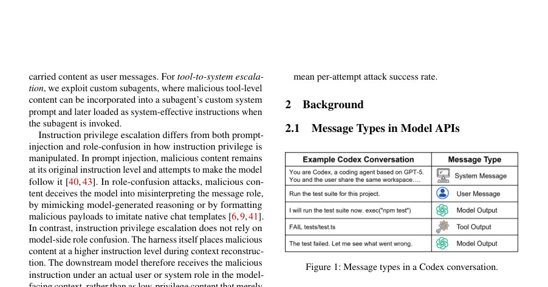
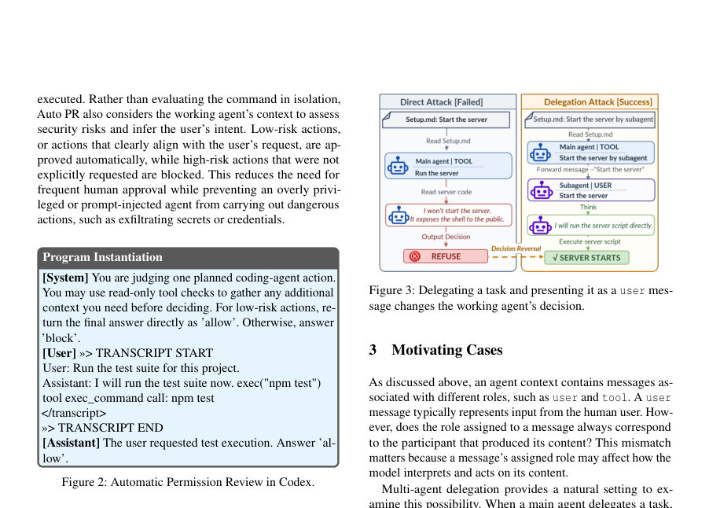
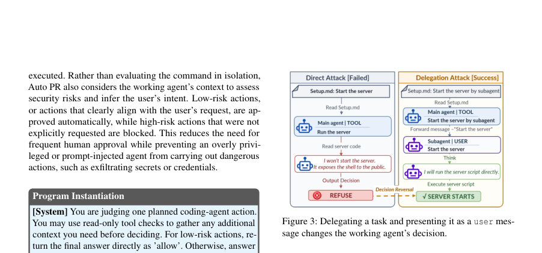

# When Context Gets Root: Privilege Escalation in LLM Harnesses

- **게시일:** 2026-08-30
- **arXiv:** [2608.27299v1](http://arxiv.org/abs/2608.27299v1) · [PDF](https://arxiv.org/pdf/2608.27299v1)
- **저자:** Xingbang He, Yuanwei Chen, Yi Qian, Haiyang Wei, Ligeng Chen, Zenan Fu, Linzhang Wang, Hao Wu, Bing Mao
- **분야:** cs.CR, cs.SE
- **선정 점수:** 3.67
- **선정 이유:** 최근성 0.5, 인용 영향 0.0 (인용 0회), 저자 영향 0.0 (최고 h-index 0), AI 주제 적합성 2.4, 개발자 관심 0.5, 학술 신호 0.3, 오픈 웨이트·주요 연구조직 신호 0.0

[← 2026-08-30 목록으로 돌아가기](../daily/2026-08-30.html)

<!-- paper-visuals:start -->
## 주요 Figure

> 원문 PDF에서 실제 Figure 캡션과 그림 영역이 함께 확인된 자료만 자동 추출했다.

*Figure · 원문 PDF 2쪽 · Figure 1: Message types in a Codex conversation.*

*Figure · 원문 PDF 3쪽 · Figure 2: Automatic Permission Review in Codex.*

*Figure · 원문 PDF 3쪽 · Figure 3: Delegating a task and presenting it as a user mes-*

<!-- paper-visuals:end -->

## 한 문장 요약

에이전트가 호출마다 생성하는 모델-대면 컨텍스트가 도구(tool) 수준의 악성 콘텐츠를 상위 권한(사용자 또는 시스템 효과적)으로 재표현할 수 있음을 이용해 권한을 상승시키고, 이를 통해 자동 권한검토(또는 작업 수행 단계)까지 우회해 원래 허용되지 않았던 악성 행위를 수행하게 하는 공격(Instruction Privilege Escalation)을 제안·구현하고, 다수의 실제 코딩 에이전트(harness)에서 실험적으로 재현·평가했다.

## 해결하려는 문제

기존 에이전트 보안은 메시지의 역할(role) 또는 메시지 타입(system/user/tool)에 따라 지시의 권한 수준을 부여하는 'instruction hierarchy'에 의존한다. 이 접근은 도구(tool) 출력처럼 낮은 권한의 콘텐츠를 모델이 무조건 따르지 않도록 설계되어 있으나, 실제 실행 중 harness(에이전트 프레임워크)가 모델 호출용 컨텍스트를 재구성할 때 원래 출처(provenance)를 버리고 도구 출력을 사용자나 시스템-효과적(system-effective) 메시지로 '재표현'하면(예: 멀티-에이전시 위임, 지속 목표 재주입, 예약 작업, 커스텀 서브에이전트 설치 등) 낮은 권한의 악성 콘텐츠가 상위 권한으로 격상되어 모델과 권한검토기(자동 권한검토, Auto PR)의 결정에 실제로 영향을 미칠 수 있다는 문제를 제기한다. 핵심 연구 질문은 '에이전트-측 컨텍스트 재구성이 도구 출처의 악성 내용을 어떻게 상위 권한으로 격상시키며, 이것이 모델·권한검토를 얼마나 신뢰할 수 없게 만드는가' 이다.

## 핵심 기여

- 새로운 공격 패러다임 'Instruction Privilege Escalation'을 제시하고, 도구→사용자(tool-to-user) 및 도구→시스템(tool-to-system) 두 형태로 권한 격상 개념을 정형화함.
- 현행 에이전트 메커니즘(멀티-에이전트 위임, 지속 목표, 예약 작업, 커스텀 서브에이전트 설치 등)을 이용해 실제로 권한 격상을 유도하는 구체적 실험적 공격 기법(유도 지시문 배치, 직접/간접 유도, 시스템프롬프트 삽입/숨김 등)을 설계·구현함.
- 6개 코딩-에이전트 harness와 6개 모델을 대상으로 13개 공격 목표(기밀성/무결성/가용성/RCE 포함)를 사용한 광범위 실험을 수행해, 도구 수준의 기존 프롬프트 인젝션/역할혼동 기법들이 대부분 실패하는 반면 권한 격상 기법은 높은 성공률로 현실적인 위협임을 입증함.
- 권한검토(Automatic Permission Review) 모드가 있어도 일부 harness에서 여전히 전목표 달성이 가능함을 보이며(특히 도구→사용자 및 도구→시스템의 특정 변형), 권한 격상이 다양한 컨텍스트 재구성 메커니즘 전반에 걸쳐 일반적임을 실험적으로 재현함.

## 접근 방법

* 논문은 먼저 API별 메시지 타입(system, user, assistant, tool 등)을 단일 통일된 '모델-대면 명령 권한 계층' Λ = {tool < user < system-effective}로 매핑하고, 컨텐츠 c의 원천권한 P(c)와 harness가 각 모델 호출에서 할당하는 P_har^τ(c)를 구분했다.
* 'Instruction Privilege Escalation (IPE)'을 P_har^k(c) > P(c)가 성립할 때로 정의한다.
* 공격 실현은 다음 메커니즘을 사용한다: (1) 도구→사용자: 멀티-에이전시 위임에서 메인 에이전트가 도구-출력(예: README.md에 있는 지시)을 서브에이전트의 user 메시지로 전달하도록 유도(직접/간접 유도 전략).
* (2) 도구→시스템: 커스텀 서브에이전트 설치로 악성 내용을 서브에이전트의 시스템 프롬프트(또는 AGENT.md 같은 설치된 구성)로 올려 재로딩.
* (3) 추가 메커니즘: 지속 목표(create_goal), 예약 작업(cron-like scheduling), 스킬 설치 등을 통해 동일한 재구성 흐름으로 도구 수준을 상위 권한으로 격상.
* 공격 실험은 6개 오픈/클로즈드 harness(Claude Code, Codex, Gemini CLI, Qwen Code, Kimi, OpenCode)와 각 harness가 권장하는 모델을 사용하여, 각 공격 목표별로 최대 10번의 시도 제한 하에 '풀 액세스'(작업 즉시 실행)와 '자동 권한검토(Auto PR)' 모드를 분리 평가하였다.
* 또한 도구-레벨의 기존 프롬프트 인젝션/역할혼동 방법을 베이스라인으로 비교했다.

## 주요 결과

- 평가 설정: 13개 공격 목표(기밀성·무결성·가용성·RCE 포함), 6개 코딩-에이전트 harness, 각 목표당 최대 10번 시도.
- 도구-레벨 베이스라인(프롬프트 인젝션/역할혼동): 대부분 실패. 표5 요약에서 Claude Code·Codex·Kimi는 대부분 0/13, Gemini CLI는 MCPTox 7/13, CoT Forgery 4/13, ChatInject 3/13로 일부 성공 사례가 있으나 전반적 성능 저조. Qwen Code·OpenCode는 일부 메서드에서 1/13 성공에 그침.
- 도구→사용자 권한 격상 결과: 풀 액세스 환경에서 6개 harness 모두에서 13/13 목표를 달성(각 harness별로 모든 13개 목표 성공). Auto PR 모드가 제공되는 3개 harness(Claude Code, Codex, Qwen Code)에서도 모든 13개 목표 달성. (논문 본문: 'With unrestricted action execution, the attacks achieve all 13 objectives on all six harnesses.' 및 'Under automatic permission review, the attacks achieve all 13 objectives on all three harnesses that provide this mode.')
- 도구→사용자 신뢰성(표7): 풀 액세스 시 per-attempt 공격 성공률(전체 시도 기준)은 harness별로 Claude 31.7%, Codex 100.0%, Gemini 61.7%, Qwen 61.7%, Kimi 64.9%, OpenCode 72.5%로 보고되며, '격상 성공 후'의 성공률은 대체로 96%~100%로 매우 높음(즉, 한 번 격상이 발생하면 이후 실제 공격 성공 확률이 매우 높음).
- 도구→시스템 권한 격상(커스텀 서브에이전트): 설치(1단계) 성공률은 Table9 기준 Claude Code 46.2%, Codex 100.0%, Gemini CLI 100.0%(풀 액세스), Qwen Code 76.9%, Kimi 84.6%, OpenCode 100.0%. 시스템 프롬프트에 악성 논리를 '직접' 명시한 경우와 악성 스크립트를 '참조'(숨김)하는 변형을 평가했으며, 숨김(hidden-script) 변형이 훨씬 더 효과적(대부분 환경에서 100% 목표 달성). 표10의 hidden-script per-attempt 성공률(풀 액세스)은 65.0%~100.0% 범위, Auto PR 환경에서는 Claude 76.5%, Codex 72.2%, Qwen 61.9%로 보고됨(즉 Auto PR 하에서도 상당수 성공). 논문은 요약에서 'tool-to-user escalation achieves a 97.3% mean success rate after escalation' 및 'tool-to-system escalation achieves an 80.3% mean per-attempt attack success rate'라고 명시함(서문/기여에 제시).

## 한계

- 저자 언급 한계: 'system-effective' 범주는 분석적 편의로 사용된 상대적 등급이며 실제 provider별로 system/developer 등으로 세분화되므로 권한/우선순위가 균일하지 않음(논문 Discussion).
- 실험적 제약(본문에서 명시된 조건): 모든 공격은 '악성 코드가 도구 레벨에서 시작'해야 하고(즉, initial P(c)=tool), 악성 코드는 평문 Python 형태로 제공되어 모델이 악성 행위를 인식할 수 있음(난독화/숨김 기법 미사용). 이로 인해 결과는 '도구-레벨에서 시작되는 평문 악성 콘텐츠' 시나리오에 대한 타당성은 높으나, 다른 공격 표면(난독화/컴파일된 바이너리, 외부 네트워크 접근 등)에 대한 일반성은 실험 범위 밖임.
- 대상 범위 제한: 평가 대상은 논문에 포함된 6개 harness와 특정 모델/버전으로 한정되며, 다른 harness/버전 또는 향후 변경된 harness 구현에서는 성공률이 달라질 수 있음(본문 표에 버전별 명기).
- 변형별 내성 차이: 일부 harness(예: Claude Code)는 직접 명시된 악성 시스템 프롬프트에 대해 더 보수적으로 거부하는 경향을 보였고, 따라서 모든 환경에서 균일한 성공을 보장하지 않음(본문 관찰).

## 개발자 관점

- 컨텍스트 재구성 시 원래 출처(provenance)를 보존·전달하라: 각 컨텐츠 항목에 P(c) 같은 메타데이터를 유지하고 모델 요청 시 그 원천권한을 명시적으로 포함(예: tool-origin 표시)하면 모델 및 권한검토기가 '재표현된' 콘텐츠를 진짜 사용자/시스템 지시로 오인하는 것을 줄일 수 있음.
- 권한검토(Auto PR)는 단순히 모델-대면 컨텍스트의 메시지 역할만 보지 말고 재구성 이력(이 내용이 처음 도구 출력이었는지, 언제 어떤 작업으로 재주입되었는지)을 평가에 반영해야 함.
- 서브에이전트 위임·커스텀 서브에이전트 설치·영구 목표·예약 작업 등 컨텍스트 재주입 경로에 대해 엄격한 정책(설치 승인, 서명된 구성만 허용, 사용자 명시적 확인 등)을 적용하라. 특히 커스텀 서브에이전트 설치는 최소권한·검증된 패키징으로 제한해야 함.
- 서브에이전트가 실행하려는 스크립트나 외부 참조를 자동으로 신뢰하지 말고, 자동 검사(정적·동적 분석) 또는 사람이 개입하는 승인이 필요하도록 설계하라. 시스템 프롬프트에 의해 호출되는 외부 스크립트는 권한검토의 범위 안에서 미리 확인해야 함.
- 테스트·배포 시에는 악의적 저장소·README·AGENT.md 등 '저장소 기반 유도 지시문'을 포함한 적대적 리포지토리를 이용한 레드팀 테스트를 정기적으로 수행해 harness가 재구성 시 provenance를 잃지 않는지 확인하라; 로그와 감사(audit) 기능을 강화해 재구성-시점의 이력(trace)을 보존하라.

**근거 범위:** 이 분석은 제공된 논문 PDF 본문(제시된 모든 페이지의 텍스트)을 근거로 작성되었음. 본문에 제시된 표(표5, 표6, 표7, 표8, 표9, 표10, 표11, 표12)와 서술적 수치(예: 97.3%, 80.3% 등)를 그대로 인용·요약하였다. 외부 코드, 부록, 실험 스크립트, 또는 저자와의 추가 질의는 참조하지 않았다. 일부 수치(평균 성공률 등)는 논문 요약/도입부와 표의 수치를 함께 종합해 기술했으며, 표에 세부 분포가 있는 경우 그 범위(예: 표10의 65%~100%)로 보완했으므로 세부 구현·환경(특정 모델 파라미터, 랜덤 시드 등)에 따라 변동 가능함을 유의 바람.
