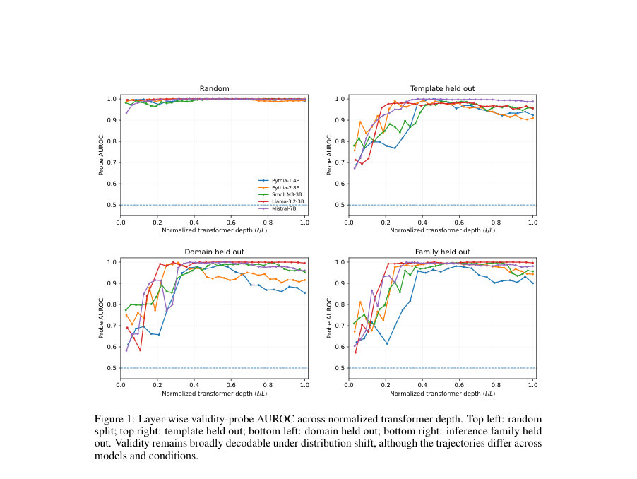
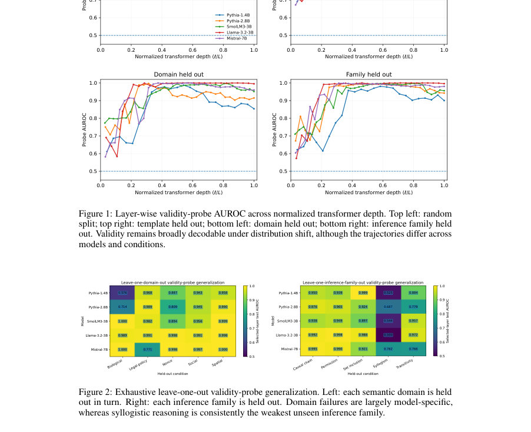
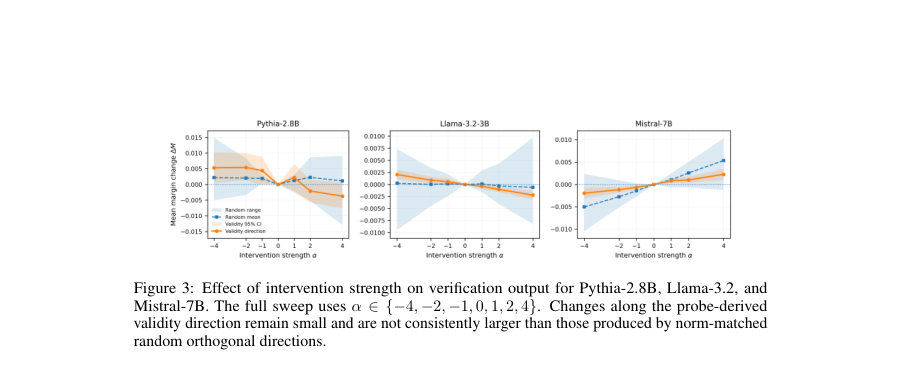

# When Decodability Is Not Enough: Logical Validity Representations, Behavioral Dissociation, and Causal Tests in Language Models

- **게시일:** 2026-09-03
- **arXiv:** [2609.02438v1](http://arxiv.org/abs/2609.02438v1) · [PDF](https://arxiv.org/pdf/2609.02438v1)
- **저자:** Smitha Muthya Sudheendra, Jaideep Srivastava
- **분야:** cs.CL, cs.LG
- **선정 점수:** 6.09
- **선정 이유:** 최근성 1.1, 인용 영향 0.0 (인용 0회), 저자 영향 0.0 (최고 h-index 0), AI 주제 적합성 2.6, 개발자 관심 0.2, 학술 신호 0.5, 오픈 웨이트·주요 연구조직 신호 1.6

[← 2026-09-03 목록으로 돌아가기](../daily/2026-09-03.html)

<!-- paper-visuals:start -->
## 주요 Figure

> 원문 PDF에서 실제 Figure 캡션과 그림 영역이 함께 확인된 자료만 자동 추출했다.

*Figure · 원문 PDF 7쪽 · Figure 1: Layer-wise validity-probe AUROC across normalized transformer depth. Top left: random*

*Figure · 원문 PDF 7쪽 · Figure 2: Exhaustive leave-one-out validity-probe generalization. Left: each semantic domain is held*

*Figure · 원문 PDF 16쪽 · Figure 3: Effect of intervention strength on verification output for Pythia-2.8B, Llama-3.2, and*

<!-- paper-visuals:end -->

## 한 문장 요약

논리적 검증(주장 타당성 판정) 문제에서 출력 행동과 내부 표현의 불일치를 조사하기 위해 800개(400개 매치 쌍) 예제로 구성된 통제된 데이터셋과 레이어별 선형 프로브·보조 통제·활성화 개입을 사용해 타당성(validity)의 선형적 디코더빌리티, 일반화, 행동적 해석 가능성 및 인과적 영향력을 체계적으로 평가했다.

## 해결하려는 문제

기존 행동적 평가(정답/오답)만으로는 모델 내부가 주장 타당성(validity)을 어떻게 표현하고 사용하는지를 알기 어렵다. 특히 (1) 모델이 출력으로 타당성을 표현하는지(행동), (2) 숨겨진 상태에서 타당성 관련 정보가 선형적으로 접근 가능한지(표현), (3) 프로브로 찾은 선형 방향이 실제로 모델의 결정에 인과적으로 영향을 미치는지(인과성)를 구별하여 평가할 필요가 있다. 또한 표면문구(템플릿), 의미적 도메인, 추론 패밀리(논리 구조) 등에서 이 표현이 얼마나 일반화되는지도 알려져 있지 않다.

## 핵심 기여

- 통제된 논리적 검증 데이터셋을 제작·공개(800예제, 400개의 매치된 valid–invalid 쌍; 5개 추론 가족, 5개 의미 도메인, 3개 난이도, 템플릿별 분할 포함).
- 행동(출력), 선형 접근성(레이어별 ℓ2-정규화 로지스틱 프로브), 인과성(프로브 유도 방향으로의 활성화 개입)을 분리하여 동일 환경에서 평가하는 체계적 실험 설계.
- 다섯 개 오픈 웨이트 트랜스포머(Pythia-1.4B, Pythia-2.8B, SmolLM3-3B, Llama-3.2-3B, Mistral-7B)에 대해 '행동 수준의 실패'에도 불구하고 숨겨진 상태에서 타당성이 강하게 선형 디코딩됨을 보였음(대부분 모델의 랜덤 분할 AUROC ≈ 1.0).
- 프로브의 일반화 한계(예: syllogism에 대한 일관된 전이 실패)와 프로브 방향에 대한 개입이 무작위 제어와 유사하게 약하거나 일관되지 않음을 통해 '디코더빌리티 ≠ 출력 표현 ≠ 인과적 사용'임을 실증적으로 제시함.

## 접근 방법

* 데이터: 각 입력은 전제 집합(P), 후보 주장(c), 타당성 레이블(y), 추론 가족(f), 의미 도메인(d), 템플릿(t), 난이도(δ)를 포함하며 400개의 matched valid–invalid 쌍(총 800 예제)을 구성.
* 난이도는 1단계 검증(직접), 2단계 추론, 2단계+잡음 전제로 구분.
* 학습/평가 분할로 랜덤(640/160), 템플릿 홀드아웃(600/200), 도메인·패밀리 홀드아웃(둘 다 640/160) 및 전 범위를 도는 leave-one-out 분석을 사용.모델·행동 측정: Pythia-1.4B, Pythia-2.8B, SmolLM3-3B, Llama-3.2-3B, Mistral-7B를 동일한 예제로 평가.
* 출력은 VALID/INVALID 토큰의 조건부 로그확률 평균으로 점수화(sV, sI)하고 margin M = sV−sI, 정확도 및 margin AUROC 보고.프로빙: 각 트랜스포머 블록의 최종 프롬프트 토큰 히든스테이트 hi,ℓ를 추출하여 표준화한 뒤 ℓ2-정규화 로지스틱 회귀(probe)를 학습(C∈{0.1,1,10}, 페어 단위 그룹 교차검증).
* 층 선택은 검증 AUROC로 하며 선택된 층에 대해 테스트를 수행.대조 실험: 전체 프롬프트/주장만/전제만 TF–IDF, 메타데이터 전용 분류기, 200회 셔플 레이블 프로브로 통제.인과성 테스트: 선택된 층의 최종 프롬프트 토큰 히든 상태에 프로브 방향 v(표준화 계수 역변환 후 정규화)를 투영하고 스케일 σv의 배수 α∈{−4,−2,−1,0,1,2,4}로 가감하여 출력 margin 변화 ∆Mα 측정.
* 또한 노름 일치된 무작위 직교 방향(5개)과 matched-projection 패칭을 비교.

## 주요 결과

- 데이터셋: 800 예제(400 matched valid–invalid 쌍), 5 추론 가족, 5 도메인, 난이도 분포(200/400/200), 템플릿 엄격 분할 600/200.
- 행동적 성능(표 2): 전체적으로 정확도는 거의 무작위 수준. Pythia-1.4B 정확도 0.500(모든 예제에 INVALID 예측), Pythia-2.8B 정확도 0.500(거의 INVALID), SmolLM3-3B 정확도 0.500(항상 VALID), Llama-3.2-3B 정확도 0.470, Mistral-7B 정확도 0.500. Margin AUROC는 모델별로 0.458(Llama)–0.576(Mistral) 범위로 전반적 순위 정보도 약함.
- 인-분포(hidden-state) 디코더빌리티(표 3): 랜덤 분할에서 모든 모델의 선택층에서 AUROC ≈ 1.000(본문: 'essentially perfect'). 템플릿 홀드아웃에서도 AUROC 0.963–0.999로 매우 높음. 레이어별로 조기(초기 블록)부터 높은 구분 가능성 관찰됨(예: 첫 블록 AUROC 0.935–0.995 범주).
- OOD 일반화(leave-one-out): 도메인 홀드아웃은 모델별 차이 존재 — 예: Pythia-1.4B가 biological 도메인 홀드아웃 시 AUROC 0.576, Pythia-2.8B 0.714, Mistral-7B가 legal-policy 홀드아웃 시 0.771. 추론 가족 홀드아웃에서는 syllogism이 모든 모델에서 약함(최종 AUROC: Pythia-1.4B 0.525, Pythia-2.8B 0.687, SmolLM3-3B 0.544, Llama-3.2-3B 0.500, Mistral-7B 0.762).
- 행동·표현 해리: 매치드 페어(pairwise) 평가에서 모든 모델·분할에 대해 프로브의 페어 정확도 PairAcc = 1.000(부트스트랩 CI [1.000,1.000]). correctness-conditioned AUROC(정의 가능한 경우)에서도 Llama-3.2는 오답 예제에 대해 AUROC = 1.000 등 높은 decodability 유지(표 10). 즉 행동적 오류와 선형 접근성의 부재는 일반적으로 일치하지 않음. 既定 문장: 'behavioral errors do not generally coincide with absence of linearly accessible validity information.'  

"인과성 개입" 결과(표 4): α=+4에서 probe 방향 개입의 평균 ∆M 매우 작음(예: Pythia-2.8B −0.0037 [−0.0076,0.0004], Llama-3.2 −0.0022 [−0.0031,−0.0013], Mistral-7B +0.0023 [+0.0011,+0.0034]). 이 개입으로 이진 예측이 바뀐 경우는 거의 없음(α=+4에서 0% 전부, α=−4에서 Llama 한 예제만 플립). 무작위 노름-일치 방향이 동등하거나 더 큰 변화 산출. matched-projection patching도 margin 변화를 거의 유사하게 매우 작게 만듦(≈0.001–0.0045). 이로써 '프로브로 찾은 선형 방향이 최종 결정에 강한 인과적 제어변수는 아니다'가 결론임.  

대조 실험: 랜덤 분할에서 TF–IDF(전체 프롬프트) AUROC = 0.970, claim-only TF–IDF = 0.965로 인-분포에서 표면적·어휘적 규칙성이 큰 기여를 함. 템플릿/도메인 이동에서 TF–IDF 성능은 더 크게 하락(예: full-prompt 템플릿 홀드아웃 0.855, 도메인 홀드아웃 0.814)한 반면 히든스테이트 프로브는 대체로 더 강함. 셔플 레이블 프로브(200 perm) null 평균 AUROC ≈ 0.496–0.499(표준편차 ≈0.031–0.039), 관측치가 모두 permuted보다 우수(p≈1/201).

## 한계

- 저자 언급: 데이터셋이 통제적·합성적(synthetic)이라 자연언어 기반의 장문·오픈형 추론으로 직접 일반화하기 어렵다.
- 저자 언급: 분석은 최종 프롬프트 토큰의 선형(probe) 접근성에 초점을 맞추며, 타당성은 비선형적으로, 토큰에 분산되어, 또는 다른 계산 위치에 인코딩되어 있을 수 있다.
- 저자 언급: 개입(steering) 결과가 약하다고 해서 타당성 관련 정보가 인과적으로 무의미하다고 결론내릴 수는 없고, 단지 '해당 층·해당 선형 방향'이 강한 제어변수가 아님을 보임.
- 저자 언급: 모든 모델이 상대적으로 작은(1.4B–7B) 공개 가중치(transformer)이며 양자화(quantization)하에 평가되었으므로 더 큰 모델·아키텍처에 대한 일반성은 불확실함. 
추가 확인된 제약: 랜덤(인-분포)에서 프로브 AUROC가 거의 완전한 것은 TF–IDF 등 표면적 신호의 기여를 받는 부분이 있어, 높은 in-distribution 성능만으로는 보편적 표현을 증명할 수 없음(본문의 통제 결과와 일치).

## 개발자 관점

- 재현성: 논문은 사용한 모델(Hugging Face 식별자 포함), 예제 수·분할(랜덤 640/160, 템플릿 600/200 등), matched-pair 유지, 레이어별 최종 프롬프트 토큰 추출, 표준화·ℓ2-정규화 로지스틱 프로브(C∈{0.1,1,10}), 페어 기반 교차검증, 2000 페어-레벨 부트스트랩으로 불확실성 측정 등의 구현 세부를 제공하므로 동일 환경에서 재현 가능성이 높음.
- 데이터·실험 설계: 매치드 페어를 분할/부트스트랩 시 항상 함께 유지해야 하며(논문 전반의 일관된 규칙), 템플릿·도메인·패밀리 홀드아웃을 통해 표면적 규칙성 대비 진정한 일반화를 평가하도록 설계해야 함.
- 개입·안정성: 프로브로 찾은 단일 선형 방향을 신뢰해 모델 출력을 '조종'하려는 시도는 실패 가능성이 높으므로(무작위 제어와 유사한 효과), 생산환경에서 안전·정책적 목적의 행동 수정 수단으로 바로 사용해서는 안 됨.
- 비용·인프라: 실험은 1.4B–7B 규모 모델과 단일-층 활성화 조작·선형 프로빙이므로 대규모 파라미터 조정 없이도 실행 가능하나, 정확한 재현을 위해 원문에 명시된 양자화·토크나이제이션 선택을 일치시켜야 함.
- 모니터링·해석: 높은 선형 디코더빌리티는 내부에 관련 정보가 존재함을 시사하지만, 서비스·제품 차원에서는 인과성 검증(개입 실험) 및 다양한 분포 이동에서의 안정성 검증을 병행해 해석하고 배포해야 함.

**근거 범위:** 이 분석은 제공된 논문 PDF 본문(및 부록 포함) 내용에 근거해 작성되었다. 표와 수치(예: 표 2–4, 표 8–12, 그림 1–3)는 본문과 부록에서 직접 인용하였다. 구현 세부(예: 정확한 랜덤 시드, 하드웨어/런타임 비용)는 PDF에 명시되지 않아 추정하지 않았고, 모델 내부 체크포인트나 코드 실행 결과는 포함하지 않는다.
