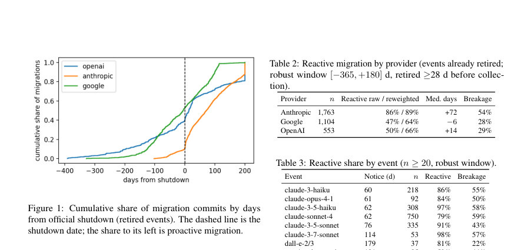
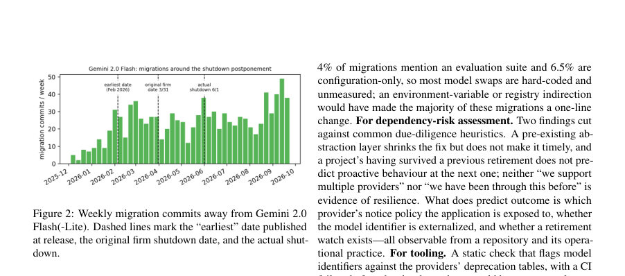
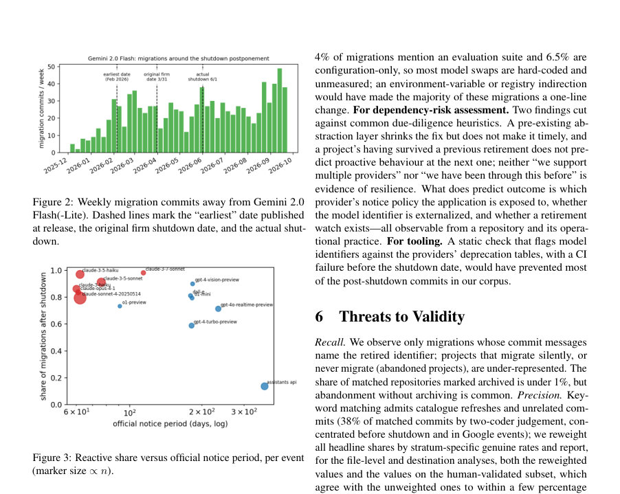

# When the Model Retires: An Empirical Study of LLM Migration in Open-Source Applications

- **게시일:** 2026-09-28
- **arXiv:** [2609.31288v1](http://arxiv.org/abs/2609.31288v1) · [PDF](https://arxiv.org/pdf/2609.31288v1)
- **저자:** Hyungjin Lukas Kim
- **분야:** cs.SE
- **선정 점수:** 5.05
- **선정 이유:** 최근성 0.4, 인용 영향 0.0 (인용 0회), 저자 영향 0.0 (최고 h-index 0), AI 주제 적합성 2.4, 개발자 관심 0.7, 학술 신호 0.5, 오픈 웨이트·주요 연구조직 신호 1.0

[← 2026-09-28 목록으로 돌아가기](../daily/2026-09-28.html)

<!-- paper-visuals:start -->
## 주요 Figure

> 원문 PDF에서 실제 Figure 캡션과 그림 영역이 함께 확인된 자료만 자동 추출했다.

*Figure · 원문 PDF 3쪽 · Figure 1: Cumulative share of migration commits by days*

*Figure · 원문 PDF 5쪽 · Figure 2: Weekly migration commits away from Gemini 2.0*

*Figure · 원문 PDF 5쪽 · Figure 3: Reactive share versus official notice period, per event*

<!-- paper-visuals:end -->

## 한 문장 요약

공식 퇴역(데프리케이션) 공지에 맞춰 GitHub 커밋을 수집·매칭해 OpenAI, Anthropic, Google의 LLM 퇴역 시점에 실제 오픈소스 응용들이 어떻게(언제, 얼마나) 모델을 교체하는지 생태계 규모로 측정한 실증 연구다.

## 해결하려는 문제

상용 LLM API를 호출하는 애플리케이션은 공급자가 임의로 정한 모델 퇴역 일정에 의존하며, 라이브러리와 달리 퇴역일에는 요청이 전부 실패한다. 기존 연구는 개별 사례나 툴·프레임워크 제안에 그쳤고(예: 프롬프트 재설계, 회귀 테스트 도구), 생태계 전체에서 실제로 애플리케이션이 사전(프로액티브)으로 이동하는지 아니면 퇴역 후(리액티브)에 긴급 패치를 하는지, 퇴역 공지 기간이 결과에 미치는 영향, 코드·아키텍처 수준의 비용과 휴리스틱(추상화 계층, 핀된 스냅샷 등)의 실제 효과는 알려지지 않았다. 본문은 이 질문들을 구체적 연구문제(RQ1–RQ6)로 제시하고 있다.

## 핵심 기여

- 퇴역 이벤트(공식 공지·퇴역일) 표와 이를 이용해 OpenAI·Anthropic·Google의 퇴역 관련 커밋을 매칭한 데이터셋(22,555 커밋, 17,703 비포크 저장소 중 5,139 매칭 커밋)과 수집 파이프라인 공개
- 생태계 규모의 '프로액티브(사전) vs 리액티브(사후)' 마이그레이션 최초 측정 및 공지 기간과의 관계(용량-반응 관계) 추정
- 공급자별 공지 정책 비교와 공지 길이의 로그선형(dose–response) 회귀 추정(각 e-fold 증가가 사후 마이그레이션 오즈를 ~74–78% 감소시킴)
- 브레이크리지(404·silent failure·파라미터 비호환·핀된 스냅샷 등)에 대한 키워드·수동 분류 기반 분류체계와 인간 검증(300표본, 이중 코더, κ=0.89–0.95)
- 마이그레이션 규모(파일·라인 변경), 식별자 하드코딩 빈도, 추상화 계층 도입·효과 등의 아키텍처적 증거 제공

## 접근 방법

* 저자는 GitHub 커밋 검색 API에 대해 퇴역 모델 식별자·엔드포인트와 마이그레이션 어휘(예: migrate, replace, shutdown 등)를 조합한 22개 질의문을 분기·월 단위로 실행해 포크를 제외하고 SHA로 중복 제거해 22,555 유니크 커밋(17,703 저장소)을 수집했다.
* 공급자의 공식 데프리케이션 페이지에서 수집한 이벤트 표(30 OpenAI, 9 Anthropic, 7 Google)를 기준으로 각 커밋 메시지에서 가장 구체적인 모델·엔드포인트 패턴과 마이그레이션 동사를 포함하는 경우에 '매칭'으로 간주했다(사전 공지 30일 이전 커밋, dependency-bot, AI 작성 헤더 등 제외).
* 그 결과 5,139 매칭 커밋(4,544 저장소)이 산출되었고, 이 중 이미 종료된 이벤트와 연관된 3,933 커밋에 대해 타이밍 분석을 수행했다.
* 두 명의 독립 코더가 계층화(stratified)된 300표본(공급자별·사전/사후 층화)을 6개 코드(실제 마이그레이션 여부, 성격, 브레이크리지, silent failure, 핀된 스냅샷, 추상화 계층)로 라벨링해 정밀도·재현율과 코더 합의를 산출하고(κ값 보고) 각 층별 '진짜 마이그레이션' 비율로 전체 추정치를 보정(reweight)했다.
* 타이밍은 공지·종료일 기준 일수로 계산하고, 공지 길이 효과는 로그(notice days)를 설명변수로 한 로지스틱 회귀(저장소 클러스터 표준오차)로 추정했다.
* 또한 커밋 패치에서 파일별·라인별 변경을 추출해 아키텍처별(프롬프트 전용, 에이전트/툴, RAG, 파인튜닝) 규모를 분석했고, 키워드 분류기로 브레이크리지·silent failure·추상화·평가·프롬프트 변경 등을 자동 플래그했다.

## 주요 결과

- 코퍼스: 22,555 유니크 커밋, 17,703 비포크 저장소, 언어 분포(대략) TypeScript 28%, Python 27%, JavaScript 6%.
- 매칭/검증: 5,139 매칭 커밋(4,544 저장소), 이 중 이미 종료된 이벤트 관련 3,933 커밋을 타이밍 분석에 사용. 인간 검증 표본 300에서 코더 간 일치율: 대부분 코드 κ = 0.89–0.95(핀된 스냅샷은 κ=0.62로 중간 수준). 전체 매칭 커밋 중 인간 라벨 기준 '진정한 마이그레이션' 비율은 층별로 달라 평균 62%였고, 저자는 층별 진짜 비율로 모든 추정치를 재가중화(reweight)함.
- 주요 타이밍: 이미 종료된 이벤트(3,933 커밋 기준)에서 원시(raw) 기준 72%가 종료일 이후 커밋되었고, 층별 진짜 비율로 재가중화한 추정치는 82%가 사후(reactive) 마이그레이션(95% CI 79–84). 중앙값은 종료 후 39일, 공지 후 158일에 마이그레이션이 발생.
- 공급자별: 재가중치 결과로 Anthropic 관련 마이그레이션의 89%가 사후(95% CI 88–91), OpenAI 66% (CI 59–73), Google 64% (CI 52–78). 원시 비율은 더 낮게 나타났으나 이는 층별 위양성(특히 Google) 때문임.
- 공지 길이 효과: 이벤트 수준 Spearman ρ = −0.53 (p = 0.06, n = 13). 커밋 수준 로지스틱 회귀(저장소 클러스터 표준오차)에서 log(notice days) 계수는 원시 매칭세트에서 −1.52 (SE 0.09, p < 0.001), 재가중치 시 −1.36 (SE 0.09, p < 0.001)로 각 e-fold 증가가 사후 마이그레이션 오즈를 약 74–78% 감소시킴. Google을 소프트-공지(미발표 공지일 가정)로 포함하면 계수 약 −0.95 (SE 0.06, p < 0.001). 사례: Anthropic의 60–114일 공지는 86–98%의 사후 비율을 보인 반면 OpenAI Assistants API(365일)는 13% 사후 비율(표 수준)이었다(표3). 60일급 공지 후에는 종료 직후 25배 급증(스파이크)이 관찰된 반면 1년 공지에는 사전 반응이 많았다(스파이크 없음). Google의 소프트·가변일자 퇴역은 뚜렷한 전후 스파이크를 만들지 않았음(점진적 유입). 9%만이 종료 후 1주 내, 27%는 1달 내, 55%는 3달 내에 도착—따라서 장애 지속 기간은 주 단위로 길다(중앙값 39일).  (원문 수치 인용).  

  "브레이크리지": 키워드 기준으로 41%가 브레이크리지를 기술(사후 48%, 사전 29%). 인간 검증된 진짜 마이그레이션 표본에서 코더는 사후 Anthropic 마이그레이션의 63%에서 브레이크리지를 확인했고(Google 29%, OpenAI 19%), 사전에는 각각 42%/33%/4%였음. 브레이크리지 유형으로는 404 등 하드 실패, silent failure(예: 예외를 잡아 무응답이나 잘못된 대답을 반환해 수 주간 장애를 숨김), 파라미터 비호환(max tokens 등), 그리고 드물게(샘플에서 소수) 핀된 스냅샷이 확인됨(핀된 스냅샷은 드물어 저자는 키워드 규칙이 과대추정한다고 보고). 키워드 분류 성능: 브레이크리지 정밀도 0.81 재현율 0.92; silent-failure 0.57/0.57; abstraction 0.70/0.42; pinned-snapshot 0.25/0.83(그래서 핀된 스냅샷은 보수적 보고).  

  "마이그레이션 규모·아키텍처": 전체 중앙값으로 마이그레이션은 작음(중앙값 2 변경 파일, 75th 퍼센타일 5). 전체적으로 중앙값 14 추가 라인, 6 삭제 라인이 보고됨(본문). 파일 수준(3,931 퇴역 이벤트 마이그레이션)에서 94%가 소스 파일을 편집해 모델 식별자가 하드코딩되어 있었음(구성/문서만 건드린 경우 6%). 아키텍처별 중앙값(표4): 프롬프트 전용 2파일·+6라인(중앙값), 에이전트/툴 5파일·+63라인, RAG 7파일·+155라인, 파인튜닝 14파일·+693라인. 즉 파인튜닝/체크포인트 의존 앱은 교체 비용이 매우 큼.  

  "추상화 계층": 미리 존재하는 추상화 계층은 드물다(사전 존재 3% 재가중, 인간검증 7%). 마이그레이션 중 추상화 계층을 새로 도입한 경우도 소수(약 4%). 추상화가 있으면 변경 규모를 줄이지만(예: 사전 존재 계층에서 중앙값 4파일·20라인) 시의성(사후 비율)은 개선되지 않음(사후 비율 유사).  

  "목적지·공급자 전환": 3,933 퇴역 이벤트 마이그레이션 중 2,236 커밋이 목적지 모델을 명시. 이들 중 약 8%만 다른 공급자로 전환(7% 재가중), 68–74%는 같은 공급자 내의 후속 지정 모델로 이동, 16%는 두 번째 공급자를 병립(헤징)으로 추가. 리액티브였든 프로액티브였든 전환 확률은 낮음(리액티브 7% vs 프로액티브 13%).  

  "학습(learning) 여부": 2회 이상 퇴역을 겪은 85개 저장소의 경우 첫 이벤트와 이후 이벤트에서 사후 비율(reactive share)은 동일(각 73%)해 큰 학습 효과는 관찰되지 않음(표본 작음).

## 한계

- 저자가 명시한 한계 — 리콜(Recall): 커밋 메시지에 퇴역 식별자를 명시한 마이그레이션만 관찰하므로, 런타임에서 조용히(코드/설정 없이) 교체한 사례나 전혀 마이그레이션하지 않은 포기된 프로젝트는 과소표집됨.
- 저자가 명시한 한계 — 정밀도(Precision): 키워드 기반 매칭은 카탈로그 정리·문서 갱신·타 모델로의 마이그레이션 등 위양성 여지를 포함(검증 표본에서 매칭 커밋의 약 38%가 진짜 마이그레이션이 아님). 이를 보정하기 위해 층별 진짜 비율로 재가중화함(하지만 완전 제거 불가).
- 저자가 명시한 한계 — GitHub 검색 상한 및 재현성: GitHub 커밋 검색은 쿼리당 최대 1,000 결과를 반환하므로 일부 인기 기간은 잘림(truncation) 가능성이 있으며(저자는 일부 윈도우에서 트렁케이션을 확인), 수집 결과는 최솟값이다.
- 저자가 명시한 한계 — 우측 검열(Right censoring): 최근에 퇴역한 이벤트는 아직 모든 사후 커밋을 누적하지 못했으므로 일부 이벤트는 우측 검열되어 있으며, 저자는 28일 이상 지난 이벤트만 주 분석에 포함하는 등 보정함이 있음에도 완전 제거 불가함을 밝힘(따라서 최근 이벤트의 사후 비율은 과소평가 가능).  

    추가로 본문에서 합리적으로 확인되는 제약(저자가 부분적으로 언급한 내용 포함):
    - 분석은 커밋 메시지·패치에 의존하므로 실제 런타임 장애·사용자 영향(예: 장애가 서비스 중단으로 이어졌는지)은 직접 관찰할 수 없음(커밋 메시지 텍스트에 의존).  
    - Google 이벤트의 공지(announcement) 날짜가 공개되지 않아 본문의 주요 공지-길이 회귀에서 Google을 제외했음(민감도 분석으로 소프트-notice 가정 포함).  
    - 이벤트 수(특히 이벤트 수준 상관분석 n=13)와 다중 퇴역 경험 저장소 표본(85개)은 제한적이어서 작은 효과나 이질성은 검출 불가할 수 있음.

## 개발자 관점

- 공지 기간이 가장 강력한 정책 레버: 공급자는 긴 공지(예: 1년)를 제공하면 애플리케이션의 다운타임을 크게 줄일 수 있으며, 퇴역 공지를 API 응답 헤더나 SDK 로그(런타임 경고)로 표시하면 운영 중인 시스템에 직접 도달해 더 효과적일 수 있다(이메일 통지는 키 계정 소유 문제가 있어 실패 사례가 보고됨).
- 식별자 외부화: 모델 식별자를 소스에 하드코딩하지 말고 환경변수·설정 파일·레지스트리 등으로 외부화하면 다수(본문에서는 대다수)의 마이그레이션을 한 줄 변경으로 해결할 수 있음(본문: 94%가 소스 하드코딩).
- 에러 처리·모니터링: 예외를 조용히 흡수하는 핸들러는 장애를 수주간 숨기므로 모델 호출 주위의 예외는 '명확히 실패'하도록 하고, 회귀 테스트·평가 스위트(본문에서는 마이그레이션 커밋의 4.5%만이 평가·회귀를 언급함)를 갖춰 항목별 회귀를 검출하라.
- 추상화 계층의 현실적 효용: 기존 추상화 계층은 교체 비용(라인·파일 수)은 줄이지만 마이그레이션의 시의성(사전 vs 사후)을 개선하지 못했다. 따라서 추상화 도입은 비용 절감 수단이나, 퇴역 알림·운영 관행과 결합하지 않으면 장애 예방 효과는 제한적이다.
- 파인튜닝·체크포인트 의존성 인지: 파인튜닝 앱의 교체 비용이 매우 크므로(중앙값 ~14파일·693라인), 프로덕션에서는 파인튜닝 의존도를 사전에 위험 평가하고 롤백/대체 계획을 마련하라(체크포인트 불일치가 근본 원인).  

    재현·배포 관련 실무 제안:
    - CI 정적 검사: 모델 식별자를 공급자 데프리케이션 표와 대조해 폐기 예정 식별자가 포함되면 CI 실패로 만들면 사후 커밋의 대다수를 예방할 수 있음(저자 권고).
    - 퇴역 감시(Watch): 조직 단위로 퇴역 알림 수신·공유 체계를 마련하라(키 소유자 불일치로 이메일이 도달하지 않는 사례 존재).  

    비용·안전성:
    - 공급자 이탈률이 낮아(약 8%만 전환) 공지 기간 연장은 공급자 유지 측면에서 큰 손실을 주지 않으므로 공급자 정책 설계 시 고려 가치가 큼.  
    - 모델 대체 시 항목별 회귀(aggregate 지표로는 숨겨짐)가 발생할 수 있으므로 안전 민감 응용은 평가·검증 허니팟을 갖추어야 함.

**근거 범위:** 분석은 제출된 논문 PDF 본문(페이지 1–7) 텍스트에 근거함. 표와 본문에서 보고한 수치(예: 커밋·저장소 수, 재가중치 추정치, κ값, 회귀계수, 중앙값/중위치, 표4의 아키텍처별 중앙값 등)를 직접 인용했다. 본문은 '+Lines' 등 표의 칼럼명이 다소 축약되어 있어 일부 라인 수 기술(예: 본문 전체 중앙값 14 추가·6 삭제 라인 vs 표4의 아키텍처별 '+Lines'는 추가 라인으로 해석)은 원문 문맥에 맞춰 정리했으나 표 칼럼 해석이 애매한 부분이 있을 수 있음을 밝힌다. 또한 GitHub 검색 캡(쿼리당 1,000)으로 인한 트렁케이션 등 저자가 명시한 제한은 본 분석에 반영했다.
