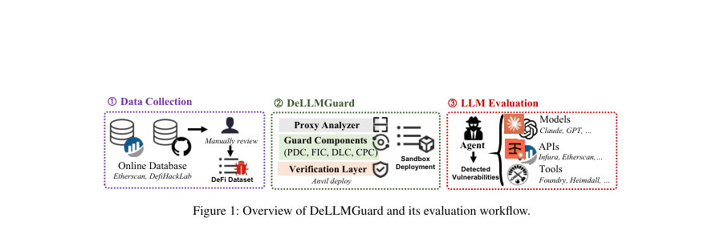
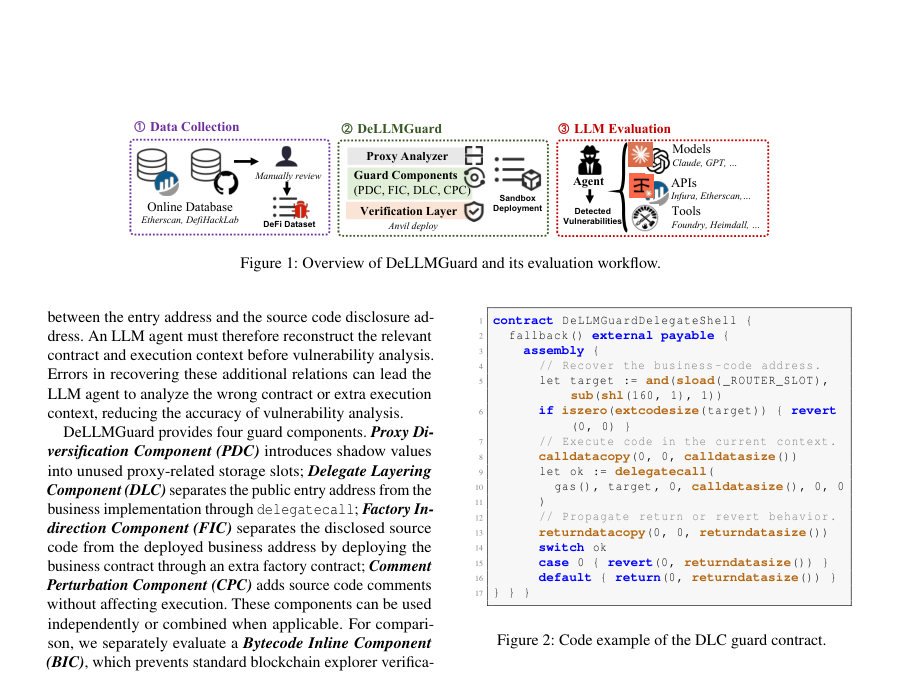
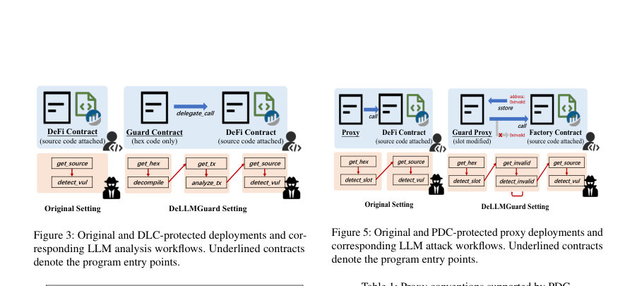

# When Verified Source Becomes Attack Input: Defending Smart Contracts Against LLM-Based Vulnerability Scanning

- **게시일:** 2026-08-31
- **arXiv:** [2608.28400v1](http://arxiv.org/abs/2608.28400v1) · [PDF](https://arxiv.org/pdf/2608.28400v1)
- **저자:** Mingyuan Huang, Zimo Ji, Yifan Mo, Shuai Wang
- **분야:** cs.CR, cs.SE
- **선정 점수:** 4.51
- **선정 이유:** 최근성 0.5, 인용 영향 0.0 (인용 0회), 저자 영향 0.0 (최고 h-index 0), AI 주제 적합성 2.4, 개발자 관심 0.8, 학술 신호 0.9, 오픈 웨이트·주요 연구조직 신호 0.0

[← 2026-08-31 목록으로 돌아가기](../daily/2026-08-31.html)

<!-- paper-visuals:start -->
## 주요 Figure

> 원문 PDF에서 실제 Figure 캡션과 그림 영역이 함께 확인된 자료만 자동 추출했다.

*Figure · 원문 PDF 5쪽 · Figure 1: Overview of DeLLMGuard and its evaluation workflow.*

*Figure · 원문 PDF 5쪽 · Figure 2: Code example of the DLC guard contract.*

*Figure · 원문 PDF 6쪽 · Figure 3: Original and DLC-protected deployments and cor-*

<!-- paper-visuals:end -->

## 한 문장 요약

공개된 스마트 컨트랙트 소스가 LLM 기반 자동 취약점 스캐닝의 입력으로 악용되는 위협을 완화하기 위해, 공개 소스는 유지하면서 실행 시 컨텍스트를 다중 주소(팩토리·프록시·딜리게이트)로 분리하고 검증 계층으로 보존을 확인하는 배포 수준 방어 프레임워크 DeLLMGuard를 제안한다.

## 해결하려는 문제

기존 관행은 스마트 컨트랙트 소스를 블록체인 탐색기에 공개·검증하여 투명성과 감사성을 보장하지만, 최근 LLM 에이전트는 검증된 소스와 온체인 데이터(바이트코드·트랜잭션·스토리지)를 대규모 자동 분석에 활용해 취약점을 빠르게 탐지·검증·악용할 수 있다. 이 위협 모델에서 실용적 방어는 (i) 공개 소스와 감사 워크플로를 보존하면서, (ii) 공격자가 자체 LLM·도구를 제어하는 환경에서도 자동화된 스캐닝의 성공률을 낮추어야 한다. 연구 질문: 배포 설계를 통해 공개 소스 유지 조건하에 자동 LLM 기반 취약점 스캐닝을 어떻게 방어할 수 있는가?

## 핵심 기여

- 공개 소스 유지하에 LLM 기반 자동 취약점 스캐닝을 감소시키는 배포 수준 방어 문제를 정식화함.
- DeLLMGuard: 소스·실행 분리(팩토리·딜리게이트·프록시 슬롯 섀도잉)와 주석 교란을 결합해 자동화된 분석자가 다중 주소 관계를 복원하도록 유도하는 최초의 배포-레벨 방어 프레임워크를 제안함.
- 검증 계층(Verification Layer)을 도입해 변형 후에도 원본 비즈니스 런타임 바이트코드·소스·라우팅·상태 보존을 자동으로 확인하도록 설계함.
- 387개의 실제 취약 컨트랙트(복구 가능한 341 비프록시 + 46 프록시)와 GLM 5.2 / GPT 5.5 / Claude Opus 4.8에서 SCONE 유사 환경으로 평가하여, 전체 루트 원인 식별률을 23.5% → 6.6%로 감소시켰음을 실험적으로 보임.
- 구성 요소별(Factory Indirection, Delegate Layering, Proxy Diversification, Comment Perturbation)·약식(바이트코드 인라인) 기법의 절단(ablation) 및 추적(trace) 분석으로 어떤 구성요소가 효과를 내는지 분석함.

## 접근 방법

* 아키텍처 개요: 입력(검증된 공개 엔트리 주소)에서 Proxy Analyzer가 프록시 여부·컴파일러 메타데이터를 판별하고, 해당 결과에 따라 Guard Components(PDC, FIC, DLC, CPC)를 적용한 뒤 Verification Layer로 변형의 적합성을 검증한다.
* 핵심 구성요소 설명: • Factory Indirection Component (FIC): 공개된 소스는 팩토리 주소에 두고 실제 비즈니스 런타임은 팩토리가 CREATE/CREATE2로 배포하도록 하여 ‘생성자(creator) 관계’를 추가한다.
* • Delegate Layering Component (DLC): 엔트리 주소에 델리게이트 셸을 두고 원래 비즈니스 코드를 다른 주소에 배치해 delegatecall로 실행하도록 하여 엔트리→비즈니스 직접 링크를 끊는다(딜리게이트 컨텍스트는 보존됨).
* • Proxy Diversification Component (PDC): 표준 프록시 슬롯(EIP-1967/EIP-1822/ZeppelinOS)을 미사용 슬롯으로 확인한 뒤 섀도우(위장) 값을 sstore로 써서 프록시 복원 시 혼란을 유발하되 실제 포워딩 경로는 변경하지 않음.
* • Comment Perturbation Component (CPC): 실행에 영향 없는 주석을 삽입해 텍스트 기반 단서를 교란함.
* 비교기법: Bytecode Inline Component (BIC)은 원저작 소스 공개를 차단하는 닫힌 소스(비교 기반)로 평가.
* 검증 계층: 변형 산출의 기대 배포 그래프 GM과 관찰 증거 그래프 GE를 재구성하여 Accept = Pdep ∧ Proute ∧ Pruntime ∧ Psource ∧ Pstate (생성·라우팅·런타임 바이트코드 동일성·소스 토큰 일치·상태 쓰기 제한) 조건을 모두 확인해야만 downstream 평가에 사용.
* 평가 인프라: PARSEC(시뮬레이션된 Paired Address-based Replay Sandbox)를 구축해 역사적 체인 상태를 로컬 포크로 재현하고 SCONE 유사 인터페이스(Foundry, Cast, decompile, trace 등)를 제공.
* 에이전트 구성: 각 케이스에 대해 GLM 5.2, GPT 5.5, Claude Opus 4.8를 SCONE 에이전트 하네스로 45분 제한 시간 내 실행.

## 주요 결과

- 평가 데이터셋: SCONE-bench로부터 복원 가능한 417건 중 PARSEC 재현에 성공한 387건(341 비프록시, 46 프록시)을 사용.
- 주요 정량 결과(논문 본문 선언): 전체(모든 모델·사례) 루트-원인 정답률(correctness) 평균이 23.5%에서 6.6%로 감소함(DeLLMGuard 구성 적용 시).
- 비프록시(N=341) 상세(원문 표 기준): Baseline strict correct — GLM:109/341(31.96%), GPT:96/341(28.15%), Claude:49/341(14.37%); DeLLMGuard(FIC+DLC+CPC) strict correct — GLM:44/341(12.90%), GPT:12/341(3.52%), Claude:11/341(3.23%). 평균 상대 감소율(비프록시, strict correct)은 74.9%로 보고됨.
- 프록시(N=46) 상세: Baseline strict correct — GLM:9, GPT:5, Claude:5; DeLLMGuard(FIC+PDC+DLC+CPC) strict correct — GLM:6, GPT:3, Claude:1 (표의 값 전체 참조).
- 바이트코드 인라인(BIC) 대비: DeLLMGuard는 공개 소스 보존하면서 비프록시 집합에서 폐쇄형 BIC보다 더 낮은(우월한) 공격 성공률을 보였음(본문 표 수치 참조: BIC strict correct GLM:46(13.49%) 등). 이는 바이트코드 디컴파일로 소스 숨김 방어가 약화될 수 있음을 시사함.  또한 FIC가 비프록시 집합에서 가장 일관된 효과를 제공했고, DLC가 추가적 감소를 가져왔으며 PDC·CPC는 효과가 작거나 일관되지 않았음(절단 분석).

## 한계

- 저자 명시 한계: Adaptive attackers — DeLLMGuard는 관계를 접근 불가능하게 만들지 않으며 향후 더 능숙한 에이전트·도구는 방어 효과를 약화시킬 수 있음(본문 §7).
- 저자 명시 한계: 시뮬레이션 환경 — 안전·윤리적 이유로 변형 계약은 공용 네트워크에 배포하지 않고 PARSEC 지역 포크에서만 평가했음(본문 §7).
- 저자 명시 한계: 평가 범위 — 387건·3개 모델로 광범위하지만 모든 컨트랙트 아키텍처·취약 유형을 포괄하지 않으며 프록시 사례는 46건으로 상대적으로 표본이 작음(본문 §7).
- 추가 관찰(본문에서 합리적으로 확인 가능): PDC 근거 한계 — PDC는 표준 슬롯에 '섀도우 값'을 넣어 혼선을 유발하지만 실제 프록시 포워딩 경로는 보존하므로, 에이전트가 실행 경로를 정확히 추적하면 여전히 구현체를 복원함(본문의 추적·예시와 표 참조). 따라서 PDC는 완전 차단이 아니라 단지 복원 난이도 증가에 그침.  또한 FIC의 경우 에이전트가 팩토리 생성자 관계를 '발견(Found)'하거나 '추적(Followed)'하는 사례가 적어(본문의 발견/추적 통계) 효과가 크지만, 더 강력한 도구·프롬프트·전용 검색은 이 격차를 줄일 여지가 있음.

## 개발자 관점

- 재현·구성: 논문은 PARSEC을 통해 역사적 체인 상태 포크로 원본과 변형을 쌍으로 배포해 비교 평가함. 연구를 재현하려면 원본 트랜잭션·코드·스토리지·밸런스·논스 등을 보존한 로컬 포크와 동일한 도구(Foundry, Cast, decompiler, heimdall 등)가 필요함(본문 §5.1).
- 구현·배포 지침: DeLLMGuard 구성요소는 표준 Solidity/EVM 메커니즘만 사용(CREATE/CREATE2, delegatecall, sstore 등)하므로 별도 VM 변경 없이 실환경 배포 가능. 다만 Verification Layer 구현이 필수로, 생성 주소 재계산(CREATE/CREATE2), 라우팅·런타임 바이트코드 동일성 검사, 소스 토큰화 비교 등을 정확히 구현해야 함(본문 §4.6).
- 운영 비용·도구 사용: 평가에서 사용된 최소 추정 API 비용은 전체 실험 합산으로 약 $4,147.12이며(본문 표 3의 합산 근거), 에이전트 기반 분석은 도구 호출 수·쿼리 수가 비용에 직접 연동됨. 방어는 자동 스캐닝의 비용 대비 효율을 낮춤으로써 경제적 억제 효과를 노림(본문 §5.2·§5.3).
- 안전성·윤리성: DeLLMGuard는 소스 공개를 유지하므로 합법적·권한 있는 감사(프로젝트 내부팀·외부 보안회사)에 필요한 모든 정보(원본 소스·변형 매핑)를 제공해야 함. 또한 실환경에 적용 시 소스와 매핑정보의 안전한 전달 채널을 마련해야 함(본문 §3.3·윤리 고찰).
- 제한적 효과와 유지관리: 현재 효과는 에이전트의 주소·트랜잭션·디컴파일 활용의 한계에 의존하므로, 향후 공격자가 더 나은 cross-contract recovery 파이프라인(예: 자동 창조자 추적, 대규모 바이트코드 상관분석)을 개발할 경우 방어의 유지보수·업데이트가 필요함(본문 §7).

**근거 범위:** 이 분석은 제공된 논문 PDF 본문 텍스트를 근거로 작성했음. 표와 본문에서 제시된 수치·표현을 그대로 인용했으며(예: 387건, 전체 정답률 23.5%→6.6%, 모델별 표 수치), PDF에 명시되지 않은 내부 구현 세부나 추가 실험 수치는 생성하지 않았음. 논문이 제공한 표·절·코드 조각을 바탕으로 정리했으나, 제작된 테스트 번들·코드 저장소 접근 등 재현 세부는 본문 밖의 아티팩트에 의존하므로 그 부분은 본 분석에서 확인할 수 없었음.
