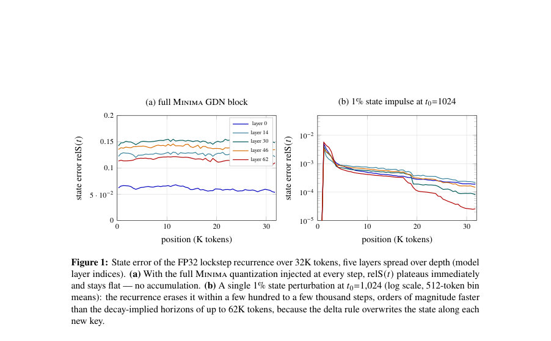
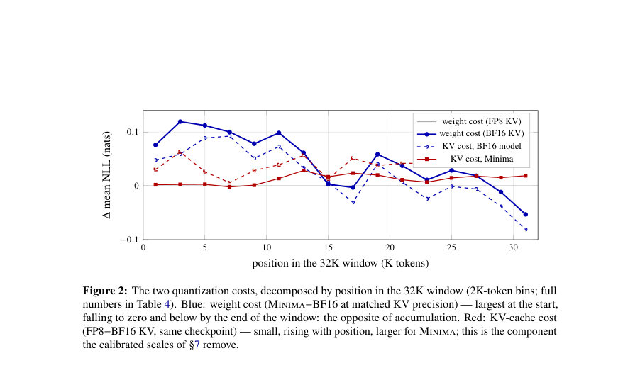

# Why Gated DeltaNet Survives 4-Bit Quantization: NVFP4 W4A4 for the Recurrent Half of a Hybrid 27B LLM

- **게시일:** 2026-09-06
- **arXiv:** [2609.04098v1](http://arxiv.org/abs/2609.04098v1) · [PDF](https://arxiv.org/pdf/2609.04098v1)
- **저자:** Sergii Kozyrev, Davyd Maiboroda
- **분야:** cs.AI
- **선정 점수:** 4.28
- **선정 이유:** 최근성 0.5, 인용 영향 0.0 (인용 0회), 저자 영향 0.0 (최고 h-index 0), AI 주제 적합성 2.3, 개발자 관심 0.0, 학술 신호 0.3, 오픈 웨이트·주요 연구조직 신호 1.2

[← 2026-09-06 목록으로 돌아가기](../daily/2026-09-06.html)

<!-- paper-visuals:start -->
## 주요 Figure

> 원문 PDF에서 실제 Figure 캡션과 그림 영역이 함께 확인된 자료만 자동 추출했다.

*Figure · 원문 PDF 7쪽 · Figure 1: State error of the FP32 lockstep recurrence over 32K tokens, five layers spread over depth (model*

*Figure · 원문 PDF 8쪽 · Figure 2: The two quantization costs, decomposed by position in the 32K window (2K-token bins; full*

<!-- paper-visuals:end -->

## 한 문장 요약

Gated DeltaNet을 포함한 Qwen3.8-27B의 모든 선형층을 NVFP4 W4A4로 사후양자화하여(게이트 포함) BF16 성능과 동등한 정확도와 큰 메모리·프리필 이득을 얻고, 왜 순환 절반이 4비트에 강한지 네 가지 기전으로 규명한다.

## 해결하려는 문제

대형 하이브리드 LLM(Qwen3.8-27B)은 많은 레이어가 Gated DeltaNet(GDN) 같은 선형-어텐션(고정 크기 순환 상태)을 사용한다. 커뮤니티 초기 4비트 빌드는 '순환에서 오차가 누적된다'는 직관으로 GDN(특히 decay·write-strength 게이트)만 8/16비트로 보호했으나, 이 보호가 실제로 필요한지와 GDN을 포함한 전모델 W4A4 양자화가 가능한지 검증·설명하는 연구 질문을 다룬다.

## 핵심 기여

- 모든 496개 선형 행렬(48 GDN 레이어의 in_proj_qkv,z,a,b·out_proj 등 포함)을 NVFP4 W4A4로 사후양자화한 실용적 체크포인트(Minima)를 제시하고, BF16과 비교해 주요 정확도·추론 비용 지표를 보고함(§3–4).
- GDN이 4비트를 견디는 이유를 네 가지 기전(블록 스케일링에 의한 특이치 국지화, 게이트 비선형화의 잡음 압축, 델타 규칙에 의한 상태 소거·평형, 토큰 수에 비례하지 않는 단위 토큰 비용)으로 메커니즘 연구를 수행하여 설명함(§5).
- 서빙 스택에서의 실제 측정 오류(모듈별 캘리브레이션 vs fused-GEMM, 멀티모달 vs 텍스트 경로, 챗 템플릿 필요성 등)를 찾아 고치고(예: fused 스케일 하모나이제이션) 올바른 비교 환경을 정립함(§6).
- FP8 KV-cache 스케일 캘리브레이션을 통해 FP8 KV 저장의 PPL 비용을 대부분(83%) 회복하는 실용적 레시피(모든 것 양자화, KV 스케일 동봉)를 제안함(§7).

## 접근 방법

* 아키텍처/양자화: Qwen3.8-27B(히든 5120, 48 GDN + 16 attention)를 대상으로 llm-compressor로 NVFP4(E2M1 4비트 값 + 16-요소 블록당 E4M3 스케일, 텐서당 FP32 글로벌 스케일) W4A4를 모든 백본 선형층(496개)에 적용(임베딩·lm_head·컨볼루션·노름 제외).
* 캘리브레이션은 고정된 128 샘플 × 32K 토큰 집합으로 수행.
* 실험설정: vLLM 0.27.1, TP=1, 하나의 RTX PRO 6000에서 텍스트 전용 서빙, FP8 KV-cache 기본(별도 ablation).
* 메커니즘 분석: 실제 BF16 실행에서 32K 입력 동안 모든 GDN 입력을 캡처하고(4×32K 토큰), fake-quantization(quantize→dequantize)으로 정확히 4비트 반올림 오차만 주입하여(단일-투영 재생, 전체-동시 재생, FP32 lockstep 재생) 투영별 민감도, 상태(relS) 시간 경과, 위치별 NLL 분해 등을 측정.
* 서빙 관련 수정: fused-GEMM 그룹의 스케일 불일치 보정(퍼모듈 캘리브레이션 → 공유 글로벌 스케일로 재작성하고 블록 스케일에 비율 폴딩), FP8 KV 스케일 정적 캘리브레이션 적용.

## 주요 결과

- 정확도·생산성(표 1): BF16 기준 대비 Minima(모든 선형층 NVFP4 W4A4)는 MMLU-Pro, GSM8K, AIME’25, GPQA-Diamond, LiveCodeBench 등을 포함한 5-태스크 평균에서 BF16과 씨앗 변동(seed noise) 내로 일치(5-task 평균: BF16 85.62, Minima 85.10, Δ −0.52). 어떤 태스크에서도 CI로 분리된 차이는 없음(§4, 표1).
- 퍼플렉시티 및 메모리: PPL@4K/@32K — BF16 6.95/10.35, Minima 7.67/10.84(표1). Minima는 체크포인트·VRAM·디스크에서 가장 작음(가중치 VRAM: BF16 50.13 GiB → Minima 17.53 GiB). KV 캐시 수용력은 1.81M 토큰(한 카드)으로 최대화됨. 프리필 속도(TTFT@32K): BF16 6.90 s → Minima 4.03 s(≈+14–19% prompt throughput 이득 vs 커뮤니티 빌드). 디코드 처리량(@32 동시): BF16 621 tok/s, Minima 1,154 tok/s(표5).
- KV-cache 캘리브레이션(§7): FP8로 KV 저장 시 PPL@32K 페널티는 BF16에 대해 +0.13, Minima에 대해 +0.41였으나 정적 per-tensor FP8 스케일을 동봉하면 Minima의 PPL@32K은 10.84→10.50으로 페널티의 83%를 회복(성능 변화는 0.4% 이내).
- 메커니즘 정량: (i) 입력 통계(표2): GDN 입력은 잔차 스트림의 극단치 공유(중간 레이어 max/RMS ≈63.5, block 1-hot 비율 10.6%)이나 NVFP4의 16-요소 블록 스케일링이 극단치를 국지화해 활성화 오차(A4 %)가 모든 역할에서 균일(약 7.5–9.2%). (ii) 게이트 민감도(표3): 게이트 투영의 GEMM 사전오차는 ~11%였지만 최종 출력에 대한 영향은 작음(a: GEMM 11.0%→출력 2.1%, b: 8.5%→2.6%) — softplus/exp와 sigmoid 파라메터화가 잡음을 압축. (iii) 상태 동역학(§5.3, 표6): 모든-동시 주입 시 상태 상대오차 relS가 토큰 256에서 12.96%, 토큰 32,768에서 12.31%로 플래토 형성(plateau ≈12.6%) — 누적되지 않음. 단일 1% 임펄스는 1/e 내 80–1,382 스텝, 1/10 내 ~2,200–2,900 스텝으로 소거(델타 규칙이 키 방향으로 덮어씀). (iv) 위치별 효과(그림2, 표4): 가중치 양자화로 인한 NLL 격차는 창의 앞부분에서 크고 뒷부분으로 갈수록 줄어들며(첫 16K 평균 +0.081 nats → 후반 16K 평균 +0.011 nats) 마지막 2K에선 Minima가 BF16보다 더 좋음 — 오류가 컨텍스트로 씻김.
- limitations':['저자가 명시한 한계: 단일 모델 패밀리와 크기(Qwen3.8-27B), 단일 양자화 포맷(NVFP4), 주로 32K 토큰까지 평가(128K+는 외삽) — 따라서 결과 일반화는 제한적임(§9).','실험 범위에서 드러나는 제약(본문 근거): 서빙·커널 수준 아티팩트 존재(작은 배치에서 NVFP4 활성화 양자화 오버헤드로 인한 디코드 성능 손실 2–4% 등), 게이트-쉴딩 주장은 로그-공간 softplus/exp 파라메터화에 의존하므로 선형으로 파라메터화된 다른 순환 믹서에는 적용되지 않을 수 있음(§9, §5.3).','메커니즘 검증 범위: 상태 오류 평형과 소거가 32K까지 관찰되었으나 128K 이상 장문 맥락에서의 행동은 본문에서 직접 측정되지 않아 추론에 기반한 예측임(§9).'],

## 한계

- 저자가 명시한 한계: 단일 모델 패밀리와 크기(Qwen3.8-27B), 단일 양자화 포맷(NVFP4), 주로 32K 토큰까지 평가(128K+는 외삽) — 따라서 결과 일반화는 제한적임(§9).
- 실험 범위에서 드러나는 제약(본문 근거): 서빙·커널 수준 아티팩트 존재(작은 배치에서 NVFP4 활성화 양자화 오버헤드로 인한 디코드 성능 손실 2–4% 등), 게이트-쉴딩 주장은 로그-공간 softplus/exp 파라메터화에 의존하므로 선형으로 파라메터화된 다른 순환 믹서에는 적용되지 않을 수 있음(§9, §5.3).
- 메커니즘 검증 범위: 상태 오류 평형과 소거가 32K까지 관찰되었으나 128K 이상 장문 맥락에서의 행동은 본문에서 직접 측정되지 않아 추론에 기반한 예측임(§9).

## 개발자 관점

- 실용 레시피: '모두 양자화(모든 선형층 NVFP4 W4A4), FP8 KV 캐시 저장, 캘리브레이션된 KV 스케일을 체크포인트에 동봉' — 성능 손실을 거의 없애고 VRAM·프리필 이득을 얻는다(§7, 결론).
- 서빙 파이프라인 검증 필수: per-module 캘리브레이션이 fused-GEMM 서빙 커널과 충돌할 수 있으므로(논문: qkv/z, b/a 스케일 불일치), 배포 전에 fused 그룹 스케일 하모나이제이션을 적용해 검사해야 함(§6).
- 평가·하니스 주의: 멀티모달 복합 체크포인트는 텍스트 전용 경로와 다른 동작을 보임; 'raw-completion' 방식은 챗 템플릿(특히 thinking 토큰 차단)을 우회해 잘못된 점수를 만들 수 있으므로 챗 템플릿·유효성 검사 사용 권장(§6).
- 메커니즘적 신뢰성: GDN의 로그-공간 게이트 파라메터화(softplus/exp, sigmoid)가 양자화 잡음을 압축하므로, 동일한 구조를 가진 다른 모델에서는 추가 보호 없이도 게이트를 4비트로 유지해도 안전할 가능성이 높음(§5.2–5.3).
- 재현 관련: 캘리브레이션은 128샘플×32K 토큰 고정 세트로 수행했으며(§3), FP8 KV 스케일 정적 캘리브레이션은 서빙 성능 영향 없이 페널티를 회복하므로 배포시 스케일 동봉을 권장함(§7).

**근거 범위:** 이 분석은 제공된 논문 PDF 본문(페이지 1–14, 부록 포함)의 텍스트를 근거로 작성되었음. 표(표1–6), 그림(그림1–2) 및 본문에서 직접 언급한 수치와 발견만 사용했으며, 원문에 없거나 본문에서 확인되지 않는 구현·수치 세부사항은 생성하지 않았음. PDF 추출물의 모든 숫자와 서술은 본문에 근거함.
