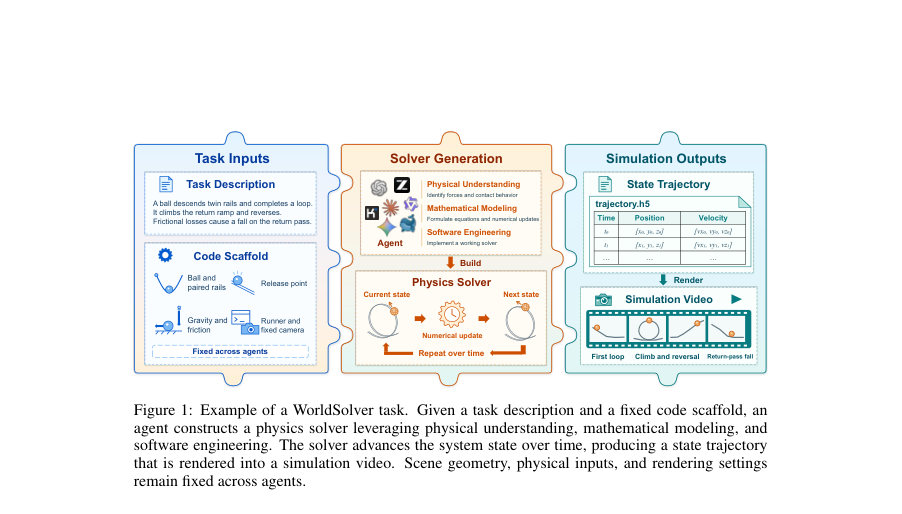
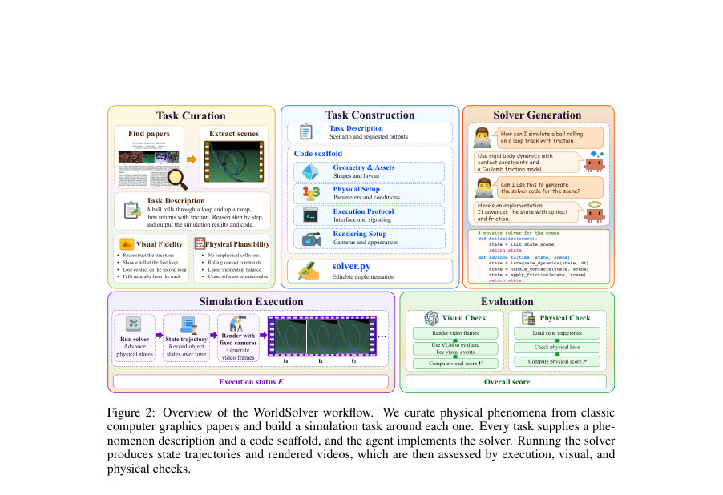
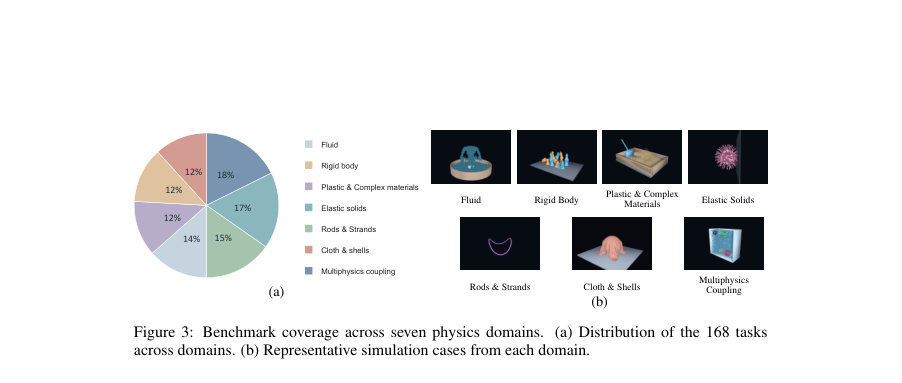

# WorldSolver: Can LLM Agents Simulate the Physical Dynamics via Solver Generation?

- **게시일:** 2026-10-07
- **arXiv:** [2610.08720v1](http://arxiv.org/abs/2610.08720v1) · [PDF](https://arxiv.org/pdf/2610.08720v1)
- **저자:** Siru Jiang, Yongzhe Lyu, Shuo Lu, Yubin Wang, Yuxiang Zhang, Yue Liao, Bin Wang, Jian Liang, Tieniu Tan
- **분야:** cs.AI
- **선정 점수:** 5.40
- **선정 이유:** 최근성 1.4, 인용 영향 0.0 (인용 0회), 저자 영향 0.0 (최고 h-index 0), AI 주제 적합성 3.0, 개발자 관심 0.5, 학술 신호 0.6, 오픈 웨이트·주요 연구조직 신호 0.0

[← 2026-10-07 목록으로 돌아가기](../daily/2026-10-07.html)

<!-- paper-visuals:start -->
## 주요 Figure

> 원문 PDF에서 실제 Figure 캡션과 그림 영역이 함께 확인된 자료만 자동 추출했다.

*Figure · 원문 PDF 2쪽 · Figure 1: Example of a WorldSolver task. Given a task description and a fixed code scaffold, an*

*Figure · 원문 PDF 3쪽 · Figure 2: Overview of the WorldSolver workflow. We curate physical phenomena from classic*

*Figure · 원문 PDF 4쪽 · Figure 3: Benchmark coverage across seven physics domains. (a) Distribution of the 168 tasks*

<!-- paper-visuals:end -->

## 한 문장 요약

본 논문은 물리 현상 설명과 고정 코드 스캐폴드를 입력으로 받아 LLM 기반 에이전트가 물리 시뮬레이션용 솔버 코드를 생성할 수 있는지 평가하기 위해 7개 물리 도메인, 61개 논문에서 발췌한 168개 과제로 구성된 벤치마크 WorldSolver와 실행·시각·물리 정합성 평가 프로토콜을 제안하고, 여러 최첨단 모델을 평가한 연구이다.

## 해결하려는 문제

기존 동적 장면 생성 연구는 (1) 솔버를 직접 작성하지 않고 애니메이션을 생성하거나(엔진 의존), (2) 과학 계산 벤치마크는 풀어야 할 방정식을 미리 제공하여 모델 선택 및 수치화 과정을 평가하지 못한다. 따라서 LLM 에이전트가 물리적 이해로 모델을 선택하고 수학적으로 정식화한 뒤 실행 가능한 솔버 코드를 구현해 연속적 물리 궤적과 렌더 영상을 만드는 능력(즉 '설명된 물리 현상을 솔버로 변환하는 능력')의 실질적 성능을 묻는다.

## 핵심 기여

- 물리 이해, 수치 정식화, 소프트웨어 구현 능력을 통합적으로 평가하는 '솔버 생성'을 대리 과제로 제시한 최초의 연구(에이전트적 코드 생성 관점).
- 클래식 컴퓨터 그래픽스 논문 61편에서 발췌한 물리 현상으로 구성된 7개 도메인·168개 과제의 WorldSolver 벤치마크와 각 과제별 고정 코드 스캐폴드(장면, 물리 파라미터, 실행 프로토콜, 렌더 설정)를 구축·공개.
- 실행(Execution), 시각적 충실도(Visual Fidelity, VLM 기반), 물리적 타당성(Physical Plausibility, 궤적 기반 계산기)으로 구성된 통합 평가 프로토콜을 설계하고 이를 통해 여러 최첨단 LLM 에이전트를 벤치마킹하여 한계와 성능 분포를 분석.

## 접근 방법

* 각 과제는 설명문 d와 스캐폴드 S=(G,P,E,R)를 제공한다.
* 에이전트 A는 설명 d와 스캐폴드 S를 받아 솔버 Φ(함수 advance step)를 구현하고 초기 상태 s0에서 시간 T까지 상태 궤적 τ=(s0,...,sT)과 렌더 영상 v=R(τ)를 생성한다.
* 스캐폴드는 장면·물리 파라미터·실행 인터페이스·렌더 설정을 고정하여 에이전트가 오직 solver/** 폴더만 수정하도록 제한한다.
* 제출된 솔버는 호스트에서 실행되며(컨테이너 환경: NumPy, SciPy, Numba, h5py, PyYAML, FFmpeg 등만 허용, 외부 엔진/네트워크 금지), 세 축으로 평가한다.
* 실행 체크(E): 런타임 성공 여부(이진).
* 시각적 충실도(V): 각 과제별로 정의한 4개 기준(사건 순서, 상호작용 반응, 특유 현상, 시간적 일관성)을 GPT-5.6-Sol 기반 VLM에 의해 20개 키프레임을 5회 반복 평가해 평균 점수 산출.
* 물리적 타당성(P): 도메인별 사전 정의된 물리 법칙 계산기(예: 비침투, 운동량/충격 불일치, 질량/중심검증 등)를 궤적 필드(trajectory.h5)에 바인딩해 정규화된 위반오차를 계산하고 표준화하여 평균 점수 산출.
* 최종 케이스 점수는 실행 성공 시 (V+P)/2, 실패 시 0이며 전체 점수는 과제 평균.

## 주요 결과

- 전 모델에서 솔버 생성은 여전히 어려움: 전체 점수(0–100)를 기준으로 GPT-5.6-Sol 48.7, Claude-Opus-5 46.7, Gemini-3.7-Flash 29.3, DeepSeek-V4.1-Flash 24.6, GLM-5.3 23.6, Qwen-3.8-Max 22.7, Kimi-K2.7-Code 17.1(표 3).
- 생성 단계별 성공률(그림 4): 대부분 모델이 제출(solvers submitted)은 높으나(대략 88–100%), 실제 유효한 궤적과 영상 출력(trajectory produced)은 더 낮아 GPT-5.6-Sol 82%, Claude-Opus-5 79% 등이며 일부 모델은 38% 수준까지 떨어짐(예: Kimi). '케이스 통과'(최종 점수 ≥60%)는 GPT-5.6-Sol 41%, Claude-Opus-5 37%, 다른 모델은 훨씬 낮음.
- 도메인별 편차 큼(그림 18): GPT-5.6-Sol는 Fluid, Rigid Body, Rods/Strands, Multiphysics에서 강한 편이며 Claude-Opus-5는 Plastic/Complex, Elastic Solids, Cloth/Shells에서 높음. 예: 강체 도메인에서 시각 점수와 물리 점수의 괴리가 관찰됨(시각적으로 그럴싸하더라도 궤적으로는 물리 위반 발견).
- 비용·시간·툴 사용 관점: GPT-5.6-Sol는 평균 벽시간 8.89분으로 가장 빠르고 비용대비 효율이 높음; Claude 평균 시간 18.59분; Gemini는 2.59분으로 가장 짧음(그러나 점수는 중간). 모델별 생성 epoch 및 도구 사용 패턴 분석에서 GPT-5.6-Sol는 평균 호출 epoch가 적음(13.07)에도 우수한 성능을 보였고, 코드 편집(edit) 비중이 높은 모델이 더 좋은 경향을 보임(그림 6).
- 평가 도구(시각 VLM) 타당성: VLM 기반 시각 점수는 인간 전문가와 높은 상관관계(피어슨 r=0.730, 스피어만 ρ=0.713)를 보였으며 반복 평가 안정성도 확인됨(섹션 D).

## 한계

- 저자 기재(논문 본문): WorldSolver는 7개 도메인·168개 과제로 구성했지만 여전히 물리 현상의 부분집합만 포함하므로 범위 확장이 필요하다고 명시함.
- 저자 기재(논문 본문): 물리적 타당성 검사는 미리 정의된 유한한 법칙 집합과 계산기에 의존하므로 모든 비물리적 실패를 포착하지 못할 수 있음을 인정하고 시각·물리 평가가 상호보완적이라고 설명함.
- 본문으로 합리적으로 확인되는 제약(분명히 표기된 내용 기반): 시각 평가가 GPT-5.6-Sol VLM에 의존하므로 VLM 심사자의 편향 가능성(특정 모델에 유리하거나 불리할 가능성)이 존재함(논문은 VLM으로 판정하며 검증은 했지만 이 한계는 남음).
- 본문으로 합리적으로 확인되는 제약: 스캐폴드 구축과 검증에 인간 전문가의 반복적 개입이 필요했음(부록 A.2), 이는 확장성·자동화 측면에서 비용 및 인건비 제약을 유발함(구성 과정이 수작업 포함).

## 개발자 관점

- 재현을 위해서는 논문에 제시된 고정 스캐폴드 구조(ID/config.yaml, scene.py, scene_geometry.yaml, render_spec.yaml, run.py, render.py, assets/, solver/)와 trajectory.h5 규격(시간, position, velocity, orientation, interaction_force 등 필드)을 엄격히 구현해야 함(본문 A.4).
- 에이전트 제출 인터페이스는 세 가지 메서드(initialize, advance_to, diagnostics)를 요구하므로 솔버는 시간적 통합 루프와 충돌·마찰 처리, 출력 필드 기록을 제공해야 함(본문 A.3).
- 평가 환경은 제출 후 호스트에서 오프라인으로 실행되므로 외부 네트워크/엔진 사용 금지, 허용 라이브러리(NumPy, SciPy, Numba, h5py, PyYAML, FFmpeg)만으로 구현해야 함(본문 A.5). 이는 실제 배포 시 의존성 제약과 성능 최적화 필요를 의미함.
- 개발·디버깅 전략: 논문이 권장한 '초기 물리적 베이스라인을 빠르게 제출하고(컴파일 체크), 최대 두 번의 구체적 수정 패스만 허용' 정책은 에이전트 설계 시 '얼리-델리버리'와 제한된 반복을 권장함(본문 A.3).
- 비용·성능 고려: 모델 선택에서 평균 호출 epoch, 벽시간, API 비용을 균형 있게 고려해야 하며(그림 7), 코드 편집과 수차례 리비전(edit 비중)이 성능에 긍정적 영향이 관찰됨(그림 6). 엔드투엔드 자동화 시 토큰·시간 비용 최적화가 필요함(그림 21,20).

**근거 범위:** 이 분석은 제공된 논문 PDF 본문 전체(본문, 표, 그림, 부록)를 근거로 작성되었음. 논문이 보고한 수치(표 3, 그림 4/6/7 등)와 평가 절차(스캐폴드 구조, solver API, VLM·물리 계산기 방식)를 본문에서 직접 인용하여 정리하였다. 다만 물리 계산기(contact.penetration 등)의 내부 수치식이나 일부 구현 세부(정규화 상수, 특정 계산기 파라미터 값)는 본문에 상세 식으로 제시되어 있지 않아 기술하지 않았으며, 실행 환경의 미세 구성(컨테이너 이미지 세부 패키지 버전 등)은 PDF에서 제한적으로만 언급되어 있으므로 해당 항목들은 별도로 확인이 필요하다.
