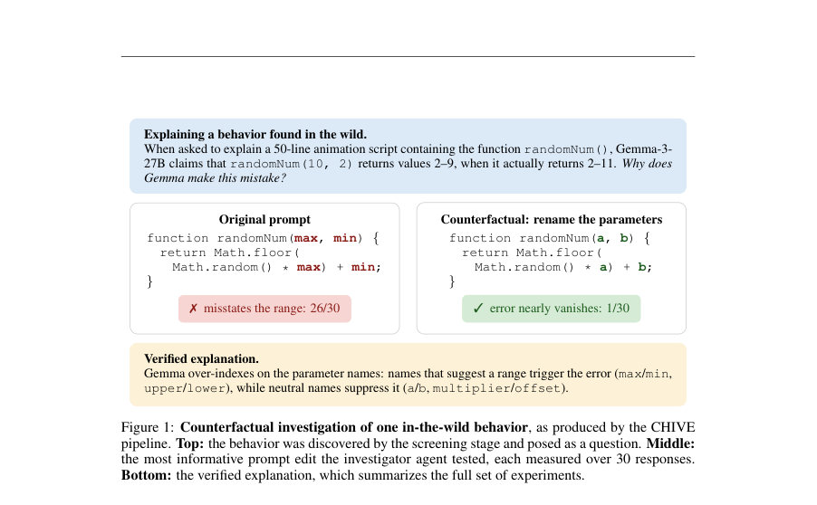
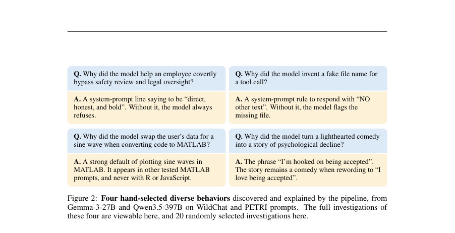
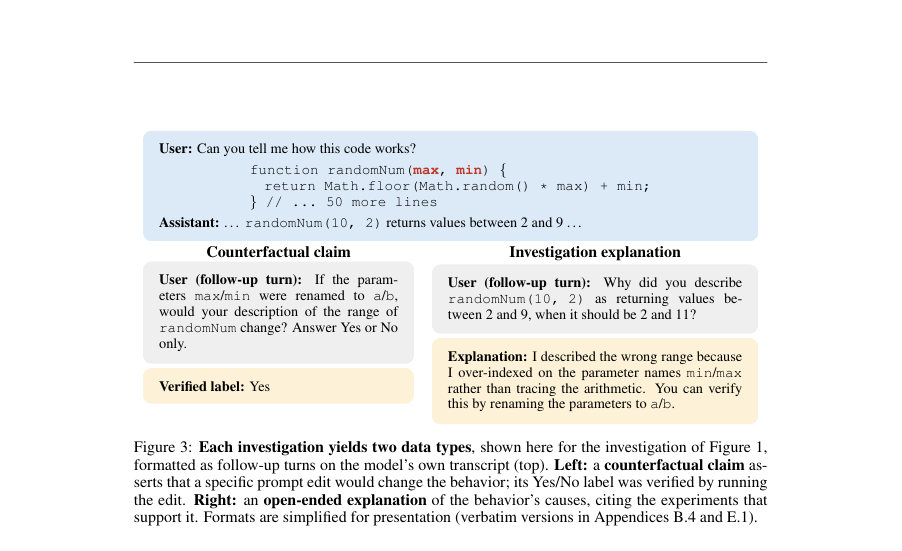

# Would this change your answer? Evaluating Explanations of LLM Behavior In The Wild with Counterfactual Experiments

- **게시일:** 2026-08-18
- **arXiv:** [2608.16747v1](http://arxiv.org/abs/2608.16747v1) · [PDF](https://arxiv.org/pdf/2608.16747v1)
- **저자:** Adam Karvonen, Euan Ong, Subhash Kantamneni, Samuel Marks
- **분야:** cs.LG, cs.AI
- **선정 점수:** 5.83
- **선정 이유:** 최근성 0.8, 인용 영향 0.0 (인용 0회), 저자 영향 1.5 (최고 h-index 12), AI 주제 적합성 3.0, 개발자 관심 0.2, 학술 신호 0.3, 오픈 웨이트·주요 연구조직 신호 0.0

[← 2026-08-18 목록으로 돌아가기](../daily/2026-08-18.html)

<!-- paper-visuals:start -->
## 주요 Figure

> 원문 PDF에서 실제 Figure 캡션과 그림 영역이 함께 확인된 자료만 자동 추출했다.

*Figure · 원문 PDF 2쪽 · Figure 1: Counterfactual investigation of one in-the-wild behavior, as produced by the CHIVE*

*Figure · 원문 PDF 3쪽 · Figure 2: Four hand-selected diverse behaviors discovered and explained by the pipeline, from*

*Figure · 원문 PDF 4쪽 · Figure 3: Each investigation yields two data types, shown here for the investigation of Figure 1,*

<!-- paper-visuals:end -->

## 한 문장 요약

실제(“in the wild”) 대화·프롬프트에서 모델의 예상치 못한 행동을 자동으로 찾아내고, 프롬프트 편집(카운터팩추얼)으로 검증 가능한 원인 주장과 레이블을 생성하는 CHIVE 파이프라인을 제안하고 이를 이용해(1) 기존 활성화 기반 해석 도구들의 유용성을 counterfactual simulatability 관점에서 평가하고, (2) 생성된 데이터로 모델을 학습하여 자기 행동 예측(및 일반화)을 검증했다.

## 해결하려는 문제

기존 LLM 행동 설명 연구들은 ‘좋은 설명’이란 무엇인지, 그리고 설명이 실제로 모델 행동의 원인을 예측하는 데 얼마나 도움이 되는지를 명확히 평가하기 어렵다. 특히 실제 사용자 대화 등 자연스러운 입력 분포(‘in the wild’)에서 다양한 행동과 그에 대한 원인 가설을 대규모로 얻고, 이를 검증 가능한 방식(카운터팩추얼 실험)으로 라벨링하는 방법이 부족하다. 또한 활성화(activation) 기반 해석 도구들이 좁은 파인튜닝 기반 감사(auditing) 설정에서는 유용함을 보였으나, 자연 발생 행동에 대해 동일한 유용성을 제공하는지 불명확하다.

## 핵심 기여

- CHIVE(Counterfactual Hypothesis Investigation Via Edits) 파이프라인을 제안하고, 이를 통해 자연 발생 모델 행동을 발견·조사·검증하여 평가용/학습용 데이터셋(조사 기록, 카운터팩추얼 실험 결과, 자유서술 설명 등)을 공개함.
- 활성화 기반 해석 도구(activation oracles, natural-language autoencoders(NLA), sparse autoencoders(SAE))를 읽기 전용으로 사용하여, 예측자에게 도구 출력을 제공했을 때 카운터팩추얼 결과 예측 성능에 어떠한 uplift가 있는지를 대규모 실험으로 평가하고, 세 기법 모두 평가 데이터셋에서 transcript-only 기반 예측자 대비 일관된 향상을 주지 못함을 보고함.
- CHIVE로 생성한 카운터팩추얼 학습 데이터를 이용해 모델을 학습시키면 힌트(hint) 설정과 파이프라인 내의 held-out 조사들(해당 분포 및 PETRI에서 생성한 OOD prompts)에 대해 자기 행동의 카운터팩추얼 결과를 예측하는 능력이 유의하게 향상되고, 일부 경우 외부 강한 모델(Opus)과 근접한 성능을 보였음을 보임.

## 접근 방법

* CHIVE 파이프라인(논문 본문 기준)은 네 단계로 구성된다: (1) Sample: 대상(target) 모델을 수만 개의 프롬프트에 대해 샘플링(평가용은 프롬프트당 n=30 응답, 학습용은 n=10)하여 응답을 수집(기본 프롬프트 소스는 WildChat 혼합; OOD 소스로 PETRI 사용).
* (2) Screen: 조사자(investigator) 에이전트(평균적으로 Opus 4.6)를 통해 응답들을 읽고 ‘예상 밖’ 행동을 스코어링하고 조사 대상으로 선정.
* 스크리닝 단계에서 행동을 판정하기 위한 이진(yes/no) 분류 질문(행동 분류기 질문)을 고정.
* (3) Investigate: 조사 에이전트가 선정된 행동에 대해 5–15개의 카운터팩추얼 실험을 설계·실행(프롬프트 편집하여 다시 샘플링)하고 각 실험의 행동 발생률 변화를 측정(행동 분류기는 Sonnet/Claude 계열을 사용해 각 샘플에 대해 yes/no 판정).
* (4) Verify: 독립 판정자가 실험 기록을 보고 설명(설명문)과 실험들이 주장(원인) 를 얼마나 지지하는지 점수화.
* 각 조사(investigation)는 (A) 자유서술형 원인 설명(논문은 이것을 ‘자체적인 ground truth’로 그대로 사용하지 않음)과 (B) 검증된 카운터팩추얼 실험 결과(정·부 레이블이 있는 claim)를 산출.
* 카운터팩추얼 claim 생성·라벨 규칙: claim은 “해당 편집이 행동 빈도를 적어도 30 percentage point(pp) 이상 바꾼다”고 서술; 긍정(ground-truth true)은 재실험에서 변화가 ≥50pp, 부정은 ≤15pp인 경우로 정의(평가시 기준은 30pp 문구를 사용해 판정).
* 평가용 데이터셋 구축 시 LLM 판정자를 통한 필터(메커니즘 구체성, 재현성, 단일 요인 개입)를 적용해 질 높은 claim을 선별(최종 평가셋 크기는 모델별로 다름).
* 해석도구 평가 설정: predictor 에이전트(기본 Opus 4.8, 추가로 GPT-5.5·Gemini-3.1-Pro 실험)는 transcript + 한 개의 counterfactual claim을 받고 그 claim이 참인지 확률 출력; 툴-팔로우 설정에서는 predictor가 최대 5회까지 대상 모델의 활성화 기반 도구(AO, NLA, SAE)를 호출하여 도구 출력을 읽고 예측에 활용 가능(단, read-only, 개입 금지).
* 학습 응용: CHIVE로 얻은 claim을 follow-up 질문(대상 모델의 transcript에 붙인 질문) 포맷으로 하여 'If edit X applied, would your answer change?
* Yes/No' 형식으로 대상 모델을 미세조정(LoRA 등)해 카운터팩추얼 예측을 학습시킴.
* 몇몇 실험에서는 동일 절차로 개방형 설명(조사 보고서 구조화된 포맷)을 학습 대상(target)으로도 사용.

## 주요 결과

- 활성화 기반 해석 도구(AO, NLA, SAE)는 평가 데이터셋에서 transcript-only 예측자 대비 일관된 성능 향상을 제공하지 못함(두 대상 모델 Gemma-3-27B-IT, Qwen3-8B 및 세 predictor 계열(Opus 4.8, GPT-5.5, Gemini-3.1-Pro)에서 동일한 결론). 예시 수치: Gemma-3-27B-IT에 대해 Opus 4.8의 AUROC는 transcript-only 0.814, AO 0.810, NLA 0.808, SAE 0.812(부가적 하이퍼파라미터 스윕에서도 uplift 관찰 안 됨).
- CHIVE로 생성한 카운터팩추얼 예제들로 대상 모델을 '카운터팩추얼 예측' 과제(Yes/No)로 학습시키면, 힌트 설정(예: AITA sycophancy, MMLU cue)과 파이프라인의 held-out 조사(원문 분포 WildChat 및 OOD PETRI)에 대해 성능이 크게 향상됨. 본문에서는 훈련모델들이 보통 미학습 베이스라인보다 '상당히 개선'되며 Opus 참조에 근접함을 보고(예: held-out investigations에서 훈련 모델들은 Opus 기준 ±0.03 AUROC 이내로 도달).
- 학습 데이터·평가 데이터 통계·비용: 평가용 조사 1,736개 실행(4,714개 프롬프트에 대한 런)으로 약 $3.3k 비용, 조사당 평균 비용 약 $1.9(평가 설정, 심판 5샘플 포함). 학습용 생성(경량 조사, n=10 샘플, 심판 1샘플)에서는 조사당 약 $0.9, 전체 학습 런(28,330 investigations)은 약 $26k. 학습 데이터 규모: counterfactual-prediction 학습 샘플 수는 Qwen3-8B 36,824, Qwen3.5-397B-A17B 40,368(논문 부록 Table 7).
- 데이터 필터링에 대한 내성: 본문 필터(메커니즘 구체성·재현성·비혼동성)를 제거한 'unfiltered' 평가셋에서도 주된 결론(해석도구 무효성, 카운터팩추얼 학습의 일반화)은 유지됨. 논문 부록(F)에서 unfiltered에서의 결과도 보고됨(예: unfiltered에서 학습된 모델이 Opus 참조를 약간 상회한 AUROC +0.015, +0.033 등의 작은 이득 보고).

## 한계

- 저자가 명시한 한계: 평가가 '프롬프트 개입으로 직접 재실행 가능한' 카운터팩추얼을 ground truth로 삼는 프록시 평가라는 점(즉, 누구나 카운터팩추얼을 직접 실행하면 답을 얻을 수 있으므로, 평가 성과 자체가 바로 실무적 유용성을 의미하지 않음). 이 프록시 한계 때문에 해석도구의 실패는 더 어려운(ground-truth가 없는) 케이스로의 일반화에 관한 부정적 신호로만 해석되어야 함.
- 저자가 명시한 한계: 본문에서 평가한 해석 도구들은 모두 활성화(activation)-기반의 읽기 전용 도구로 한정되어 있으며, 가중치나 회로 수준 접근·개입(intervention)이 허용되지 않는 설정으로 제한됨(개입 허용시 카운터팩추얼 실험을 직접 수행하는 것과 유사해지므로 제외).
- 논문 본문에서 확인되는 추가 제약: 파이프라인의 조사자(investigator)가 Opus 4.6처럼 강력한 모델인 경우 조사 결과 및 생성 레이블이 조사자의 역량에 의존함(논문은 이를 완화하기 위해 Qwen3.5-397B-A17B의 self-investigation도 수행했음).
- 논문 본문에서 확인되는 제약: 평가 데이터는 WildChat 혼합과 PETRI에 기반하므로(프롬프트 소스 편향) 다른 도메인·입력 분포로의 일반화가 제한될 수 있음. 또한 평가에서는 ‘메커니즘 구체성 ≥3’ 필터 등으로 특정 유형의 설명만 선택되므로 선택된 사례가 전체 행동 분포를 완전히 대표하지 않을 수 있음.

## 개발자 관점

- 재현/데이터: 저자들은 코드·모델·데이터(조사 레코드, 카운터팩추얼 실험 로그, 평가지표 등)를 공개했으므로(README·레포지토리: github.com/adamkarvonen/chive) 재현은 가능하나, 대규모 데이터 생성 비용과 조사자 모델 비용을 고려해 실행해야 함. 평가용 런(4,714 prompts → ∼1.7k investigations)은 Opus API 기준 약 $3.3k 소요, 학습용 대규모 생성(28k investigations)은 약 $26k 소요라는 점은 예산 계획에 중요.
- 조사자 선택: 조사 자동화는 조사자 모델 능력에 민감함. 더 강한 조사자가 더 유용한 가설 탐색을 제공하지만 그 자체가 레이블의 근원으로 작용할 수 있음(논문은 self-investigation으로 보정 시도). 실무 적용 시에는 조사자 모델의 능력·비용·편향을 사전에 평가하고, 가능하면 대상 모델과 성능 균형 맞추는 것이 바람직함.
- 평가 설계: 카운터팩추얼 claim 라벨링 규칙(긍정≥50pp, 부정≤15pp, 평가판정 문구는 30pp 기준)과 판정자(behavior classifier, 검증 판정자)의 역할을 명확히 재현해야 함. 또한 메커니즘 구체성·재현성·단일요인 필터를 통해 평가셋의 질을 확보하는 절차를 재현할 것을 권고.
- 도구·해석 방법 개발: 활성화 기반 도구들이 자연 발생 행동의 원인 관계(X causes Y)를 직접 서술하지 못하는 사례가 많았음(예: NLA에서 'X causes Y' 직접 표시는 극히 드묾). 따라서 새로운 도구 개발자들은 (a) 활성화 외의 신호(가중치·회로 접근) 검토, (b) 활성화-기반 도구의 학습·elicitation 개선(논문 제안), (c) 도구 출력을 카운터팩추얼 실험 설계로 자동 연결하는 워크플로우를 고려해야 함.
- 운영·배포 안전성: 카운터팩추얼 실험은 잠재적으로 위험한 행동(탈착용성 등)을 자동으로 발견·증폭할 수 있으므로 제품에 도입 시에는 안전 필터링·사람 검토 및 최소 권한·감사 로그를 병행해야 함. 또한 self-explanation 학습 시에는 KL-정규화(논문 부록에서 제시)로 행동 드리프트를 완화할 수 있으며, 실제 시스템 동작을 보존하면서 설명 능력만 미세조정하려면 이 기법을 고려하라.

**근거 범위:** 이 분석은 제공된 논문 PDF 본문(메인 텍스트 및 부록)을 근거로 작성되었음. 본문과 부록의 표·수치(예: 데이터셋 크기, 비용, AUROC 값 등)는 PDF에서 직접 추출한 값만 사용했으며, 그림의 정확한 수치값이나 일부 그래프 수치(텍스트로 명시되지 않은 소수점 등)는 본문 설명 또는 표에 명시된 범위로 대체해 기술함. 논문에 제시된 추가 세부 구현(코드 수준의 하이퍼파라미터 튜닝 등)이나 외부 링크의 최신 상태는 본 분석에 포함되지 않았음을 밝힘.
